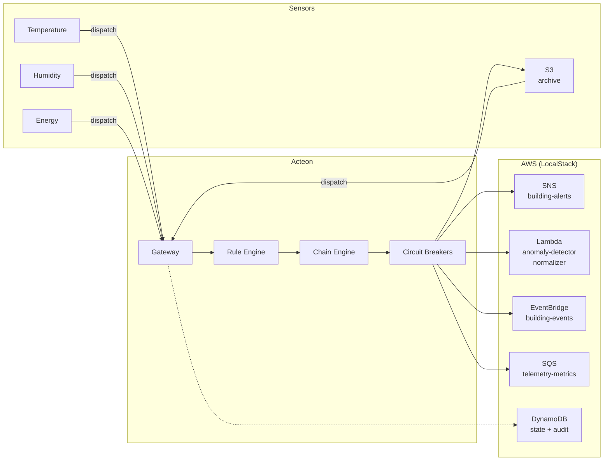
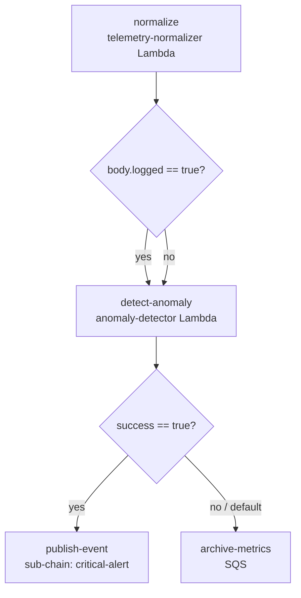

# AWS Event-Driven Pipeline

This guide shows how to use Acteon as an **event-driven pipeline orchestrator** for
AWS services. By routing IoT sensor telemetry through Acteon's dispatch pipeline,
you gain centralized rule evaluation, multi-step chain orchestration, circuit breaker
fallbacks, and a full audit trail -- all without writing any custom AWS glue code.

!!! tip "Runnable Example"
    The [`examples/aws-event-pipeline/`](https://github.com/penserai/acteon/tree/main/examples/aws-event-pipeline)
    directory contains a complete, runnable setup with LocalStack, DynamoDB-backed
    state and audit, safety rules, telemetry routing, and chain orchestration. Follow
    the quick start below to have the full pipeline running in minutes.



The scenario: a **smart building** with hundreds of IoT sensors (temperature, humidity,
motion, energy) publishes readings to Acteon. The rule engine evaluates each reading
and routes it to the right AWS service -- critical alerts fan out via SNS, normal
readings flow through a Lambda processing chain, device lifecycle events publish to
EventBridge, and metrics queue via SQS for batch processing.

---

## What This Example Exercises

The example exercises **20 Acteon features** through a single unified scenario:

| # | Feature | How |
|---|---------|-----|
| 1 | **AWS SNS** | Critical temperature and intrusion alerts fan out via SNS topic |
| 2 | **AWS Lambda** | Telemetry normalization and anomaly detection via Lambda functions |
| 3 | **AWS EventBridge** | Device lifecycle events published to custom event bus |
| 4 | **AWS SQS** | Metrics queued for batch processing; dead-letter queue for failures |
| 5 | **DynamoDB** | State + audit backends via LocalStack |
| 6 | **Chains** | `telemetry-processing`: normalize → detect → publish → archive |
| 7 | **Sub-chains** | Critical alert path invokes `critical-alert` sub-chain (SNS → EventBridge) |
| 8 | **Conditional branching** | Branch on normalization success and anomaly detection result |
| 9 | **Circuit breakers + fallback** | Lambda → DLQ; SNS → local-fallback |
| 10 | **Recurring actions** | Device heartbeat check every 5 minutes |
| 11 | **Data retention** | Audit 7 days, events 2 days |
| 12 | **Event grouping** | Humidity readings batched by floor, 30s window |
| 13 | **Quotas** | 500/hour for the `smartbuilding-hq` tenant |
| 14 | **Throttle** | Telemetry ingestion: 30/min per tenant |
| 15 | **Dedup** | Duplicate sensor readings deduplicated within 60s |
| 16 | **Suppress** | Block telemetry from test devices |
| 17 | **Deny** | Reject unsigned firmware updates |
| 18 | **Schedule** | Energy reports delayed 60s for batch aggregation |
| 19 | **Modify** | Enrich telemetry with pipeline version and building zone |
| 20 | **Audit + redaction** | Full audit with `aws_role_arn`/`function_arn`/`queue_url` redacted |

---

## Prerequisites

- [LocalStack](https://localstack.cloud/) (provides SNS, Lambda, EventBridge, SQS, DynamoDB)
- `awslocal` CLI (`pip install awscli-local`)
- `jq` (for script output formatting)
- Rust 1.88+ and Cargo

---

## Quick Start

### 1. Start LocalStack

```bash
docker run --rm -d --name localstack -p 4566:4566 localstack/localstack
```

### 2. Create AWS Resources

```bash
bash examples/aws-event-pipeline/scripts/setup.sh
```

This creates:

- SNS topic: `building-alerts`
- Lambda functions: `anomaly-detector`, `telemetry-normalizer` (Python 3.12)
- EventBridge bus: `building-events`
- SQS queues: `telemetry-metrics`, `telemetry-dlq` (dead-letter)
- DynamoDB tables: `acteon_state`, `acteon_audit`

### 3. Start Acteon

```bash
cargo run -p acteon-server --features dynamodb -- \
  -c examples/aws-event-pipeline/acteon.toml
```

Wait for `Listening on 127.0.0.1:8080`.

### 4. Create API Resources

```bash
bash examples/aws-event-pipeline/scripts/setup-api.sh
```

This creates via the REST API:

- **Quota**: 500 actions/hour for `smartbuilding-hq`
- **Retention policy**: audit 7 days, events 2 days
- **Recurring action**: device heartbeat check every 5 minutes

### 5. Fire Telemetry Events

```bash
bash examples/aws-event-pipeline/scripts/send-telemetry.sh
```

This sends ~21 sample events covering all categories (see [Expected Outcomes](#expected-outcomes)).

### 6. View the Report

```bash
bash examples/aws-event-pipeline/scripts/show-report.sh
```

This queries 8 API endpoints and displays: audit trail with outcome breakdown,
chain status, event states, provider health, quotas, groups, recurring actions,
and retention policies.

### 7. Cleanup

```bash
bash examples/aws-event-pipeline/scripts/teardown.sh
docker stop localstack
```

---

## Architecture

```
                    ┌─────────────────────────────┐
  IoT Sensors ─────►│      Acteon Gateway          │
  (temperature,     │                             │
   humidity,        │  Rules Engine               │          ┌──────────────────┐
   motion,          │  ┌─suppress test──────────┐ │         │ SNS              │
   energy)          │  ├─deny unsigned fw───────┤ │────────►│ building-alerts  │
                    │  ├─dedup 60s──────────────┤ │         ├──────────────────┤
                    │  ├─throttle 30/min────────┤ │         │ Lambda           │
                    │  ├─group humidity─────────┤ │────────►│ anomaly-detector │
                    │  ├─schedule energy────────┤ │         │ normalizer       │
                    │  ├─reroute critical───────┤ │         ├──────────────────┤
                    │  ├─chain readings─────────┤ │         │ EventBridge      │
                    │  └─allow remaining────────┘ │────────►│ building-events  │
                    │                             │         ├──────────────────┤
                    │  Chain Engine               │         │ SQS              │
                    │  ┌─normalize──────────────┐ │────────►│ telemetry-metrics│
                    │  ├─detect-anomaly────────┤ │         │ telemetry-dlq    │
                    │  ├─publish (sub-chain)────┤ │         ├──────────────────┤
                    │  └─archive-metrics────────┘ │         │ Log              │
                    │                             │────────►│ local-fallback   │
                    │  Background Jobs            │         └──────────────────┘
                    │  ├─group flush             │
                    │  ├─recurring heartbeat     │         ┌──────────────────┐
                    │  └─retention reaper        │         │ DynamoDB         │
                    │                             │────────►│ acteon_state     │
                    └─────────────────────────────┘         │ acteon_audit     │
                                                            └──────────────────┘
```

The gateway acts as a single entry point for all sensor telemetry. The rule engine
decides what happens to each reading before any AWS API call is made. This means
you can add new routing logic, change rate limits, or enable circuit breaker fallbacks
by editing YAML rule files -- no code changes, no redeployment.

---

## Provider Configuration

The `acteon.toml` configures seven providers -- six AWS services plus a local log fallback:

```toml
# SNS: fan-out critical alerts to operations team
[[providers]]
name = "alert-fanout"
type = "aws-sns"
aws_region = "us-east-1"
aws_endpoint_url = "http://localhost:4566"
topic_arn = "arn:aws:sns:us-east-1:000000000000:building-alerts"

# Lambda: anomaly detection on sensor readings
[[providers]]
name = "anomaly-detector"
type = "aws-lambda"
aws_region = "us-east-1"
aws_endpoint_url = "http://localhost:4566"
function_name = "anomaly-detector"

# Lambda: normalize raw telemetry into standard format
[[providers]]
name = "telemetry-normalizer"
type = "aws-lambda"
aws_region = "us-east-1"
aws_endpoint_url = "http://localhost:4566"
function_name = "telemetry-normalizer"

# EventBridge: publish device lifecycle and system events
[[providers]]
name = "event-bus"
type = "aws-eventbridge"
aws_region = "us-east-1"
aws_endpoint_url = "http://localhost:4566"
event_bus_name = "building-events"

# SQS: queue metrics for batch processing
[[providers]]
name = "metrics-queue"
type = "aws-sqs"
aws_region = "us-east-1"
aws_endpoint_url = "http://localhost:4566"
queue_url = "http://localhost:4566/000000000000/telemetry-metrics"

# SQS: dead-letter queue for failed dispatches
[[providers]]
name = "dead-letter-queue"
type = "aws-sqs"
aws_region = "us-east-1"
aws_endpoint_url = "http://localhost:4566"
queue_url = "http://localhost:4566/000000000000/telemetry-dlq"

# Log: local fallback when AWS providers are unavailable
[[providers]]
name = "local-fallback"
type = "log"
```

Every AWS provider points at `http://localhost:4566` (LocalStack). In production,
remove `aws_endpoint_url` to use real AWS endpoints, and optionally add
`aws_role_arn` for cross-account access.

---

## Rule Design

Rules are split across three files by concern:

### Safety Rules (`safety.yaml`)

Safety rules run at the highest priority (1) and form the **deny-by-default** layer:

```yaml
rules:
  # Block telemetry from test devices
  - name: suppress-test-devices
    priority: 1
    condition:
      all:
        - field: action.tenant
          eq: "smartbuilding-hq"
        - field: action.payload.environment
          eq: "test"
    action:
      type: suppress

  # Reject unsigned firmware updates
  - name: deny-unsigned-firmware
    priority: 1
    condition:
      all:
        - field: action.tenant
          eq: "smartbuilding-hq"
        - field: action.action_type
          eq: "firmware_update"
        - field: action.payload.signed
          eq: false
    action:
      type: deny

  # Catch-all: block anything not explicitly allowed
  - name: deny-unmatched
    priority: 100
    condition:
      field: action.tenant
      eq: "smartbuilding-hq"
    action:
      type: suppress
```

The `deny-unmatched` rule at priority 100 ensures that any reading that does not
match a higher-priority routing or allow rule is silently dropped. This prevents
unknown action types from reaching AWS services.

### Processing Rules (`processing.yaml`)

Processing rules handle deduplication, throttling, grouping, and scheduling:

```yaml
rules:
  # Deduplicate identical sensor readings within 60s
  - name: dedup-sensor-readings
    priority: 2
    condition:
      all:
        - field: action.tenant
          eq: "smartbuilding-hq"
        - field: action.action_type
          eq: "sensor_reading"
    action:
      type: deduplicate
      ttl_seconds: 60

  # Limit telemetry ingestion to 30 readings per minute
  - name: throttle-telemetry
    priority: 3
    condition:
      field: action.tenant
      eq: "smartbuilding-hq"
    action:
      type: throttle
      max_count: 30
      window_seconds: 60

  # Batch humidity readings by floor, flush every 30s
  - name: group-humidity-readings
    priority: 4
    condition:
      all:
        - field: action.tenant
          eq: "smartbuilding-hq"
        - field: action.payload.sensor_type
          eq: "humidity"
    action:
      type: group
      group_by:
        - payload.floor
      group_wait_seconds: 30

  # Delay energy reports by 60s for batch aggregation
  - name: schedule-energy-reports
    priority: 4
    condition:
      all:
        - field: action.tenant
          eq: "smartbuilding-hq"
        - field: action.payload.sensor_type
          eq: "energy"
    action:
      type: schedule
      delay_seconds: 60
```

### Routing Rules (`routing.yaml`)

Routing rules direct telemetry to the correct AWS service:

```yaml
rules:
  # Critical temperature → SNS alert fan-out
  - name: critical-temperature-alert
    priority: 5
    condition:
      all:
        - field: action.tenant
          eq: "smartbuilding-hq"
        - field: action.payload.sensor_type
          eq: "temperature"
        - field: action.payload.value
          gt: 85
    action:
      type: reroute
      target_provider: "alert-fanout"

  # Motion intrusion → SNS alert fan-out
  - name: intrusion-alert
    priority: 6
    condition:
      all:
        - field: action.tenant
          eq: "smartbuilding-hq"
        - field: action.payload.sensor_type
          eq: "motion"
        - field: action.payload.event
          eq: "intrusion"
    action:
      type: reroute
      target_provider: "alert-fanout"

  # Normal sensor readings → multi-step processing chain
  - name: chain-sensor-readings
    priority: 10
    condition:
      all:
        - field: action.tenant
          eq: "smartbuilding-hq"
        - field: action.action_type
          eq: "sensor_reading"
    action:
      type: chain
      chain: "telemetry-processing"

  # Device lifecycle → EventBridge
  - name: lifecycle-to-eventbridge
    priority: 12
    condition:
      all:
        - field: action.tenant
          eq: "smartbuilding-hq"
        - field: action.action_type
          eq: "device_lifecycle"
    action:
      type: reroute
      target_provider: "event-bus"

  # Firmware updates → SQS for batch processing
  - name: firmware-to-sqs
    priority: 14
    condition:
      all:
        - field: action.tenant
          eq: "smartbuilding-hq"
        - field: action.action_type
          eq: "firmware_update"
    action:
      type: reroute
      target_provider: "metrics-queue"

  # Enrich all telemetry with pipeline metadata
  - name: enrich-telemetry-metadata
    priority: 16
    condition:
      field: action.tenant
      eq: "smartbuilding-hq"
    action:
      type: modify
      changes:
        pipeline_version: "2.0.0"
        building_zone: "main-campus"

  # Allow remaining actions
  - name: allow-remaining
    priority: 20
    condition:
      field: action.tenant
      eq: "smartbuilding-hq"
    action:
      type: allow
```

### Rule Evaluation Order

Rules are evaluated by priority (lowest number = highest priority). The first
matching terminal rule (suppress, deny, reroute, chain, allow) determines the
outcome. Non-terminal rules (modify, deduplicate, throttle, group, schedule)
can execute before the terminal rule.

| Priority | Rule | File | Action |
|----------|------|------|--------|
| 1 | `suppress-test-devices` | safety.yaml | Suppress |
| 1 | `deny-unsigned-firmware` | safety.yaml | Deny |
| 2 | `dedup-sensor-readings` | processing.yaml | Deduplicate 60s |
| 3 | `throttle-telemetry` | processing.yaml | Throttle 30/min |
| 4 | `group-humidity-readings` | processing.yaml | Group by floor, 30s |
| 4 | `schedule-energy-reports` | processing.yaml | Schedule 60s delay |
| 5 | `critical-temperature-alert` | routing.yaml | Reroute → SNS |
| 6 | `intrusion-alert` | routing.yaml | Reroute → SNS |
| 10 | `chain-sensor-readings` | routing.yaml | Chain → telemetry-processing |
| 12 | `lifecycle-to-eventbridge` | routing.yaml | Reroute → EventBridge |
| 14 | `firmware-to-sqs` | routing.yaml | Reroute → SQS |
| 16 | `enrich-telemetry-metadata` | routing.yaml | Modify metadata |
| 20 | `allow-remaining` | routing.yaml | Allow |
| 100 | `deny-unmatched` | safety.yaml | Suppress (catch-all) |

---

## Chain Orchestration

### Main Chain: `telemetry-processing`

The `telemetry-processing` chain handles normal sensor readings through a multi-step
pipeline with conditional branching and a sub-chain:



```toml
[[chains.definitions]]
name = "telemetry-processing"
timeout_seconds = 300

[[chains.definitions.steps]]
name = "normalize"
provider = "telemetry-normalizer"
action_type = "invoke"
payload_template = {
    device_id = "{{origin.payload.device_id}}",
    sensor_type = "{{origin.payload.sensor_type}}",
    value = "{{origin.payload.value}}",
    unit = "{{origin.payload.unit}}"
}

  [[chains.definitions.steps.branches]]
  field = "body.logged"
  operator = "eq"
  value = true
  target = "detect-anomaly"

[[chains.definitions.steps]]
name = "detect-anomaly"
provider = "anomaly-detector"
action_type = "invoke"
payload_template = {
    device_id = "{{origin.payload.device_id}}",
    sensor_type = "{{origin.payload.sensor_type}}",
    value = "{{origin.payload.value}}"
}

  [[chains.definitions.steps.branches]]
  field = "success"
  operator = "eq"
  value = true
  target = "publish-event"

  default_next = "archive-metrics"

[[chains.definitions.steps]]
name = "publish-event"
sub_chain = "critical-alert"

[[chains.definitions.steps]]
name = "archive-metrics"
provider = "metrics-queue"
action_type = "send_message"
payload_template = {
    device_id = "{{origin.payload.device_id}}",
    sensor_type = "{{origin.payload.sensor_type}}",
    value = "{{origin.payload.value}}",
    processed = "true"
}
```

### Sub-Chain: `critical-alert`

When the anomaly detector flags a reading, the chain branches to a sub-chain that
fans out the alert via SNS and publishes a domain event to EventBridge:

```toml
[[chains.definitions]]
name = "critical-alert"
timeout_seconds = 120

[[chains.definitions.steps]]
name = "fan-out-alert"
provider = "alert-fanout"
action_type = "publish"
payload_template = {
    device_id = "{{origin.payload.device_id}}",
    sensor_type = "{{origin.payload.sensor_type}}",
    value = "{{origin.payload.value}}",
    severity = "critical"
}

[[chains.definitions.steps]]
name = "publish-to-bus"
provider = "event-bus"
action_type = "put_event"
payload_template = {
    source = "acteon.iot",
    detail_type = "CriticalAlert",
    detail = "{{origin.payload}}"
}
```

Sub-chains are first-class chain definitions. The parent chain's `publish-event` step
uses `sub_chain = "critical-alert"` instead of a `provider`. When the sub-chain
completes, execution returns to the parent chain.

---

## Circuit Breaker Fallbacks

Two circuit breaker fallback paths protect against AWS service outages:

```toml
[circuit_breaker]
enabled = true
failure_threshold = 3
success_threshold = 1
recovery_timeout_seconds = 30

# Lambda anomaly-detector → DLQ after 2 failures
[circuit_breaker.providers.anomaly-detector]
failure_threshold = 2
recovery_timeout_seconds = 60
fallback_provider = "dead-letter-queue"

# SNS alert-fanout → local log after 2 failures
[circuit_breaker.providers.alert-fanout]
failure_threshold = 2
recovery_timeout_seconds = 60
fallback_provider = "local-fallback"
```

### Testing Circuit Breaker Behavior

If LocalStack is not running when you start Acteon, the AWS providers will fail
immediately. After 2 failures:

- **anomaly-detector** trips → sensor readings that would go through the
  processing chain are instead sent to the `dead-letter-queue` (SQS)
- **alert-fanout** trips → critical alerts that would go to SNS are instead
  logged by the `local-fallback` (log) provider

After `recovery_timeout_seconds` (60s), the circuit breaker enters half-open state
and allows one probe request through. If it succeeds, the circuit closes and normal
routing resumes.

---

## Background Processing

The `[background]` section enables three background processors:

| Processor | Interval | Purpose |
|-----------|----------|---------|
| Group flush | 10s | Flush accumulated humidity batches |
| Timeout processing | 10s | Cancel chains that exceed `timeout_seconds` |
| Cleanup | 60s | Remove completed chains older than `completed_chain_ttl_seconds` |
| Recurring actions | 30s | Check and execute `*/5 * * * *` heartbeat |
| Retention reaper | 60s | Delete expired audit records and event state |

```toml
[background]
enabled = true
group_flush_interval_seconds = 10
timeout_check_interval_seconds = 10
cleanup_interval_seconds = 60
enable_group_flush = true
enable_timeout_processing = true
enable_recurring_actions = true
recurring_check_interval_seconds = 30
max_recurring_actions_per_tenant = 10
enable_retention_reaper = true
retention_check_interval_seconds = 60
namespace = "iot"
tenant = "smartbuilding-hq"
```

---

## Audit Trail and Redaction

Every dispatched action is recorded in the DynamoDB audit backend with full outcome
details. Sensitive fields are automatically redacted:

```toml
[audit]
enabled = true
backend = "dynamodb"
url = "http://localhost:4566"
region = "us-east-1"
table_name = "acteon_audit"
store_payload = true
ttl_seconds = 604800  # 7 days

[audit.redact]
enabled = true
fields = ["aws_role_arn", "function_arn", "queue_url"]
placeholder = "[REDACTED]"
```

Query the audit trail to see what happened:

```bash
# All dispatches
curl -s "http://localhost:8080/v1/audit?namespace=iot&tenant=smartbuilding-hq&limit=50" | jq .

# Only suppressed actions
curl -s "http://localhost:8080/v1/audit?namespace=iot&tenant=smartbuilding-hq&outcome=suppressed" | jq .

# Only actions that hit a specific provider
curl -s "http://localhost:8080/v1/audit?namespace=iot&tenant=smartbuilding-hq&provider=alert-fanout" | jq .
```

---

## Expected Outcomes

When running `send-telemetry.sh`, you should see these outcomes:

| Events | Count | Expected Outcome |
|--------|-------|-----------------|
| Critical temp (>85°C) | 2 | `rerouted` to SNS |
| Intrusion (motion) | 2 | `rerouted` to SNS |
| Normal temp | 3 | `chain_started` (telemetry-processing) |
| Humidity | 3 | `grouped` (batched by floor, 30s) |
| Energy | 2 | `scheduled` (60s delay) |
| Rapid-fire | 3 | Some `throttled` (if >30/min reached) |
| Duplicate (same key) | 2 | 1 `deduplicated` |
| Test device | 2 | `suppressed` |
| Device lifecycle | 1 | `rerouted` to EventBridge |
| Unsigned firmware | 1 | `denied` |

The exact counts for throttling depend on timing -- if you run the script quickly
after startup, the first 30 readings will pass before the throttle kicks in.

---

## File Structure

```
aws-event-pipeline/
├── acteon.toml              # Server config (providers, chains, circuit breakers, DynamoDB)
├── rules/
│   ├── routing.yaml         # Route to SNS/Lambda/EventBridge/SQS, enrich metadata, allow
│   ├── processing.yaml      # Dedup, throttle, group humidity, schedule energy
│   └── safety.yaml          # Suppress test devices, deny unsigned firmware, catch-all
├── scripts/
│   ├── setup.sh             # Create LocalStack resources (AWS + DynamoDB)
│   ├── setup-api.sh         # Create quotas + retention + recurring via API
│   ├── send-telemetry.sh    # Fire ~21 sample telemetry events
│   ├── show-report.sh       # Query audit/chains/events/health/quotas/groups
│   └── teardown.sh          # Clean up API-created resources
└── README.md
```

---

## Extending the Pipeline

### Adding S3 Archival

Add an S3 provider for long-term telemetry archival:

```toml
[[providers]]
name = "telemetry-archive"
type = "aws-s3"
aws_region = "us-east-1"
aws_endpoint_url = "http://localhost:4566"
bucket_name = "building-telemetry"
object_prefix = "raw/"
```

Create the S3 bucket in LocalStack:

```bash
awslocal s3 mb s3://building-telemetry
```

Add a chain step that archives processed readings:

```toml
[[chains.definitions.steps]]
name = "archive-to-s3"
provider = "telemetry-archive"
action_type = "put_object"
payload_template = {
    key = "{{origin.payload.device_id}}/{{origin.payload.sensor_type}}.json",
    body = "{{step_result}}",
    content_type = "application/json",
    metadata = { source = "acteon-pipeline", device_id = "{{origin.payload.device_id}}" }
}
```

Or dispatch S3 uploads directly via the API:

```bash
curl -X POST http://localhost:8080/v1/dispatch \
  -H "Content-Type: application/json" \
  -d '{
    "namespace": "iot",
    "tenant": "smartbuilding-hq",
    "provider": "telemetry-archive",
    "action_type": "put_object",
    "payload": {
      "key": "reports/daily-summary.json",
      "body": "{\"total_readings\": 1234, \"anomalies\": 3}",
      "content_type": "application/json"
    }
  }'
```

### Adding SES Email Alerts

Add SES for email-based alerting alongside SNS:

```toml
[[providers]]
name = "email-alerts"
type = "email"
backend = "ses"
from_address = "alerts@smartbuilding.example.com"
aws_region = "us-east-1"
aws_endpoint_url = "http://localhost:4566"
```

Add a routing rule for critical alerts to also send email:

```yaml
- name: email-critical-alerts
  priority: 5
  condition:
    all:
      - field: action.payload.sensor_type
        eq: "temperature"
      - field: action.payload.value
        gt: 95  # Only extreme readings
  action:
    type: reroute
    target_provider: "email-alerts"
```

### Adding a New Sensor Type

To add a new sensor type (e.g., air quality), you only need to add rules -- no code
changes. Create a routing rule:

```yaml
- name: air-quality-alert
  priority: 5
  condition:
    all:
      - field: action.payload.sensor_type
        eq: "air_quality"
      - field: action.payload.value
        gt: 150  # AQI > 150 = unhealthy
  action:
    type: reroute
    target_provider: "alert-fanout"
```

And a grouping rule for batch processing:

```yaml
- name: group-air-quality
  priority: 4
  condition:
    all:
      - field: action.payload.sensor_type
        eq: "air_quality"
  action:
    type: group
    group_by:
      - payload.floor
    group_wait_seconds: 60
```

---

## Production Considerations

### Credential Management

In production, remove `aws_endpoint_url` from all providers and use IAM roles:

```toml
[[providers]]
name = "alert-fanout"
type = "aws-sns"
aws_region = "us-east-1"
aws_role_arn = "arn:aws:iam::123456789012:role/acteon-sns-publisher"
aws_session_name = "acteon-prod"
topic_arn = "arn:aws:sns:us-east-1:123456789012:building-alerts"
```

The `AssumeRoleProvider` automatically refreshes STS credentials before they expire,
so long-running Acteon instances never encounter `ExpiredTokenException`.

### Multi-Account Deployment

For organizations with separate AWS accounts per environment, use cross-account
role assumption with external IDs:

```toml
# Production account SNS
[[providers]]
name = "prod-alerts"
type = "aws-sns"
aws_region = "us-east-1"
aws_role_arn = "arn:aws:iam::111111111111:role/acteon-publisher"
aws_external_id = "acteon-prod-trust"
topic_arn = "arn:aws:sns:us-east-1:111111111111:prod-alerts"

# Staging account SQS
[[providers]]
name = "staging-queue"
type = "aws-sqs"
aws_region = "us-west-2"
aws_role_arn = "arn:aws:iam::222222222222:role/acteon-queue"
aws_external_id = "acteon-staging-trust"
queue_url = "https://sqs.us-west-2.amazonaws.com/222222222222/staging-metrics"
```

### State Backend

For production, replace the DynamoDB state backend with PostgreSQL or Redis for
lower latency on dedup checks and throttle counters. Keep DynamoDB for audit if
you want serverless scaling:

```toml
[state]
backend = "redis"
url = "redis://redis-cluster:6379"

[audit]
backend = "dynamodb"
region = "us-east-1"
table_name = "acteon_audit"
```

### Monitoring

Use the [Grafana dashboards](../features/grafana-dashboards.md) to monitor:

- Per-provider success rates and latency
- Circuit breaker state transitions
- Rule evaluation counts by outcome
- Chain completion rates and step durations
- Quota usage per tenant

---

## Comparison: Acteon vs Custom AWS Glue

| Capability | Custom (Lambda + Step Functions) | Acteon |
|-----------|--------------------------------|--------|
| Routing logic | Lambda code or EventBridge rules | YAML rules (no code) |
| Rate limiting | API Gateway throttling (limited) | Per-tenant, per-action-type throttling |
| Deduplication | Custom DynamoDB logic | Built-in with configurable TTL |
| Circuit breakers | Custom with CloudWatch alarms | Built-in with fallback providers |
| Audit trail | Custom CloudWatch/DynamoDB logging | Built-in with field redaction |
| Multi-step workflows | Step Functions ($0.025/1000 transitions) | Built-in chains (no extra cost) |
| Event grouping | Custom SQS batching | Built-in with configurable flush |
| Approval gates | Custom (SNS + Lambda + API Gateway) | Built-in with HMAC-signed URLs |
| Human-in-the-loop | Custom UI + Lambda | Built-in approval workflow |
| Configuration changes | Code deploy required | YAML edit + hot reload |

Acteon replaces the "glue" layer between your application and AWS services. Instead
of writing Lambda functions for routing, deduplication, throttling, and error handling,
you declare these behaviors in YAML rules and TOML configuration.
