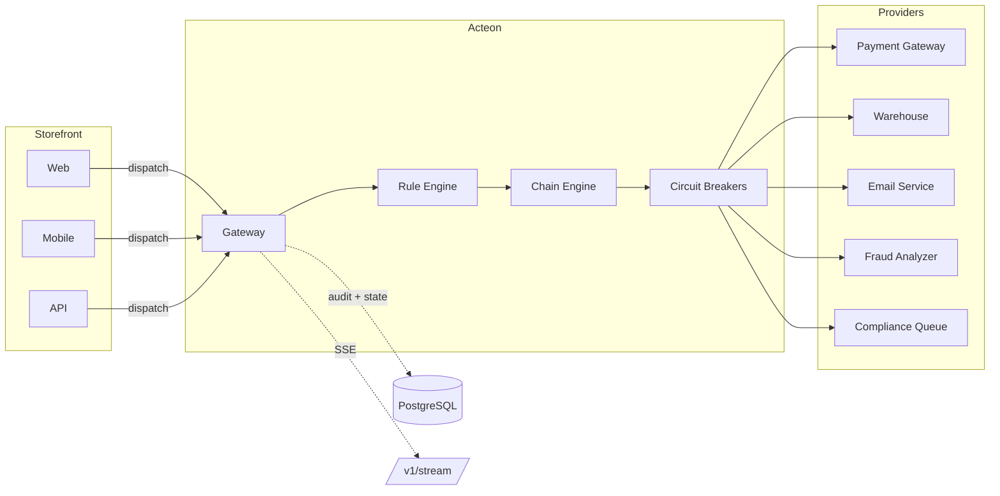
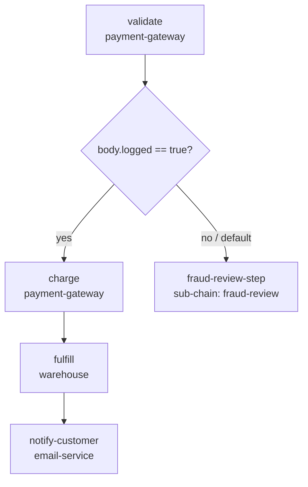
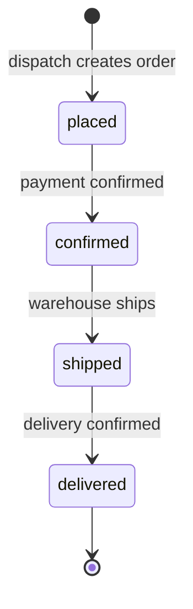

# E-Commerce Order Pipeline

This guide shows how to use Acteon as an **order processing orchestration layer**
for e-commerce platforms. Orders from storefronts flow through Acteon, which enforces
fraud screening, business-hours scheduling, rate limiting, and deduplication, then
routes approved orders through a multi-step processing chain with lifecycle tracking,
real-time SSE streaming, and a full audit trail with payment field redaction.

!!! tip "Runnable Example"
    The [`examples/ecommerce-order-pipeline/`](https://github.com/penserai/acteon/tree/main/examples/ecommerce-order-pipeline)
    directory contains a complete, runnable setup with PostgreSQL-backed state and
    audit, fraud rules, order processing chains, lifecycle management, and SSE
    streaming. Follow the quick start below to have the full pipeline running in minutes.



The scenario: an **e-commerce platform** accepts orders from web, mobile, and API
clients. Instead of building custom middleware for fraud checks, business-hours
routing, and order processing, all orders flow through Acteon. The rule engine
blocks sanctioned regions, requires approval for high-value orders, schedules
after-hours submissions, deduplicates double-clicks, and throttles abusive merchants
-- before routing approved orders through a multi-step fulfillment chain.

---

## What This Example Exercises

The example exercises **14 Acteon features** through a single unified scenario:

| # | Feature | How |
|---|---------|-----|
| 1 | **Chains** | `order-processing` chain: validate → charge → fulfill → notify-customer |
| 2 | **Sub-chains** | `fraud-review` sub-chain invoked when validation does not branch |
| 3 | **Conditional branching** | Branch on `body.logged` after validate step |
| 4 | **Deny** | Block orders from sanctioned regions (NK, SY, IR) |
| 5 | **Schedule** | After-hours orders delayed 30 seconds |
| 6 | **Time-based conditions** | `time.hour`, `time.weekday_num` with `US/Eastern` timezone |
| 7 | **Request approval** | Orders > $500 require manager approval (60s timeout) |
| 8 | **State machine** | Order lifecycle: placed → confirmed → shipped → delivered |
| 9 | **Throttle** | Max 10 orders/minute per merchant |
| 10 | **Dedup** | Same `dedup_key` deduplicated within 5 minutes |
| 11 | **Modify** | Chain payload templates enrich each step with order metadata |
| 12 | **Quotas** | 200 orders/hour per merchant via API |
| 13 | **Data retention** | Audit 14 days, events 3 days via API |
| 14 | **Audit + redaction** | Full audit with `card_last4`, `billing_zip`, `card_number` redacted |

---

## Prerequisites

- PostgreSQL (for durable state + audit)
- `jq` (for script output formatting)
- Rust 1.88+ and Cargo

---

## Quick Start

### 1. Start PostgreSQL

```bash
docker compose --profile postgres up -d
```

### 2. Run Database Migrations

```bash
scripts/migrate.sh -c examples/ecommerce-order-pipeline/acteon.toml
```

### 3. Start Acteon

```bash
cargo run -p acteon-server --features postgres -- \
  -c examples/ecommerce-order-pipeline/acteon.toml
```

Wait for `Listening on 127.0.0.1:8080`.

### 4. Create API Resources

```bash
cd examples/ecommerce-order-pipeline
bash scripts/setup.sh
```

This creates via the REST API:

- **Quota**: 200 orders/hour for `acme-store`
- **Retention policy**: audit 14 days, events 3 days

### 5. Fire Sample Orders

```bash
bash scripts/send-orders.sh
```

This sends 15 sample orders covering all categories (see [Expected Outcomes](#expected-outcomes)).

### 6. Manage Order Lifecycle

```bash
bash scripts/manage-order.sh
```

This demonstrates order state transitions: placed → confirmed → shipped → delivered.

### 7. SSE Streaming (Optional)

In a separate terminal, watch orders flow through in real time:

```bash
bash scripts/stream-orders.sh
```

This starts an SSE listener, dispatches 3 orders, and shows real-time events.

### 8. View the Report

```bash
bash scripts/show-report.sh
```

This queries 7 API endpoints and displays: audit trail with outcome breakdown,
chain status, order lifecycle events, provider health, quotas, retention policies,
and circuit breaker state.

### 9. Cleanup

```bash
bash scripts/teardown.sh
```

---

## Architecture

```
                    ┌─────────────────────────┐
  Storefront ──────►│    Acteon Gateway        │
  (Web, Mobile,     │                         │
   API clients)     │  Rules Engine           │
                    │  ┌─deny sanctioned───┐  │     ┌──────────────────┐
                    │  ├─approve >$500─────┤  │────►│ payment-gateway  │──┐ fallback
                    │  ├─schedule after-hrs─┤  │     ├──────────────────┤  │
                    │  ├─dedup 5min────────┤  │────►│ warehouse        │  │
                    │  └─throttle 10/min───┘  │     ├──────────────────┤  │
                    │                         │────►│ email-service    │  │
                    │  Chain Engine           │     ├──────────────────┤  │
                    │  ┌─validate───────────┐ │     │ fraud-analyzer   │  │
                    │  ├─fraud-review (sub)─┤ │     ├──────────────────┤  │
                    │  ├─charge─────────────┤ │     │ compliance-queue │◄─┘
                    │  ├─fulfill────────────┤ │     └──────────────────┘
                    │  └─notify-customer────┘ │
                    │                         │     ┌──────────────────┐
                    │  Background Jobs        │────►│ SSE /v1/stream   │
                    │  ├─scheduled actions   │     │ (real-time feed) │
                    │  └─retention reaper    │     └──────────────────┘
                    └─────────────────────────┘
```

The gateway acts as a single entry point for all order submissions. The rule engine
decides what happens to each order before any provider call is made. This means
you can add fraud rules, change business-hours windows, or tune throttle limits by
editing YAML rule files -- no code changes, no redeployment.

---

## Provider Configuration

The `acteon.toml` configures six log providers simulating real integrations:

```toml
# Payment gateway: card validation and charging
[[providers]]
name = "payment-gateway"
type = "log"

# Warehouse: order fulfillment and shipping
[[providers]]
name = "warehouse"
type = "log"

# Email: order confirmations and fraud alerts
[[providers]]
name = "email-service"
type = "log"

# SMS: delivery notifications (available for extensions)
[[providers]]
name = "sms-service"
type = "log"

# Fraud analyzer: deep scan for suspicious orders
[[providers]]
name = "fraud-analyzer"
type = "log"

# Compliance queue: flagged orders for manual review
[[providers]]
name = "compliance-queue"
type = "log"
```

The `payment-gateway` has a circuit breaker configured with `compliance-queue` as
the fallback:

```toml
[circuit_breaker]
enabled = true
failure_threshold = 3
success_threshold = 1
recovery_timeout_seconds = 30

[circuit_breaker.providers.payment-gateway]
failure_threshold = 2
recovery_timeout_seconds = 60
fallback_provider = "compliance-queue"
```

!!! note
    Log providers return `{"provider": "<name>", "logged": true}`. The chain engine
    uses `body.logged == true` for conditional branching. In production, replace these
    with real provider types (e.g., `type = "webhook"` for Stripe's API).

---

## Rule Design

Rules are split across three files by concern:

### Fraud Rules (`fraud.yaml`)

Fraud rules run at the highest priorities and form the **security gates**:

```yaml
rules:
  # Hard deny orders from sanctioned regions
  - name: deny-sanctioned-regions
    priority: 1
    description: "Block orders from sanctioned regions"
    condition:
      all:
        - field: action.action_type
          eq: "place_order"
        - field: action.payload.shipping_country
          in_list: ["NK", "SY", "IR"]
    action:
      type: deny

  # Require manager approval for orders over $500
  - name: approve-high-value
    priority: 3
    description: "Orders over $500 require manager approval"
    condition:
      all:
        - field: action.payload.total_cents
          gte: 50000
        - field: action.action_type
          eq: "place_order"
    action:
      type: request_approval
      notify_provider: email-service
      timeout_seconds: 60
      message: "High-value order requires manager approval"
```

The `deny-sanctioned-regions` rule at priority 1 ensures that orders from blocked
countries are rejected before any other processing. The `approve-high-value` rule
at priority 3 holds orders exceeding $500 for manager approval with a 60-second
timeout.

### Processing Rules (`processing.yaml`)

Processing rules handle business-hours scheduling, deduplication, and throttling:

```yaml
rules:
  # Queue orders placed outside business hours (9-17 ET Mon-Fri)
  - name: schedule-after-hours
    priority: 10
    timezone: "US/Eastern"
    condition:
      all:
        - field: action.action_type
          eq: "place_order"
        - any:
            - field: time.hour
              lt: 9
            - field: time.hour
              gte: 17
            - field: time.weekday_num
              gte: 6
    action:
      type: schedule
      delay_seconds: 30

  # Prevent double-submit of same order
  - name: dedup-double-submit
    priority: 15
    condition:
      field: action.action_type
      eq: "place_order"
    action:
      type: deduplicate
      ttl_seconds: 300

  # Max 10 orders per minute per merchant
  - name: throttle-merchant-orders
    priority: 20
    condition:
      field: action.action_type
      eq: "place_order"
    action:
      type: throttle
      max_count: 10
      window_seconds: 60
```

!!! info "Time-Based Conditions"
    The `schedule-after-hours` rule uses `time.hour` and `time.weekday_num` fields
    with the `US/Eastern` timezone. Orders placed before 9 AM, after 5 PM, or on
    weekends are delayed 30 seconds. Run `send-orders.sh` outside business hours
    to see `Scheduled` outcomes.

### Safety Rules (`safety.yaml`)

A catch-all rule ensures nothing slips through:

```yaml
rules:
  - name: deny-unmatched
    priority: 100
    description: "Block any action not matched by a higher-priority rule"
    condition:
      field: action.tenant
      eq: "acme-store"
    action:
      type: suppress
```

### Rule Evaluation Order

Rules are evaluated by priority (lowest number = highest priority). The first
matching terminal rule determines the outcome. Acteon uses **first-match-wins**
semantics:

| Priority | Rule | File | Action |
|----------|------|------|--------|
| 1 | `deny-sanctioned-regions` | fraud.yaml | Deny |
| 3 | `approve-high-value` | fraud.yaml | Request approval (60s) |
| 10 | `schedule-after-hours` | processing.yaml | Schedule (30s delay) |
| 15 | `dedup-double-submit` | processing.yaml | Deduplicate 5min |
| 20 | `throttle-merchant-orders` | processing.yaml | Throttle 10/min |
| 100 | `deny-unmatched` | safety.yaml | Suppress (catch-all) |

Each order matches exactly one rule. More specific conditions (sanctioned regions,
high-value) are evaluated first to ensure security gates fire before general processing.

---

## Chain Orchestration

### Main Chain: `order-processing`

The `order-processing` chain handles orders through 4 steps, with an optional
sub-chain for fraud review:



```toml
[[chains.definitions]]
name = "order-processing"
timeout_seconds = 120

[[chains.definitions.steps]]
name = "validate"
provider = "payment-gateway"
action_type = "validate_order"
payload_template = {
    order_id = "{{origin.payload.order_id}}",
    total_cents = "{{origin.payload.total_cents}}",
    currency = "{{origin.payload.currency}}"
}

  [[chains.definitions.steps.branches]]
  field = "body.logged"
  operator = "eq"
  value = true
  target = "charge"

[[chains.definitions.steps]]
name = "fraud-review-step"
sub_chain = "fraud-review"

[[chains.definitions.steps]]
name = "charge"
provider = "payment-gateway"
action_type = "charge_card"
payload_template = {
    order_id = "{{origin.payload.order_id}}",
    total_cents = "{{origin.payload.total_cents}}",
    card_last4 = "{{origin.payload.card_last4}}"
}

[[chains.definitions.steps]]
name = "fulfill"
provider = "warehouse"
action_type = "ship_order"
payload_template = {
    order_id = "{{origin.payload.order_id}}",
    shipping_country = "{{origin.payload.shipping_country}}",
    items = "{{origin.payload.items}}"
}

[[chains.definitions.steps]]
name = "notify-customer"
provider = "email-service"
action_type = "order_confirmation"
payload_template = {
    order_id = "{{origin.payload.order_id}}",
    customer_email = "{{origin.payload.customer_email}}"
}
```

### Sub-Chain: `fraud-review`

When validation does not produce a branch match (i.e., the payment gateway returns
an unexpected response), the chain falls through to the fraud-review sub-chain for
deeper analysis:

```toml
[[chains.definitions]]
name = "fraud-review"
timeout_seconds = 60

[[chains.definitions.steps]]
name = "analyze"
provider = "fraud-analyzer"
action_type = "deep_scan"
payload_template = {
    order_id = "{{origin.payload.order_id}}",
    total_cents = "{{origin.payload.total_cents}}",
    shipping_country = "{{origin.payload.shipping_country}}"
}

[[chains.definitions.steps]]
name = "flag-compliance"
provider = "compliance-queue"
action_type = "review_request"
payload_template = {
    order_id = "{{origin.payload.order_id}}",
    reason = "high_value"
}

[[chains.definitions.steps]]
name = "notify-merchant"
provider = "email-service"
action_type = "fraud_alert"
payload_template = {
    order_id = "{{origin.payload.order_id}}",
    merchant = "{{origin.tenant}}"
}
```

---

## Order Lifecycle (State Machine)

The `manage-order.sh` script demonstrates Acteon's event state machine for tracking
orders through their lifecycle:



Each transition is driven by an API call:

```bash
# Confirm payment
curl -X PUT "http://localhost:8080/v1/events/order-lifecycle-001/transition" \
  -H "Content-Type: application/json" \
  -d '{"to": "confirmed", "namespace": "ecommerce", "tenant": "acme-store"}'

# Ship order
curl -X PUT "http://localhost:8080/v1/events/order-lifecycle-001/transition" \
  -H "Content-Type: application/json" \
  -d '{"to": "shipped", "namespace": "ecommerce", "tenant": "acme-store"}'

# Confirm delivery
curl -X PUT "http://localhost:8080/v1/events/order-lifecycle-001/transition" \
  -H "Content-Type: application/json" \
  -d '{"to": "delivered", "namespace": "ecommerce", "tenant": "acme-store"}'
```

---

## Real-Time SSE Streaming

The `stream-orders.sh` script demonstrates real-time event streaming via Server-Sent
Events. Orders dispatched to Acteon generate SSE events that clients can consume:

```bash
# Start listening for order events
curl -N "http://localhost:8080/v1/stream?namespace=ecommerce"
```

The demo script starts a background SSE listener, dispatches 3 orders (2 standard,
1 sanctioned), and shows the events arriving in real time. This is useful for
building live dashboards or order tracking UIs.

---

## Audit Trail and Redaction

Every dispatched order is recorded in the PostgreSQL audit backend with full outcome
details. Sensitive payment fields are automatically redacted:

```toml
[audit]
enabled = true
backend = "postgres"
url = "postgres://localhost:5432/acteon"
store_payload = true
ttl_seconds = 1209600  # 14 days

[audit.redact]
enabled = true
fields = ["card_last4", "billing_zip", "card_number"]
placeholder = "[REDACTED]"
```

Query the audit trail to see what happened:

```bash
# All dispatches
curl -s "http://localhost:8080/v1/audit?namespace=ecommerce&tenant=acme-store&limit=50" | jq .

# Only denied actions (sanctioned regions)
curl -s "http://localhost:8080/v1/audit?namespace=ecommerce&tenant=acme-store&outcome=suppressed" | jq .

# Only orders that required approval
curl -s "http://localhost:8080/v1/audit?namespace=ecommerce&tenant=acme-store&outcome=pending_approval" | jq .
```

---

## Expected Outcomes

When running `send-orders.sh`, you should see these outcomes:

| Orders | Count | Expected Outcome |
|--------|-------|-----------------|
| Standard ($50-$200) | 3 | `Executed` (pass dedup + throttle gates) |
| High-value (>$500) | 2 | `PendingApproval` (requires manager approval) |
| Sanctioned region (NK, SY) | 2 | `Suppressed` (denied by fraud rule) |
| Duplicate (same dedup_key) | 2 | 1 `Executed`, 1 `Deduplicated` |
| Rapid-fire | 3 | `Executed` (new dedup_key each, under throttle limit) |
| After-hours | 3 | `Scheduled` (if run outside 9-17 ET Mon-Fri) |

!!! info "Business Hours"
    The after-hours orders will show `Scheduled` only if you run the script outside
    9 AM - 5 PM Eastern, Monday through Friday. During business hours, they pass
    through to the dedup and throttle rules instead.

---

## File Structure

```
ecommerce-order-pipeline/
├── acteon.toml              # Server config (chains, circuit breakers, background, audit)
├── rules/
│   ├── fraud.yaml           # Deny sanctioned, approve high-value
│   ├── processing.yaml      # Schedule after-hours, dedup, throttle
│   └── safety.yaml          # Catch-all suppress
├── scripts/
│   ├── setup.sh             # Create quotas + retention via API
│   ├── send-orders.sh       # Fire 15 sample orders exercising all features
│   ├── manage-order.sh      # Transition orders through lifecycle via API
│   ├── stream-orders.sh     # SSE streaming demo (real-time order events)
│   ├── show-report.sh       # Query audit/chains/events/quotas/retention summary
│   └── teardown.sh          # Clean up API-created resources
└── README.md
```

---

## Extending the Pipeline

### Adding Stripe Payment Processing

Replace the log provider with a webhook targeting Stripe's API:

```toml
[[providers]]
name = "payment-gateway"
type = "webhook"
url = "https://api.stripe.com/v1/charges"
headers = { "Authorization" = "Bearer sk_live_xxx", "Content-Type" = "application/x-www-form-urlencoded" }
```

### Adding Inventory Checks

Add a chain step that checks inventory before fulfillment:

```toml
[[chains.definitions.steps]]
name = "check-inventory"
provider = "warehouse"
action_type = "inventory_check"
payload_template = {
    items = "{{origin.payload.items}}",
    warehouse_region = "{{origin.payload.shipping_country}}"
}

  [[chains.definitions.steps.branches]]
  field = "body.in_stock"
  operator = "eq"
  value = true
  target = "fulfill"

  default_next = "notify-backorder"
```

### Adding Webhook Notifications for Order Status

Add a webhook provider to notify external systems of order state changes:

```toml
[[providers]]
name = "order-webhooks"
type = "webhook"
url = "https://your-app.example.com/webhooks/orders"
headers = { "Content-Type" = "application/json" }
```

Then add a rule to route order lifecycle events:

```yaml
- name: notify-order-status
  priority: 8
  condition:
    all:
      - field: action.action_type
        eq: "order_status_change"
  action:
    type: reroute
    target_provider: "order-webhooks"
```

---

## Production Considerations

### Timezone Configuration

The `default_timezone` in the rules section ensures consistent business-hours
evaluation regardless of the server's system timezone:

```toml
[rules]
directory = "examples/ecommerce-order-pipeline/rules"
default_timezone = "US/Eastern"
```

For global deployments, use per-rule timezone overrides:

```yaml
- name: schedule-emea-after-hours
  priority: 10
  timezone: "Europe/London"
  condition:
    all:
      - field: action.payload.region
        eq: "EMEA"
      - any:
          - field: time.hour
            lt: 9
          - field: time.hour
            gte: 17
  action:
    type: schedule
    delay_seconds: 30
```

### Approval Workflow

The `approval_secret` in the server config is used to generate HMAC-signed approval
URLs. In production, use a strong random hex string:

```toml
[server]
approval_secret = "<64-hex-char-random-string>"
```

When a high-value order triggers `request_approval`, the server logs the approval
URL. Integrate with your admin UI or Slack bot to surface these URLs to managers.

### Monitoring

Use the [Grafana dashboards](../features/grafana-dashboards.md) to monitor:

- Order throughput and rejection rates
- Approval queue depth and timeout rates
- Chain completion times per step
- Dedup and throttle hit rates
- Payment gateway circuit breaker state

---

## Comparison: Acteon vs Custom Order Pipeline

| Capability | Custom (Stripe + SQS + Lambda) | Acteon |
|-----------|-------------------------------|--------|
| Fraud screening | Custom Lambda logic | YAML rules (no code) |
| Sanctioned region blocking | IP/country checks in API layer | Rule with `in_list` condition |
| High-value approval | Custom approval UI + Lambda | Built-in with HMAC-signed URLs |
| Business-hours scheduling | CloudWatch Events + custom logic | Time-based rule conditions |
| Deduplication | Custom DynamoDB logic | Built-in with configurable TTL |
| Rate limiting | API Gateway throttling | Per-tenant, per-action-type throttle |
| Order lifecycle tracking | Custom state machine in DynamoDB | Built-in event state API |
| Audit trail | Custom CloudWatch/DynamoDB logging | Built-in with field redaction |
| Real-time streaming | Custom WebSocket server | Built-in SSE endpoint |
| Multi-step fulfillment | Step Functions ($0.025/1000) | Built-in chains (no extra cost) |
| Configuration changes | Code deploy required | YAML edit + hot reload |

Acteon replaces the "middleware" between your storefront and payment/fulfillment
providers. Instead of writing Lambda functions for fraud checks, scheduling,
deduplication, and orchestration, you declare these behaviors in YAML rules and
TOML configuration.
