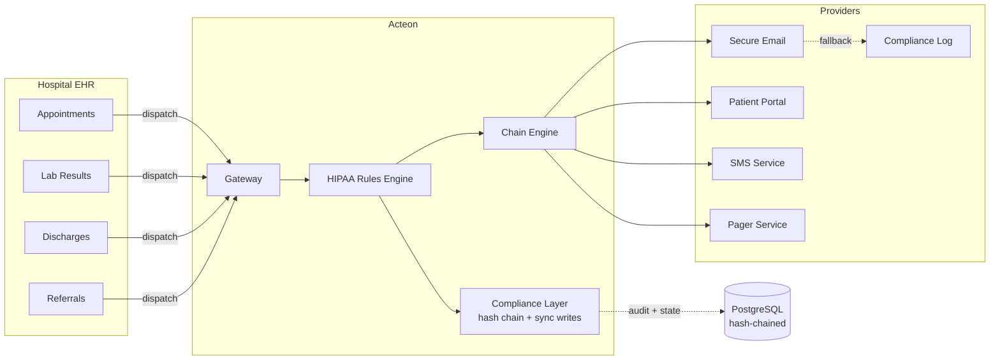
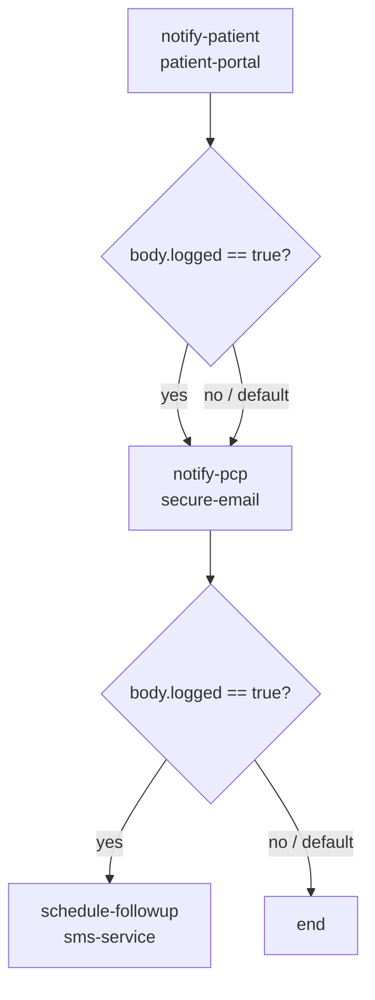

# Healthcare Notification Pipeline

This guide shows how to use Acteon as a **HIPAA-compliant notification gateway**
for healthcare organizations. Patient notifications (appointment reminders, lab
results, discharge summaries) flow through Acteon, which detects and blocks Protected
Health Information (PHI) over insecure channels, reroutes sensitive data to the
patient portal, requires compliance officer approval for external sharing, and
maintains a tamper-evident hash-chained audit trail of every notification attempt
-- including blocked ones.

!!! tip "Runnable Example"
    The [`examples/healthcare-notification-pipeline/`](https://github.com/penserai/acteon/tree/main/examples/healthcare-notification-pipeline)
    directory contains a complete, runnable setup with PostgreSQL-backed state and
    audit, HIPAA compliance mode, PHI detection rules, discharge workflow chains,
    and hash chain verification. Follow the quick start below to have the full
    pipeline running in minutes.



The scenario: **Metro General Hospital** sends patient notifications across multiple
channels -- encrypted email, SMS, patient portal, and pager. HIPAA regulations
require that Protected Health Information (PHI) never travels over insecure channels.
Instead of building custom middleware to detect and block PHI, all notifications
flow through Acteon. The rule engine uses regex patterns and keyword matching to
detect SSNs, MRNs, ICD codes, and clinical terms, then suppresses, reroutes, or
holds notifications based on channel security and recipient type.

---

## What This Example Exercises

The example exercises **15 Acteon features** through a single unified scenario:

| # | Feature | How |
|---|---------|-----|
| 1 | **HIPAA compliance mode** | `mode = "hipaa"` enables sync writes + immutable audit + hash chain |
| 2 | **Hash chain integrity** | SHA-256 hash chain verified via `POST /v1/audit/verify` |
| 3 | **Immutable audit records** | HIPAA mode prevents deletion of audit records |
| 4 | **Synchronous audit writes** | Every notification attempt recorded inline before response |
| 5 | **Audit field redaction** | PHI fields (mrn, ssn, diagnosis, medication) redacted with `[PHI_REDACTED]` |
| 6 | **Suppress** | Block PHI in SMS and unencrypted email |
| 7 | **Reroute** | PHI notifications redirected to secure patient portal |
| 8 | **Request approval** | External PHI sharing requires compliance officer sign-off (1h timeout) |
| 9 | **Chains** | `discharge-workflow`: notify-patient → notify-pcp → schedule-followup |
| 10 | **Deduplication** | Duplicate appointment reminders within 5-minute window |
| 11 | **Grouping** | Routine lab results batched by `patient_id` (60s window) |
| 12 | **Quotas** | 200 notifications/hour per hospital |
| 13 | **Retention + compliance hold** | 90-day audit, 7-day events, no auto-deletion |
| 14 | **Circuit breaker + fallback** | secure-email → compliance-log on failure |
| 15 | **Modify/enrich** | Add `hipaa_compliant` and `audit_required` metadata to all actions |

---

## Prerequisites

- PostgreSQL (for durable state + audit with hash chaining)
- `jq` (for script output formatting)
- Rust 1.88+ and Cargo

---

## Quick Start

### 1. Start PostgreSQL

```bash
docker compose --profile postgres up -d
```

### 2. Run Database Migrations

```bash
scripts/migrate.sh -c examples/healthcare-notification-pipeline/acteon.toml
```

### 3. Start Acteon with HIPAA Compliance Mode

```bash
cargo run -p acteon-server --features postgres -- \
  -c examples/healthcare-notification-pipeline/acteon.toml
```

Wait for `Listening on 127.0.0.1:8080`. You should see a log line confirming
HIPAA compliance mode is active.

### 4. Create API Resources

```bash
cd examples/healthcare-notification-pipeline
bash scripts/setup.sh
```

This creates via the REST API:

- **Retention policy**: audit 90 days, events 7 days, compliance hold enabled
- **Quota**: 200 notifications/hour for `metro-hospital`

### 5. Fire Sample Notifications

```bash
bash scripts/send-notifications.sh
```

This sends ~21 sample notifications covering all categories (see [Expected Outcomes](#expected-outcomes)).

### 6. Verify HIPAA Compliance

```bash
bash scripts/verify-compliance.sh
```

This checks compliance mode status and verifies the audit hash chain integrity.

### 7. View the Report

```bash
bash scripts/show-report.sh
```

This queries 7 API endpoints and displays: audit trail with outcome breakdown,
chain status, provider health, quotas, event groups, retention policies, compliance
status, and a summary table comparing expected vs actual outcomes.

---

## Architecture

```
                    ┌──────────────────────────┐
  Hospital EHR ───►│   Acteon Gateway          │
  (appointments,    │                          │
   lab results,     │  HIPAA Rules Engine      │
   discharges)      │  ┌─block PHI in SMS────┐ │     ┌────────────────┐
                    │  ├─block PHI unencrypt──┤ │────►│ secure-email    │──┐ fallback
                    │  ├─approval ext PHI─────┤ │     ├────────────────┤  │
                    │  ├─reroute PHI→portal───┤ │────►│ patient-portal  │  │
                    │  ├─dedup notifications──┤ │     ├────────────────┤  │
                    │  ├─enrich HIPAA hdrs────┤ │────►│ sms-service     │  │
                    │  ├─group routine labs───┤ │     ├────────────────┤  │
                    │  └─chain discharge──────┘ │────►│ pager-service   │  │
                    │                          │     ├────────────────┤  │
                    │  Compliance Layer         │     │ compliance-log  │◄─┘
                    │  ├─hash chain (SHA-256)  │     └────────────────┘
                    │  ├─sync audit writes     │
                    │  ├─immutable records     │
                    │  └─PHI field redaction   │
                    │                          │
                    │  Background Jobs          │
                    │  ├─group flush (10s)     │
                    │  ├─retention reaper      │
                    │  └─timeout processing    │
                    └──────────────────────────┘
```

The gateway acts as a single entry point for all hospital notifications. The HIPAA
rules engine inspects every notification for PHI before any provider call is made.
The compliance layer ensures that every attempt -- including blocked ones -- is
recorded in a tamper-evident, hash-chained audit trail. This means you can add
new PHI detection patterns, change channel security policies, or update approval
workflows by editing YAML rules -- no code changes, no redeployment.

---

## Compliance Mode

The `[compliance]` section enables HIPAA mode, which activates three guarantees:

```toml
[compliance]
mode = "hipaa"
```

| Guarantee | Description |
|-----------|-------------|
| **Synchronous audit writes** | Every notification attempt is written to the audit backend inline, before the HTTP response is returned. No fire-and-forget. |
| **Immutable audit records** | Audit records cannot be deleted via the API. Even admin users cannot purge records. |
| **Hash chain integrity** | Each audit record includes a SHA-256 hash of the previous record, forming a tamper-evident chain. Verify with `POST /v1/audit/verify`. |

These guarantees together satisfy the HIPAA requirement for a complete, tamper-evident
record of all access to PHI -- including denied access attempts.

### Verifying Hash Chain Integrity

```bash
curl -X POST "http://localhost:8080/v1/audit/verify" \
  -H "Content-Type: application/json" \
  -d '{"namespace": "healthcare", "tenant": "metro-hospital"}'
```

Response:

```json
{
  "valid": true,
  "records_checked": 21,
  "first_record_id": "...",
  "last_record_id": "...",
  "first_broken_at": null
}
```

If any record has been tampered with, `valid` will be `false` and `first_broken_at`
will identify the corrupted record.

---

## Provider Configuration

The `acteon.toml` configures five providers -- all log providers for demo purposes:

```toml
# Encrypted email (TLS + S/MIME in production)
[[providers]]
name = "secure-email"
type = "log"

# Patient-facing portal (always considered secure)
[[providers]]
name = "patient-portal"
type = "log"

# SMS gateway (considered insecure for PHI)
[[providers]]
name = "sms-service"
type = "log"

# On-call paging (for urgent notifications)
[[providers]]
name = "pager-service"
type = "log"

# Compliance audit log (circuit breaker fallback)
[[providers]]
name = "compliance-log"
type = "log"
```

The `secure-email` provider has a circuit breaker configured to fall back to
`compliance-log`:

```toml
[circuit_breaker]
enabled = true
failure_threshold = 3

[circuit_breaker.providers.secure-email]
failure_threshold = 2
recovery_timeout_seconds = 60
fallback_provider = "compliance-log"
```

!!! note
    Log providers return `{"provider": "<name>", "logged": true}`. In production,
    replace these with real provider types (e.g., `type = "email"` with SES backend
    for encrypted email, `type = "webhook"` for the patient portal API).

---

## Rule Design

Rules are split across three files by concern:

### HIPAA Rules (`hipaa.yaml`)

HIPAA rules run at the highest priorities and form the **PHI protection layer**:

```yaml
rules:
  # Block PHI in SMS messages
  - name: block-phi-in-sms
    priority: 1
    description: "Block notifications containing PHI sent via SMS"
    condition:
      all:
        - field: action.tenant
          eq: "metro-hospital"
        - field: action.provider
          eq: "sms-service"
        - any:
            - field: action.payload.body
              matches: "\\b\\d{3}-\\d{2}-\\d{4}\\b"      # SSN pattern
            - field: action.payload.body
              matches: "\\bMRN[:\\s]*\\d{6,}\\b"           # MRN pattern
            - field: action.payload.body
              matches: "\\bICD-?\\d{1,2}[.\\d]*\\b"       # ICD codes
            - field: action.payload.body
              contains: "diagnosis"
            - field: action.payload.body
              contains: "medication"
    action:
      type: suppress

  # Block PHI in unencrypted email
  - name: block-phi-unencrypted-email
    priority: 2
    description: "Block PHI sent via email unless encryption is enabled"
    condition:
      all:
        - field: action.tenant
          eq: "metro-hospital"
        - field: action.provider
          eq: "secure-email"
        - field: action.payload.encrypted
          ne: true
        - any:
            - field: action.payload.body
              matches: "\\b\\d{3}-\\d{2}-\\d{4}\\b"
            - field: action.payload.body
              matches: "\\bMRN[:\\s]*\\d{6,}\\b"
            - field: action.payload.body
              matches: "\\bICD-?\\d{1,2}[.\\d]*\\b"
            - field: action.payload.body
              contains: "diagnosis"
            - field: action.payload.body
              contains: "medication"
    action:
      type: suppress

  # External PHI sharing requires compliance officer approval
  - name: require-approval-external-phi
    priority: 3
    description: "External PHI sharing requires compliance officer approval"
    condition:
      all:
        - field: action.tenant
          eq: "metro-hospital"
        - field: action.payload.recipient_type
          eq: "external"
        - any:
            - field: action.payload.body
              matches: "\\b\\d{3}-\\d{2}-\\d{4}\\b"
            - field: action.payload.body
              matches: "\\bMRN[:\\s]*\\d{6,}\\b"
            - field: action.payload.body
              contains: "diagnosis"
    action:
      type: request_approval
      notify_provider: "compliance-log"
      timeout_seconds: 3600
      message: "External PHI sharing requires compliance officer approval"

  # Reroute PHI to secure patient portal
  - name: reroute-phi-to-portal
    priority: 4
    description: "Reroute PHI-containing notifications to the patient portal"
    condition:
      all:
        - field: action.tenant
          eq: "metro-hospital"
        - field: action.payload.encrypted
          ne: true
        - any:
            - field: action.provider
              eq: "sms-service"
            - field: action.provider
              eq: "secure-email"
        - any:
            - field: action.payload.body
              contains: "lab result"
            - field: action.payload.body
              contains: "test result"
            - field: action.payload.body
              contains: "medical record"
    action:
      type: reroute
      target_provider: "patient-portal"
```

The PHI detection rules use a layered approach:

1. **Priority 1-2**: Hard block PHI on insecure channels (SMS, unencrypted email)
2. **Priority 3**: Hold external PHI sharing for compliance officer approval
3. **Priority 4**: Reroute remaining PHI mentions to the secure patient portal

!!! info "PHI Detection Patterns"
    The rules detect PHI using regex patterns for SSN (`\d{3}-\d{2}-\d{4}`),
    MRN (`MRN:\d{6,}`), and ICD codes (`ICD-\d{1,2}[.\d]*`), plus keyword
    matching for `diagnosis` and `medication`. In production, you would extend
    these patterns to cover additional PHI categories defined by HIPAA.

### Routing Rules (`routing.yaml`)

Routing rules handle deduplication, grouping, discharge chains, and enrichment:

```yaml
rules:
  # Deduplicate identical notifications within 5 minutes
  - name: dedup-notifications
    priority: 5
    condition:
      all:
        - field: action.tenant
          eq: "metro-hospital"
        - field: action.action_type
          eq: "notification"
    action:
      type: deduplicate
      ttl_seconds: 300

  # Batch routine lab results by patient, 60s window
  - name: group-routine-labs
    priority: 6
    condition:
      all:
        - field: action.tenant
          eq: "metro-hospital"
        - field: action.action_type
          eq: "lab_result"
        - field: action.payload.priority
          eq: "routine"
    action:
      type: group
      group_by:
        - payload.patient_id
      group_wait_seconds: 60

  # Start discharge workflow chain
  - name: chain-discharge
    priority: 7
    condition:
      all:
        - field: action.tenant
          eq: "metro-hospital"
        - field: action.action_type
          eq: "discharge_summary"
    action:
      type: chain
      chain: "discharge-workflow"

  # Enrich all actions with HIPAA compliance metadata
  - name: enrich-hipaa-headers
    priority: 9
    condition:
      field: action.tenant
      eq: "metro-hospital"
    action:
      type: modify
      changes:
        hipaa_compliant: true
        audit_required: true

  # Allow all remaining clinical actions
  - name: allow-clinical
    priority: 10
    condition:
      field: action.tenant
      eq: "metro-hospital"
    action:
      type: allow
```

### Safety Rules (`safety.yaml`)

A catch-all rule ensures nothing slips through:

```yaml
rules:
  - name: deny-unmatched
    priority: 100
    condition:
      field: action.tenant
      eq: "metro-hospital"
    action:
      type: suppress
```

### Rule Evaluation Order

| Priority | Rule | File | Action |
|----------|------|------|--------|
| 1 | `block-phi-in-sms` | hipaa.yaml | Suppress |
| 2 | `block-phi-unencrypted-email` | hipaa.yaml | Suppress |
| 3 | `require-approval-external-phi` | hipaa.yaml | Request approval (1h) |
| 4 | `reroute-phi-to-portal` | hipaa.yaml | Reroute → patient-portal |
| 5 | `dedup-notifications` | routing.yaml | Deduplicate 5min |
| 6 | `group-routine-labs` | routing.yaml | Group by patient_id, 60s |
| 7 | `chain-discharge` | routing.yaml | Chain → discharge-workflow |
| 9 | `enrich-hipaa-headers` | routing.yaml | Modify (add HIPAA metadata) |
| 10 | `allow-clinical` | routing.yaml | Allow |
| 100 | `deny-unmatched` | safety.yaml | Suppress (catch-all) |

---

## Chain Orchestration

### Discharge Workflow

The `discharge-workflow` chain handles patient discharge notifications through
three steps with conditional branching:



```toml
[[chains.definitions]]
name = "discharge-workflow"
timeout_seconds = 300

[[chains.definitions.steps]]
name = "notify-patient"
provider = "patient-portal"
action_type = "discharge_notification"
payload_template = {
    patient_id = "{{origin.payload.patient_id}}",
    discharge_date = "{{origin.payload.discharge_date}}",
    instructions = "Please review your discharge summary in the patient portal."
}

  [[chains.definitions.steps.branches]]
  field = "body.logged"
  operator = "eq"
  value = true
  target = "notify-pcp"

[[chains.definitions.steps]]
name = "notify-pcp"
provider = "secure-email"
action_type = "pcp_notification"
payload_template = {
    patient_id = "{{origin.payload.patient_id}}",
    pcp_name = "{{origin.payload.pcp_name}}",
    summary = "Patient discharged — see portal for details.",
    encrypted = true
}

  [[chains.definitions.steps.branches]]
  field = "body.logged"
  operator = "eq"
  value = true
  target = "schedule-followup"

[[chains.definitions.steps]]
name = "schedule-followup"
provider = "sms-service"
action_type = "followup_reminder"
payload_template = {
    patient_id = "{{origin.payload.patient_id}}",
    message = "Your follow-up appointment has been scheduled. Check your patient portal for details."
}
```

Note that the PCP notification uses `encrypted = true` in the payload template,
ensuring the chain step passes the HIPAA email encryption check. The follow-up
SMS intentionally contains no PHI -- just a pointer to the portal.

---

## Audit Trail and PHI Redaction

Every dispatched notification is recorded in the PostgreSQL audit backend. PHI
fields are automatically replaced with `[PHI_REDACTED]` before storage:

```toml
[audit]
enabled = true
backend = "postgres"
url = "postgres://localhost:5432/acteon"
store_payload = true
ttl_seconds = 7776000  # 90 days

[audit.redact]
enabled = true
fields = ["mrn", "ssn", "date_of_birth", "diagnosis", "medication", "insurance_id"]
placeholder = "[PHI_REDACTED]"
```

!!! warning "PHI Never Persisted"
    The original PHI values are redacted in-memory before the audit record is
    written to PostgreSQL. The unredacted data never touches disk. This satisfies
    the HIPAA minimum necessary standard -- the audit trail proves what happened
    without storing the PHI itself.

Query the audit trail:

```bash
# All dispatches
curl -s "http://localhost:8080/v1/audit?namespace=healthcare&tenant=metro-hospital&limit=50" | jq .

# Only suppressed (PHI blocked)
curl -s "http://localhost:8080/v1/audit?namespace=healthcare&tenant=metro-hospital&outcome=suppressed" | jq .

# Only approval-pending (external PHI)
curl -s "http://localhost:8080/v1/audit?namespace=healthcare&tenant=metro-hospital&outcome=pending_approval" | jq .
```

---

## Retention and Compliance Hold

The retention policy uses `compliance_hold = true` to prevent the retention reaper
from auto-deleting audit records, even after the 90-day TTL expires:

```bash
curl -X POST "http://localhost:8080/v1/retention" \
  -H "Content-Type: application/json" \
  -d '{
    "namespace": "healthcare",
    "tenant": "metro-hospital",
    "enabled": true,
    "audit_ttl_seconds": 7776000,
    "event_ttl_seconds": 604800,
    "compliance_hold": true,
    "description": "HIPAA: 90-day audit, 7-day events, no auto-deletion"
  }'
```

| Field | Value | Purpose |
|-------|-------|---------|
| `audit_ttl_seconds` | 7776000 (90 days) | HIPAA minimum retention period |
| `event_ttl_seconds` | 604800 (7 days) | Clean up resolved event state |
| `compliance_hold` | `true` | Prevent deletion even after TTL expires |

When `compliance_hold` is active, the retention reaper skips this tenant entirely.
Records are preserved indefinitely until a compliance officer explicitly removes
the hold and triggers cleanup.

---

## Expected Outcomes

When running `send-notifications.sh`, you should see these outcomes:

| Notifications | Count | Expected Outcome |
|---------------|-------|-----------------|
| Appointment reminders (no PHI) | 3 | `executed` |
| Lab results with PHI via SMS | 3 | `suppressed` (PHI in SMS) |
| Lab results with PHI, unencrypted email | 2 | `suppressed` (unencrypted) |
| Lab results with PHI, encrypted email | 2 | `executed` |
| External referral with PHI | 2 | `pending_approval` |
| PHI rerouted to portal | 2 | `rerouted` → patient-portal |
| Routine lab results | 3 | `grouped` by patient_id |
| Discharge summaries | 2 | `chain_started` |
| Duplicate appointment | 2 | 1 `executed`, 1 `deduplicated` |

The `show-report.sh` script displays a summary table comparing expected vs actual
counts for each category.

---

## File Structure

```
healthcare-notification-pipeline/
├── acteon.toml              # Server config (HIPAA mode, audit redaction, chains, circuit breakers)
├── rules/
│   ├── hipaa.yaml           # PHI detection: suppress, reroute, require approval
│   ├── routing.yaml         # Dedup, enrich HIPAA headers, group labs, chain discharge
│   └── safety.yaml          # Catch-all deny
├── scripts/
│   ├── setup.sh             # Create retention policy + quota via API
│   ├── send-notifications.sh # Fire ~21 sample notifications
│   ├── verify-compliance.sh # Check HIPAA mode + verify hash chain integrity
│   └── show-report.sh       # Query audit/chains/health/quotas/groups + summary table
└── README.md
```

---

## Extending the Pipeline

### Adding HIPAA-Compliant SMS

In production, use a provider that supports encrypted SMS (e.g., TigerConnect):

```toml
[[providers]]
name = "secure-sms"
type = "webhook"
url = "https://api.tigerconnect.com/v2/messages"
headers = { "Content-Type" = "application/json" }
```

Then update the HIPAA rules to allow PHI over the secure SMS channel:

```yaml
- name: allow-phi-secure-sms
  priority: 1
  condition:
    all:
      - field: action.provider
        eq: "secure-sms"
      - field: action.payload.encrypted
        eq: true
  action:
    type: allow
```

### Adding Break-the-Glass Emergency Access

For emergency situations where PHI must be sent immediately regardless of channel
security:

```yaml
- name: emergency-override
  priority: 0
  description: "Emergency: bypass PHI checks for life-threatening situations"
  condition:
    all:
      - field: action.tenant
        eq: "metro-hospital"
      - field: action.payload.emergency_code
        eq: "CODE_BLUE"
  action:
    type: allow
```

!!! warning
    Emergency overrides should be paired with additional audit logging. Every
    emergency access is recorded in the hash-chained audit trail for post-hoc
    review by the compliance team.

### Adding Consent-Based Routing

Route notifications based on patient consent preferences stored in the payload:

```yaml
- name: route-by-consent
  priority: 5
  condition:
    all:
      - field: action.payload.consent_sms
        eq: true
      - field: action.payload.phi_present
        ne: true
  action:
    type: reroute
    target_provider: "sms-service"
```

---

## Production Considerations

### Real Email Encryption

Replace the log provider with SES and enable S/MIME or TLS enforcement:

```toml
[[providers]]
name = "secure-email"
type = "email"
backend = "ses"
from_address = "notifications@metrogeneral.example.com"
aws_region = "us-east-1"
```

The `encrypted` field in payloads should map to your email provider's encryption
settings (TLS-required, S/MIME, or PGP).

### Multi-Facility Deployment

Use tenant isolation to manage multiple hospitals under one Acteon instance:

```yaml
# Metro General
- name: block-phi-metro
  priority: 1
  condition:
    all:
      - field: action.tenant
        eq: "metro-hospital"
      # ... PHI patterns

# Riverside Medical
- name: block-phi-riverside
  priority: 1
  condition:
    all:
      - field: action.tenant
        eq: "riverside-medical"
      # ... PHI patterns
```

Each facility gets its own quota, retention policy, and compliance verification
endpoint.

### Monitoring

Use the [Grafana dashboards](../features/grafana-dashboards.md) to monitor:

- PHI suppression rates by channel (SMS vs email)
- Approval queue depth and timeout rates
- Discharge chain completion times
- Hash chain verification status
- Quota usage per facility

### SOC 2 Compliance

The HIPAA compliance mode also satisfies SOC 2 Type II requirements for:

- **CC6.1**: Logical access controls (rule-based channel restrictions)
- **CC7.2**: System monitoring (hash-chained audit trail)
- **CC8.1**: Change management (YAML rules with version control)

---

## Comparison: Acteon vs Custom HIPAA Pipeline

| Capability | Custom (Lambda + SES + DynamoDB) | Acteon |
|-----------|--------------------------------|--------|
| PHI detection | Custom Lambda regex logic | YAML rules with regex + keyword matching |
| Channel security enforcement | Custom middleware per channel | Rule-based suppress/reroute per provider |
| Approval workflows | Custom UI + SNS + Lambda | Built-in with HMAC-signed URLs |
| Audit trail | Custom DynamoDB + CloudWatch | Built-in hash-chained, immutable audit |
| Tamper detection | Custom hash verification | Built-in `POST /v1/audit/verify` |
| PHI field redaction | Custom redaction in each Lambda | Built-in with configurable field list |
| Compliance hold | Custom TTL bypass logic | Built-in `compliance_hold` flag |
| Multi-step workflows | Step Functions | Built-in chains with branching |
| Deduplication | Custom DynamoDB logic | Built-in with configurable TTL |
| Configuration changes | Code deploy required | YAML edit, no redeployment |

Acteon replaces the custom compliance middleware between your EHR and notification
providers. Instead of writing Lambda functions for PHI detection, channel enforcement,
audit logging, and hash chain verification, you declare these behaviors in YAML
rules and TOML configuration -- with HIPAA compliance guarantees built into the
gateway itself.
