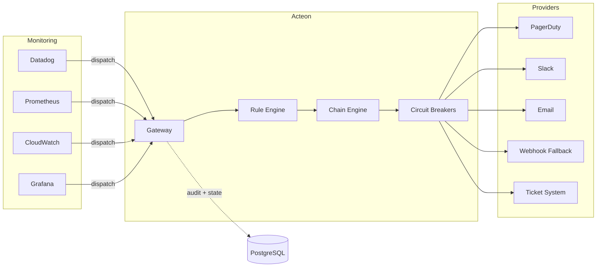
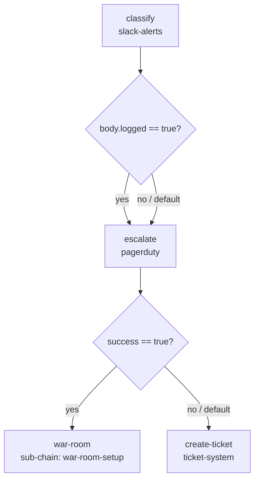
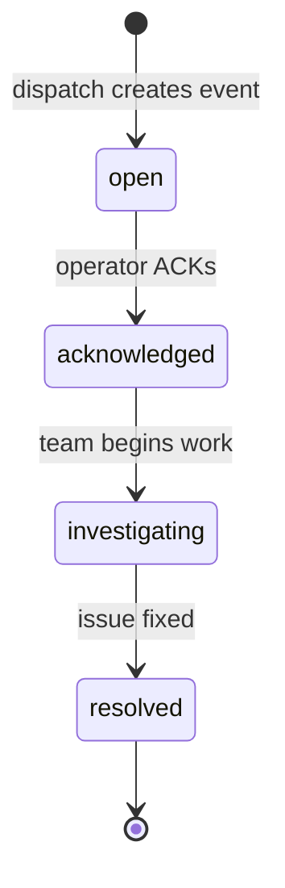

# Incident Response Pipeline

This guide shows how to use Acteon as an **incident response orchestration layer**
for operations teams. Alerts from monitoring tools flow through Acteon, which enforces
suppression of test noise, throttles alert storms, deduplicates repeated firings,
batches low-severity alerts, and routes critical incidents through a multi-step triage
chain with a war-room sub-chain -- all backed by a full audit trail with field redaction.

!!! tip "Runnable Example"
    The [`examples/incident-response-pipeline/`](https://github.com/penserai/acteon/tree/main/examples/incident-response-pipeline)
    directory contains a complete, runnable setup with PostgreSQL-backed state and
    audit, safety rules, alert routing, chain orchestration, and incident lifecycle
    management. Follow the quick start below to have the full pipeline running in minutes.



The scenario: an **operations team** receives alerts from multiple monitoring tools
(Datadog, Prometheus, CloudWatch, Grafana). Instead of routing each tool directly
to PagerDuty or Slack, all alerts flow through Acteon. The rule engine filters noise,
prevents alert fatigue, and routes actionable incidents through a triage chain that
classifies, escalates, and optionally spins up a war room.

---

## What This Example Exercises

The example exercises **14 Acteon features** through a single unified scenario:

| # | Feature | How |
|---|---------|-----|
| 1 | **Chains** | `incident-triage` chain: classify → escalate → war-room or ticket |
| 2 | **Sub-chains** | Critical path invokes `war-room-setup` sub-chain (3 steps) |
| 3 | **Conditional branching** | Branch on `body.logged` after classify; branch on `success` after escalate |
| 4 | **Event state management** | Incident lifecycle: open → acknowledged → investigating → resolved |
| 5 | **Circuit breakers + fallback** | PagerDuty → webhook-fallback; email-alerts → slack-alerts |
| 6 | **Recurring actions** | Health-check alert every 60 seconds via cron |
| 7 | **Data retention** | Audit 7 days, events 1 day |
| 8 | **Event grouping** | Low-severity alerts batched by service, 30s flush window |
| 9 | **Quotas** | 100 actions/hour for ops-team |
| 10 | **Throttle** | Alert storm protection: 20/min per tenant |
| 11 | **Dedup** | Same fingerprint deduplicated within 5 minutes |
| 12 | **Suppress** | Block alerts from test environments |
| 13 | **Modify** | Enrich all alerts with `pipeline_version` metadata |
| 14 | **Audit + redaction** | Full audit with `api_key`, `webhook_url`, `pagerduty_key` redacted |

---

## Prerequisites

- PostgreSQL (for durable state + audit)
- `jq` (for script output formatting)
- Rust 1.88+ and Cargo

---

## Quick Start

### 1. Start PostgreSQL

```bash
docker compose --profile postgres up -d
```

### 2. Run Database Migrations

```bash
scripts/migrate.sh -c examples/incident-response-pipeline/acteon.toml
```

### 3. Start Acteon

```bash
cargo run -p acteon-server --features postgres -- \
  -c examples/incident-response-pipeline/acteon.toml
```

Wait for `Listening on 127.0.0.1:8080`.

### 4. Create API Resources

```bash
cd examples/incident-response-pipeline
bash scripts/setup.sh
```

This creates via the REST API:

- **Quota**: 100 actions/hour for `ops-team`
- **Retention policy**: audit 7 days, events 1 day
- **Recurring action**: health-check alert every 60 seconds

### 5. Fire Sample Alerts

```bash
bash scripts/send-alerts.sh
```

This sends 20 sample alerts covering all categories (see [Expected Outcomes](#expected-outcomes)).

### 6. Manage an Incident Lifecycle

```bash
bash scripts/manage-incident.sh
```

This demonstrates event state transitions: open → acknowledged → investigating → resolved.

### 7. View the Report

```bash
bash scripts/show-report.sh
```

This queries 8 API endpoints and displays: audit trail with outcome breakdown,
chain status, event states, provider health, quotas, groups, recurring actions,
and retention policies.

### 8. Cleanup

```bash
bash scripts/teardown.sh
```

---

## Architecture

```
                    ┌─────────────────────────────┐
  Monitoring  ─────►│      Acteon Gateway          │
  (Datadog,        │                             │
   Prometheus,     │  Rules Engine               │          ┌──────────────────┐
   CloudWatch,     │  ┌─suppress test env───────┐│         │ pagerduty        │
   Grafana)        │  ├─throttle 20/min─────────┤│────────►│ (escalation)     │
                   │  ├─dedup 5min──────────────┤│         ├──────────────────┤
                   │  ├─enrich metadata─────────┤│         │ slack-alerts     │
                   │  ├─chain critical/high─────┤│────────►│ (classification) │
                   │  ├─group low severity──────┤│         ├──────────────────┤
                   │  ├─allow ops actions───────┤│         │ email-alerts     │
                   │  └─deny unmatched──────────┘│────────►│ (notifications)  │
                   │                             │         ├──────────────────┤
                   │  Chain Engine               │         │ webhook-fallback │
                   │  ┌─classify────────────────┐│────────►│ (CB fallback)    │
                   │  ├─escalate────────────────┤│         ├──────────────────┤
                   │  ├─war-room (sub-chain)────┤│         │ ticket-system    │
                   │  └─create-ticket───────────┘│────────►│ (ticketing)      │
                   │                             │         └──────────────────┘
                   │  Background Jobs            │
                   │  ├─group flush (10s)       │         ┌──────────────────┐
                   │  ├─recurring health-check  │         │ PostgreSQL       │
                   │  └─retention reaper        │────────►│ state + audit    │
                   └─────────────────────────────┘         └──────────────────┘
```

The gateway acts as a single entry point for all monitoring alerts. The rule engine
decides what happens to each alert before any provider call is made. This means
you can suppress test noise, tune throttle limits, or change routing logic by
editing YAML rule files -- no code changes, no redeployment.

---

## Provider Configuration

The `acteon.toml` configures five providers -- four log providers simulating real
integrations plus a webhook fallback for circuit breaker testing:

```toml
# PagerDuty: escalation for critical incidents
[[providers]]
name = "pagerduty"
type = "log"

# Slack: alert classification and war-room channel creation
[[providers]]
name = "slack-alerts"
type = "log"

# Email: notification delivery
[[providers]]
name = "email-alerts"
type = "log"

# Webhook fallback: circuit breaker target (intentionally unreachable)
[[providers]]
name = "webhook-fallback"
type = "webhook"
url = "http://localhost:9999/fallback"

# Ticket system: JIRA/ServiceNow-style ticket creation
[[providers]]
name = "ticket-system"
type = "log"
```

!!! note
    Log providers return `{"provider": "<name>", "logged": true}`. The chain engine
    uses `body.logged == true` for conditional branching. In production, replace these
    with real provider types (e.g., `type = "webhook"` for PagerDuty's Events API).

---

## Rule Design

Rules are split across three files by concern:

### Triage Rules (`triage.yaml`)

Triage rules handle the first line of defense -- suppressing noise and routing
actionable alerts:

```yaml
rules:
  # Block all alerts from test environments
  - name: suppress-test-env
    priority: 1
    description: "Block all alerts originating from test environments"
    condition:
      all:
        - field: action.tenant
          eq: "ops-team"
        - field: action.payload.environment
          eq: "test"
    action:
      type: suppress

  # Limit ops-team to 20 alerts per minute to prevent alert fatigue
  - name: throttle-alert-storm
    priority: 2
    description: "Limit ops-team to 20 alerts per minute"
    condition:
      field: action.tenant
      eq: "ops-team"
    action:
      type: throttle
      max_count: 20
      window_seconds: 60

  # Start incident triage chain for critical and high severity alerts
  - name: trigger-incident-triage
    priority: 5
    description: "Start incident triage chain for critical and high severity"
    condition:
      all:
        - field: action.tenant
          eq: "ops-team"
        - field: action.action_type
          eq: "alert"
        - field: action.payload.severity
          in_list: ["critical", "high"]
    action:
      type: chain
      chain: "incident-triage"
```

### Routing Rules (`routing.yaml`)

Routing rules handle deduplication, metadata enrichment, grouping, and the
default allow:

```yaml
rules:
  # Deduplicate alerts sharing the same dedup_key within 5 minutes
  - name: dedup-alerts
    priority: 3
    condition:
      all:
        - field: action.tenant
          eq: "ops-team"
        - field: action.action_type
          eq: "alert"
    action:
      type: deduplicate
      ttl_seconds: 300

  # Add pipeline_version metadata to all ops-team actions
  - name: enrich-alert-metadata
    priority: 4
    condition:
      field: action.tenant
      eq: "ops-team"
    action:
      type: modify
      changes:
        pipeline_version: "1.0.0"

  # Batch low-severity alerts by service, flush every 30 seconds
  - name: group-low-severity
    priority: 6
    condition:
      all:
        - field: action.tenant
          eq: "ops-team"
        - field: action.action_type
          eq: "alert"
        - field: action.payload.severity
          eq: "low"
    action:
      type: group
      group_by:
        - payload.service
      group_wait_seconds: 30

  # Allow all remaining ops-team actions
  - name: allow-ops-actions
    priority: 10
    condition:
      field: action.tenant
      eq: "ops-team"
    action:
      type: allow
```

### Safety Rules (`safety.yaml`)

A catch-all rule ensures nothing slips through:

```yaml
rules:
  # Block any action not matched by a higher-priority rule
  - name: deny-unmatched
    priority: 100
    condition:
      field: action.tenant
      eq: "ops-team"
    action:
      type: suppress
```

### Rule Evaluation Order

Rules are evaluated by priority (lowest number = highest priority). The first
matching terminal rule determines the outcome:

| Priority | Rule | File | Action |
|----------|------|------|--------|
| 1 | `suppress-test-env` | triage.yaml | Suppress |
| 2 | `throttle-alert-storm` | triage.yaml | Throttle 20/min |
| 3 | `dedup-alerts` | routing.yaml | Deduplicate 5min |
| 4 | `enrich-alert-metadata` | routing.yaml | Modify (add metadata) |
| 5 | `trigger-incident-triage` | routing.yaml | Chain → incident-triage |
| 6 | `group-low-severity` | routing.yaml | Group by service, 30s |
| 10 | `allow-ops-actions` | routing.yaml | Allow |
| 100 | `deny-unmatched` | safety.yaml | Suppress (catch-all) |

---

## Chain Orchestration

### Main Chain: `incident-triage`

The `incident-triage` chain handles critical and high-severity alerts through a
multi-step triage process with conditional branching and a sub-chain:



```toml
[[chains.definitions]]
name = "incident-triage"
timeout_seconds = 300

[[chains.definitions.steps]]
name = "classify"
provider = "slack-alerts"
action_type = "classify_alert"
payload_template = {
    alert_id = "{{origin.payload.alert_id}}",
    severity = "{{origin.payload.severity}}"
}

  [[chains.definitions.steps.branches]]
  field = "body.logged"
  operator = "eq"
  value = true
  target = "escalate"

[[chains.definitions.steps]]
name = "escalate"
provider = "pagerduty"
action_type = "create_incident"
payload_template = {
    service = "{{origin.payload.service}}",
    severity = "{{origin.payload.severity}}"
}

  [[chains.definitions.steps.branches]]
  field = "success"
  operator = "eq"
  value = true
  target = "war-room"

  default_next = "create-ticket"

[[chains.definitions.steps]]
name = "war-room"
sub_chain = "war-room-setup"

[[chains.definitions.steps]]
name = "create-ticket"
provider = "ticket-system"
action_type = "create_ticket"
payload_template = {
    alert_id = "{{origin.payload.alert_id}}",
    service = "{{origin.payload.service}}"
}
```

### Sub-Chain: `war-room-setup`

When escalation succeeds, the chain branches to a sub-chain that creates a dedicated
Slack channel, pages on-call engineers, and opens a tracking ticket:

```toml
[[chains.definitions]]
name = "war-room-setup"
timeout_seconds = 120

[[chains.definitions.steps]]
name = "create-channel"
provider = "slack-alerts"
action_type = "create_channel"
payload_template = { name = "inc-{{origin.payload.alert_id}}" }

[[chains.definitions.steps]]
name = "page-oncall"
provider = "pagerduty"
action_type = "page_oncall"
payload_template = {
    urgency = "high",
    service = "{{origin.payload.service}}"
}

[[chains.definitions.steps]]
name = "open-ticket"
provider = "ticket-system"
action_type = "create_ticket"
payload_template = {
    alert_id = "{{origin.payload.alert_id}}",
    type = "war-room"
}
```

Sub-chains are first-class chain definitions. The parent chain's `war-room` step
uses `sub_chain = "war-room-setup"` instead of a `provider`. When the sub-chain
completes, execution returns to the parent chain.

---

## Circuit Breaker Fallbacks

Two circuit breaker fallback paths protect against provider outages:

```toml
[circuit_breaker]
enabled = true
failure_threshold = 3
success_threshold = 1
recovery_timeout_seconds = 30

# PagerDuty trips after 2 failures, falls back to webhook
[circuit_breaker.providers.pagerduty]
failure_threshold = 2
recovery_timeout_seconds = 60
fallback_provider = "webhook-fallback"

# Email trips after 2 failures, falls back to Slack
[circuit_breaker.providers.email-alerts]
failure_threshold = 2
recovery_timeout_seconds = 60
fallback_provider = "slack-alerts"
```

### Testing Circuit Breaker Behavior

The `webhook-fallback` provider intentionally targets `http://localhost:9999/fallback`,
which is not running by default. If PagerDuty trips its circuit breaker after 2
failures, the fallback will also fail -- demonstrating cascading circuit breaker
behavior in the report.

To see successful fallback routing, start a simple HTTP server before running:

```bash
python3 -m http.server 9999 &
```

After `recovery_timeout_seconds` (60s), the circuit breaker enters half-open state
and allows one probe request through. If it succeeds, the circuit closes and normal
routing resumes.

---

## Event State Management

The `manage-incident.sh` script demonstrates Acteon's event state machine, which
tracks incidents through their lifecycle:



Each transition is driven by an API call:

```bash
# Acknowledge an incident
curl -X PUT "http://localhost:8080/v1/events/incident-db-001/transition" \
  -H "Content-Type: application/json" \
  -d '{"to": "acknowledged", "namespace": "incidents", "tenant": "ops-team"}'

# Begin investigation
curl -X PUT "http://localhost:8080/v1/events/incident-db-001/transition" \
  -H "Content-Type: application/json" \
  -d '{"to": "investigating", "namespace": "incidents", "tenant": "ops-team"}'

# Resolve the incident
curl -X PUT "http://localhost:8080/v1/events/incident-db-001/transition" \
  -H "Content-Type: application/json" \
  -d '{"to": "resolved", "namespace": "incidents", "tenant": "ops-team"}'
```

---

## Background Processing

The `[background]` section enables five background processors:

| Processor | Interval | Purpose |
|-----------|----------|---------|
| Group flush | 10s | Flush accumulated low-severity alert batches |
| Timeout processing | 10s | Cancel chains that exceed `timeout_seconds` |
| Cleanup | 60s | Remove completed chains older than `completed_chain_ttl_seconds` |
| Recurring actions | 30s | Check and execute `* * * * *` health-check |
| Retention reaper | 60s | Delete expired audit records and event state |

```toml
[background]
enabled = true
group_flush_interval_seconds = 10
timeout_check_interval_seconds = 10
cleanup_interval_seconds = 60
enable_group_flush = true
enable_timeout_processing = true
enable_recurring_actions = true
recurring_check_interval_seconds = 30
max_recurring_actions_per_tenant = 10
enable_retention_reaper = true
retention_check_interval_seconds = 60
namespace = "incidents"
tenant = "ops-team"
```

---

## Audit Trail and Redaction

Every dispatched alert is recorded in the PostgreSQL audit backend with full outcome
details. Sensitive fields are automatically redacted:

```toml
[audit]
enabled = true
backend = "postgres"
url = "postgres://localhost:5432/acteon"
store_payload = true
ttl_seconds = 604800  # 7 days

[audit.redact]
enabled = true
fields = ["api_key", "webhook_url", "pagerduty_key"]
placeholder = "[REDACTED]"
```

Query the audit trail to see what happened:

```bash
# All dispatches
curl -s "http://localhost:8080/v1/audit?namespace=incidents&tenant=ops-team&limit=50" | jq .

# Only suppressed actions
curl -s "http://localhost:8080/v1/audit?namespace=incidents&tenant=ops-team&outcome=suppressed" | jq .

# Only chain-started actions
curl -s "http://localhost:8080/v1/audit?namespace=incidents&tenant=ops-team&outcome=chain_started" | jq .
```

---

## Expected Outcomes

When running `send-alerts.sh`, you should see these outcomes:

| Alerts | Count | Expected Outcome |
|--------|-------|-----------------|
| Critical (database, api-gateway) | 2 | `chain_started` (incident-triage + war-room sub-chain) |
| High (cache-layer) | 3 | `chain_started` (incident-triage, simpler path) |
| Low (cdn, search, auth) | 5 | `grouped` (batched by service, 30s flush) |
| Storm (rapid-fire medium) | 5 | Some `throttled` (if >20/min reached) |
| Duplicate (same dedup_key) | 3 | 1 `executed`, 2 `deduplicated` |
| Test environment | 2 | `suppressed` |

The exact counts for throttling depend on timing -- if all 20 alerts are sent
within one minute, the throttle limit of 20/min may cause later alerts to be
throttled.

---

## File Structure

```
incident-response-pipeline/
├── acteon.toml              # Server config (providers, chains, circuit breakers, audit)
├── rules/
│   ├── triage.yaml          # Suppress test, throttle storms, route to chains
│   ├── routing.yaml         # Dedup, enrich metadata, group low-severity, allow
│   └── safety.yaml          # Catch-all suppress
├── scripts/
│   ├── setup.sh             # Create quotas + retention + recurring via API
│   ├── send-alerts.sh       # Fire 20 sample alerts exercising all features
│   ├── manage-incident.sh   # Transition events through lifecycle via API
│   ├── show-report.sh       # Query audit/chains/events/health/quotas/groups
│   └── teardown.sh          # Clean up API-created resources
└── README.md
```

---

## Extending the Pipeline

### Adding Real PagerDuty Integration

Replace the log provider with a webhook targeting PagerDuty's Events API:

```toml
[[providers]]
name = "pagerduty"
type = "webhook"
url = "https://events.pagerduty.com/v2/enqueue"
headers = { "Content-Type" = "application/json" }
```

Then update the chain step payloads to match PagerDuty's event format:

```toml
[[chains.definitions.steps]]
name = "escalate"
provider = "pagerduty"
action_type = "create_incident"
payload_template = {
    routing_key = "{{origin.metadata.pd_routing_key}}",
    event_action = "trigger",
    payload = {
        summary = "{{origin.payload.alert_id}}: {{origin.payload.service}}",
        severity = "{{origin.payload.severity}}",
        source = "acteon-pipeline"
    }
}
```

### Adding Slack Webhook Notifications

Add a real Slack webhook for low-severity alert batches:

```toml
[[providers]]
name = "slack-alerts"
type = "webhook"
url = "https://hooks.slack.com/services/T00/B00/xxx"
headers = { "Content-Type" = "application/json" }
```

### Adding an Escalation Timer

Use a recurring action to check for incidents that have been open longer than
a threshold:

```bash
curl -X POST "http://localhost:8080/v1/recurring" \
  -H "Content-Type: application/json" \
  -d '{
    "namespace": "incidents",
    "tenant": "ops-team",
    "cron_expr": "*/5 * * * *",
    "timezone": "UTC",
    "enabled": true,
    "action_template": {
      "provider": "slack-alerts",
      "action_type": "escalation_check",
      "payload": {"check": "stale_incidents", "threshold_minutes": 30}
    },
    "description": "Check for stale incidents every 5 minutes"
  }'
```

---

## Production Considerations

### High Availability

For production, run multiple Acteon instances behind a load balancer. PostgreSQL
state ensures consistency across instances for dedup, throttle, and event state:

```toml
[state]
backend = "postgres"
url = "postgres://pgbouncer:6432/acteon"

[executor]
max_retries = 3
timeout_seconds = 30
max_concurrent = 64
```

### Monitoring

Use the [Grafana dashboards](../features/grafana-dashboards.md) to monitor:

- Alert suppression and throttle rates
- Chain completion times and failure rates
- Circuit breaker state transitions
- Quota usage per tenant
- Event state distribution (open vs acknowledged vs resolved)

### Alert Routing by Source

Add rules that route alerts differently based on their monitoring source:

```yaml
- name: datadog-critical-to-pagerduty
  priority: 5
  condition:
    all:
      - field: action.metadata.source
        eq: "datadog"
      - field: action.payload.severity
        in_list: ["critical", "high"]
  action:
    type: chain
    chain: "incident-triage"

- name: cloudwatch-to-slack
  priority: 7
  condition:
    all:
      - field: action.metadata.source
        eq: "cloudwatch"
      - field: action.payload.severity
        eq: "medium"
  action:
    type: reroute
    target_provider: "slack-alerts"
```

---

## Comparison: Acteon vs Custom Incident Pipeline

| Capability | Custom (PagerDuty + Lambda + SNS) | Acteon |
|-----------|----------------------------------|--------|
| Alert dedup | PagerDuty dedup keys (limited) | Configurable TTL, any field |
| Throttle / rate limit | Custom Lambda logic | YAML rule, per-tenant |
| Alert grouping | PagerDuty intelligent grouping | Configurable group-by fields + flush window |
| Circuit breaker fallback | Custom health checks + routing | Built-in with automatic recovery |
| Multi-step triage | Step Functions or custom code | Built-in chains with branching |
| Incident lifecycle | PagerDuty-only | Provider-agnostic state machine |
| Audit trail | CloudWatch logs (unstructured) | Structured audit with field redaction |
| Test noise suppression | Separate PagerDuty service | YAML rule by environment field |
| Configuration changes | Code deploy + PagerDuty UI | YAML edit, no redeployment |
| Recurring health checks | CloudWatch Events + Lambda | Built-in recurring actions with cron |

Acteon replaces the "glue" between monitoring tools and notification providers.
Instead of building custom Lambda functions for dedup, throttle, routing, and
escalation logic, you declare these behaviors in YAML rules and TOML configuration.
