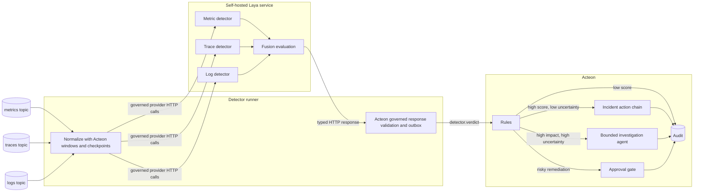
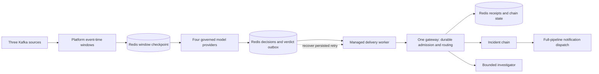

# Cascaded Neural Observability Detector

This guide designs an observability pipeline that uses
[Laya](https://github.com/NandhaKishorM/laya), an open-source,
non-autoregressive decision model, for the common case and invokes a generative
agent only when evidence is both important and ambiguous. Metrics, traces, and
logs arrive on separate Kafka topics. Signal-specific typed question sets score
them independently, a fusion question set correlates the evidence, and Acteon
applies deterministic policy before it starts an incident chain or an
investigation agent.

The result is a **System One-style detector**: a fast, non-autoregressive path
that handles repetitive pattern recognition without paying the latency, token
cost, or hallucination risk of an LLM on every event.

!!! note "What System One means here"
    This guide uses *System One* as an architectural shorthand for bounded,
    feed-forward inference with a fixed output schema. It is not a claim that
    a classifier reproduces human cognition.

!!! important "Integration boundary"
    This example places a small **detector runner** between Kafka and Acteon.
    It supplies telemetry contracts, feature extraction, question sets, and
    scenario policy. It composes Acteon's event-time windows, durable checkpoints,
    governed model providers, typed response validation, and managed outbox
    delivery. Acteon's gateways apply rules and execute chains and agent calls.

---

## The scenario

A deployment of `checkout-api` exhausts its database connection pool. No single
signal is conclusive:

| Source | Observation in one 60-second window | Detector result |
|---|---|---|
| Metrics | p95 latency rises from 180 ms to 1.8 s, errors reach 8.4%, DB pool utilization reaches 96% | `resource_saturation`, score `0.94` |
| Traces | 73% of slow requests spend most of their time in `db.checkout.reserve` | `downstream_dependency`, score `0.88` |
| Logs | 41 `pool_timeout` events appear, mixed with unrelated warnings | `db_pool_exhaustion`, score `0.91` |

The following is an illustrative target contract with hypothetical calibrated
scores. The runnable simulation later in this guide reports the actual Laya
answers, whose confidence is substantially lower.

The fusion evaluation returns a typed verdict:

```json
{
  "schema_version": 1,
  "incident_key": "checkout-api:prod:2026-10-01T19:42Z",
  "service": "checkout-api",
  "environment": "prod",
  "kind": "db_pool_exhaustion",
  "score": 0.96,
  "uncertainty": 0.07,
  "impact": "high",
  "evidence": [
    {"source": "metrics", "ref": "metrics:4:8821", "score": 0.94},
    {"source": "traces", "ref": "traces:2:1904", "score": 0.88},
    {"source": "logs", "ref": "logs:7:4420", "score": 0.91}
  ],
  "model": {
    "repository": "convaiinnovations/laya",
    "revision": "<pinned-commit>",
    "checkpoint": "typed-decisions",
    "questions": "fusion@1"
  }
}
```

Acteon can now make a deterministic decision. This high-confidence verdict
starts an incident chain. A verdict with high impact and high uncertainty
invokes a bounded investigation agent. Low scores are recorded and suppressed.

---

## Architecture



The boundary between detection and orchestration is deliberate:

- Kafka transports telemetry. The detector runner supplies domain features and
  composes Acteon's generic windowing, checkpoint, inference, and outbox APIs.
- Acteon owns policy, deduplication, throttling, audit, response chains,
  approvals, and agent governance.
- Agents receive a compact evidence bundle and references to source data. They
  do not receive an unbounded stream of raw telemetry.

---

## Comprehensive implementation plan

### 1. Define the decision and the error budget

Start with one incident class and one operational decision. For this scenario:

- **Incident class:** database connection-pool exhaustion.
- **Entity:** `(tenant, environment, service, deployment_revision)`.
- **Decision interval:** one verdict per 60-second event-time window.
- **Response:** open or update an incident, capture diagnostics, and notify the
  owning team.
- **Agent escalation:** investigate only when impact is high and uncertainty or
  detector disagreement exceeds policy.

Choose acceptance targets before selecting models:

| Measure | Initial simulation target |
|---|---:|
| Correlated incident recall | at least 95% |
| False incidents during baseline windows | at most 1% |
| Detection p95 after window close | under 2 seconds |
| Windows sent to an agent | under 2% |
| Invalid model responses admitted | 0 |
| Duplicate incident chains per incident key | 0 |

These are example targets, not production claims. Replace them with values
derived from incident cost, on-call capacity, and replay data.

### 2. Establish typed Kafka contracts

Use three source topics and one verdict topic:

| Logical topic | Key | Value |
|---|---|---|
| `observability.acme.metrics` | service + window | normalized metric sample or aggregate |
| `observability.acme.traces` | service + window | trace summary, not full span payloads |
| `observability.acme.logs` | service + window | log template counts and selected attributes |
| `observability.acme.verdicts` | incident key | validated fused verdict |

If producers can publish through the Acteon Agentic Bus, register a JSON Schema
for each payload and bind it to the topic. Publish-edge validation rejects
malformed records before they enter the detector. If telemetry already lives on
independently managed Kafka topics, deploy a bridge that normalizes those
records into the same contracts.

Every input contract should include:

- `schema_version`, `event_id`, `observed_at`, and `ingested_at`;
- tenant, environment, service, region, and deployment revision;
- a stable correlation key and a source reference containing topic, partition,
  and offset;
- a bounded feature payload with explicit units;
- trace context when it is available.

Do not send raw high-cardinality telemetry through Acteon's dispatch API. Keep
the large records in the observability store or Kafka retention window and pass
references plus bounded features to Acteon.

### 3. Build event-time correlation

The detector runner consumes all three topics with durable consumer groups. It
normalizes records into 60-second tumbling windows with a small allowed-lateness
period, such as 15 seconds. It joins by tenant, environment, service, region,
and deployment revision.

The runner normalizes each envelope into `acteon_bus::WindowRecord` and feeds
Acteon's [event-time window operator](../features/event-time-windows.md). The
operator handles these cases consistently for any multi-source workflow:

- missing signal: emit a mask rather than a fabricated value;
- late signal: update the window only within the allowed-lateness period;
- duplicate record: deduplicate by `event_id` or source coordinates;
- replay: make window output deterministic for the same ordered input;
- skewed clocks: prefer producer event time, while tracking ingest delay;
- overloaded service: apply backpressure and expose consumer lag.

A stream processor such as Kafka Streams or Flink remains appropriate at large
volume. The vertical slice uses the reusable Rust operator with a versioned
atomic checkpoint for the window state, ready-output outbox, deduplication
ledger, watermarks, and Kafka offsets. The same operator also exposes hard
limits for open windows, records per window, and tracked event IDs, plus manual
watermark advancement for an idle source.

### 4. Implement the fast detector cascade

Use Laya as the open-source System One evaluator. Laya accepts a state plus
typed `choice`, `score`, and `noul` questions and returns closed values and
probabilities in a single non-autoregressive forward pass. Its code and
published weights use Apache-2.0, and its server exposes the Jev-compatible
`POST /v1/systemone` protocol.

This is what happens in one Laya call:

1. The runner serializes one bounded state, such as the metric features for a
   60-second window.
2. It supplies several typed questions. `choice` selects one declared label,
   `score` returns an expected position on an ordered scale, and `noul` returns
   the probability that a yes/no proposition is true.
3. Laya encodes the state and rendered options and evaluates them in one model
   call. It emits probability distributions through decision heads. It does
   not decode an explanation token by token; API usage therefore reports zero
   output tokens.
4. The runner accepts only declared question IDs, labels, and numeric ranges.
   The model can still classify an incident incorrectly, so its probabilities
   require workload-specific evaluation and calibration.

The *cascade* is across calls. The first stage applies the same bounded decision
mechanism independently to metrics, traces, and logs. The second stage sends
only those three typed results, their provenance, and a missing-signal mask to
a fourth Laya call. Acteon then applies rules to the fused result. An
autoregressive agent enters the path only for a high-impact result whose
uncertainty or cross-signal disagreement requires investigation.

Use four versioned question sets over one pinned Laya checkpoint:

1. **Metric question set:** evaluates typed questions over rates, deltas, seasonal
   residuals, and saturation ratios.
2. **Trace question set:** evaluates a bounded service-graph and span-latency
   summary.
3. **Log question set:** evaluates template IDs and counts. Template mining
   happens before inference, so raw free-form logs do not enter Laya.
4. **Fusion question set:** evaluates the three typed signal results,
   missing-signal mask, deployment context, and recent incident state.

The question sets are versioned JSON, not instructions assembled by callers.
Each declares its accepted state schema, typed questions, criteria, and output
mapping. The runner converts Laya's response into the closed `SignalVerdict` or
fused-verdict schema.

Each signal detector returns:

```rust
#[derive(serde::Serialize, serde::Deserialize)]
#[serde(deny_unknown_fields)]
struct SignalVerdict {
    schema_version: u16,
    source: SignalSource,
    label: SignalLabel,
    score: f32,
    uncertainty: f32,
    evidence_refs: Vec<String>,
    model: ModelIdentity,
}
```

Use smart constructors or explicit validation to enforce `score` and
`uncertainty` in `0.0..=1.0`, maximum evidence counts, allowed enum values, and
model-version allowlists. Serde types alone do not enforce numeric ranges.

The runtime is the upstream `laya-serve` HTTP service in a CPU container. The
example enforces its lock twice. The container verifies six installed package
versions, the configured repository and revision, the exact five-file
checkpoint manifest, and every artifact SHA-256 before it starts the server.
The Rust runner uses Acteon's reusable `acteon_llm::VerifiedModelLock` API to
parse the strict lock schema, load content-addressed inference contracts, and
verify the health-reported model and revision before its first inference call.
The same API can govern another inference engine, model registry, artifact
layout, or set of named contracts; the Laya startup script is the runtime
adapter for this deployment. Calls use Acteon's `TypedJsonModelClient`, which
checks the raw response against a compiled JSON Schema before deserializing it
to the declared Rust output type. It caps response bytes and rejects redirects
before validation. The detector then applies its Laya-specific semantic checks
for question IDs, probabilities, and labels. Load only the
`typed-decisions` checkpoint to bound resident memory. Laya also supports ONNX
and per-channel INT8 export for a later compact CPU deployment, but the first
simulation uses the upstream server path. It registers four
[governed model providers](../features/governed-model-provider.md), one for each
question set. Gateway Actions carry only the canonical state; each provider
injects the locked questions and model name, verifies the live revision before
every call, and validates the response against the locked `response_schema`
contract. Model evidence includes lock digest, revision, request/response
contract names, and HTTP elapsed time.

### 5. Calibrate uncertainty and disagreement

Raw softmax scores are not uncertainty estimates. Calibrate each model on held
out incident and baseline windows, then monitor calibration drift. The fusion
input should include:

- calibrated score from each available detector;
- entropy or another bounded uncertainty measure;
- disagreement between top labels;
- number and freshness of available signals;
- deployment recency and known maintenance state;
- recent verdicts for the same incident key.

The runner should reject any verdict that is non-finite, outside its declared
range, from an unapproved model version, or missing evidence provenance.

### 6. Dispatch only the compact verdict to Acteon

The detector runner posts an Action such as:

```json
{
  "namespace": "observability",
  "tenant": "acme",
  "provider": "verdict-audit",
  "action_type": "detector.verdict",
  "payload": {
    "incident_key": "checkout-api:prod:2026-10-01T19:42Z",
    "service": "checkout-api",
    "environment": "prod",
    "kind": "db_pool_exhaustion",
    "score": 0.96,
    "uncertainty": 0.07,
    "impact": "high",
    "evidence": ["metrics:4:8821", "traces:2:1904", "logs:7:4420"],
    "model_version": "convaiinnovations/laya@<pinned-commit>:typed-decisions:fusion@1"
  },
  "dedup_key": "checkout-api:prod:2026-10-01T19:42Z",
  "fingerprint": "checkout-api:prod:db_pool_exhaustion"
}
```

The verdict schema is the security boundary. Free-form explanations may be
attached later as advisory evidence, but rules must depend only on typed fields.

### 7. Apply deterministic routing rules

Use rule priorities to separate the policy bands:

| Policy band | Example condition | Outcome |
|---|---|---|
| Invalid or unapproved | schema/model version not allowed | suppress and audit |
| Noise | `score < 0.55` | suppress and retain verdict |
| Watch | `0.55 <= score < 0.80` | notify or group |
| Incident | `score >= 0.80` and `uncertainty <= 0.20` | start `observability-incident` chain |
| Investigate | high impact and `uncertainty > 0.20` | invoke bounded agent |
| Remediate | chain or agent proposes a risky mutation | require approval |

The receiver uses [durable dispatch admission](../features/durable-dispatch.md)
around a single gateway. It persists the original verdict, caller, chain start
plan, and dispatch outcome under the window's stable key. Normal first-match
rules still suppress noise, start a chain, or reroute to the investigator.
An acknowledgement-loss retry retrieves that original receipt, including the
same chain execution ID, without a separate forwarding provider or gateway.

The live fixture tests acknowledgement loss after the incident completes and
replaces both the outbox worker and receiver gateway. Generic gateway tests
also interrupt admission before chain creation and after chain completion but
before receipt completion. Interrupted external provider calls become explicitly
subject to reconciliation; they are not silently counted as completed or
reexecuted. Receipts and admitted chains have no automatic TTL, so deployments
must plan storage maintenance. This is not an exactly-once external-effects claim.

The incident chain's notification uses a
[full-pipeline dispatch step](../features/chains.md#full-pipeline-dispatch-steps)
with its own stable key. A gateway rule reroutes that emitted Action from
`notification-intake` to `on-call`, proving that chain handoff re-evaluates policy.

### 8. Use an action chain for the known response

The high-confidence path should remain procedural:

1. create or update the incident;
2. capture a bounded diagnostics snapshot;
3. notify the service owner and on-call channel in parallel;
4. optionally perform a pre-approved reversible action;
5. wait for recovery evidence and resolve or escalate.

Chain templates can carry typed fields from earlier step results with
`{{prev.body.*}}` and `{{steps.NAME.body.*}}`. Pin chain and model versions in
the audit record. Put retry and circuit-breaker policy around external systems,
not around a model response that failed schema validation.

### 9. Invoke an agent only for ambiguity

The investigation agent receives a constrained goal:

```text
Determine which of these allowed hypotheses best explains the checkout-api
regression: db pool exhaustion, downstream timeout, deploy regression, or
insufficient evidence. Use only the attached evidence references and the
read-only observability tools. Return the InvestigationFinding schema. Do not
change production state.
```

Give it:

- the typed verdict and per-signal detector results;
- a small, time-bounded evidence bundle;
- read-only tools with tenant and service scope;
- a maximum runtime and token budget;
- a closed `InvestigationFinding` schema with hypothesis, confidence, evidence
  references, contradictions, and proposed next action.

The Ambient Swarm provider is suitable for asynchronous investigation and
returns a `run_id` immediately. Any proposed production mutation must come back
through Acteon as a new action, where rules, quotas, and approval gates apply.
Agent prose is never itself an authorization.

### 10. Measure the whole decision system

Record these fields for every window: source offsets, feature version, model
artifact digests, detector results, fused verdict, rule outcome, chain ID or
agent run ID, operator action, and eventual incident label.

Monitor:

- precision, recall, and time-to-detect by incident kind;
- calibration error and disagreement rate;
- missing-signal and late-arrival rates;
- Kafka lag and window completion latency;
- verdict-schema rejection rate;
- percentage of windows reaching each policy band;
- agent invocation rate, cost, runtime, and unsupported claims;
- chain success, retries, deduplication, and approval outcomes.

Deploy in shadow mode first. Compare verdicts with real incidents without
opening tickets. Then enable notifications, followed by incident creation, and
only later consider reversible remediation.

---

## Simulation: a convincing vertical slice

The smallest useful demonstration should prove transport, event-time
correlation, real neural inference, routing, agent containment, and
repeatability. It publishes synthetic telemetry through three Kafka topics and
invokes a pinned Laya checkpoint locally. The broker traffic and all four Laya
forward passes are real. Results demonstrate the integration and do not claim
production detector quality.

### Run the example

The repository includes the complete example under
[`examples/neural-observability-detector`](https://github.com/penserai/acteon/tree/main/examples/neural-observability-detector).
Run it from the repository root:

```bash
examples/neural-observability-detector/scripts/run.sh
```

The script starts Kafka and Redis, builds the CPU-only Laya service, downloads
the pinned checkpoint on the first run, and performs 16 governed model calls
across four trials. It replaces the detector before its Kafka commit and the
outbox worker after a lost acknowledgement, exercises gateway rules and the
incident chain, inspects a dead letter, and writes JSON and Markdown reports.

```text
examples/neural-observability-detector/
├── README.md
├── docker-compose.yml
├── contracts/laya-response.schema.json
├── model.lock.json
├── laya/
│   └── Dockerfile
├── questions/
│   ├── metrics.json
│   ├── traces.json
│   ├── logs.json
│   └── fusion.json
├── rules/
│   └── verdict-routing.yaml
├── fixtures/
│   ├── baseline.json
│   ├── log-noise.json
│   ├── pool-exhaustion.json
│   └── ambiguous-regression.json
├── results/
│   └── latest.md
└── scripts/run.sh
```

The Rust runner lives at
`crates/simulation/examples/neural_observability_simulation.rs`. Laya remains a
replaceable inference container behind its typed HTTP API.

### Four deterministic trials

| Trial | Inputs | Expected result |
|---|---|---|
| Healthy baseline | normal metrics, traces, and logs | no provider side effect |
| Log-only noise | burst of error-looking log templates, normal metrics and traces | no incident; demonstrates cross-signal resistance |
| Pool exhaustion | the three correlated signals from the scenario | one incident chain, even when the window is replayed |
| Ambiguous regression | high latency, conflicting trace and log labels, one missing source | one bounded investigation-agent run; no remediation |

The fixtures use fixed timestamps and IDs. Three versioned schemas are registered
and pinned in the managed stage's [consume policy](../features/stream-input-contracts.md).
A malformed log envelope deliberately bypasses the HTTP publish edge. The stage
quarantines it before window processing or inference and saves its full envelope,
position, failure class, and contract digest atomically with source progress. The
quarantine restores before receipt replay and remains one entry afterward.
The simulation then uses the tenant-scoped operator HTTP APIs to inspect stage
status and the original envelope, then queue a corrected payload with an operator
reason and an idempotency UUID. A replacement worker completes the repair once;
repeating the POST returns its completed audit. Source offsets do not change.
The window operator deduplicates the already-accounted event before its window
closes, so repair causes no additional neural call or incident. The retained count becomes zero; the
cumulative quarantine and replay counters remain one.

The simulation also uses the generic [audited stage controls](../features/managed-stream-stages.md).
An HTTP halt commits an audit tied to the demo caller and survives worker replacement.
Two probes—normal processing and quarantine replay—return halted with unchanged
Kafka positions. An audited resume releases the hold. Retrying the old halt UUID
returns its original audit without undoing the newer resume. The pending repair
then completes through the same leased worker path. These controls add no neural
calls and leave the four expected decisions unchanged.

The runner publishes their source
features to separate metrics, traces, and logs topics, consumes the resulting
broker positions, and joins them into 60-second event-time windows with 15
seconds of allowed lateness. It atomically checkpoints active windows,
finalized-window keys, event IDs, source watermarks, ready outputs, and source
offsets. The simulation then terminates its consumers before committing,
restores the checkpoint, and proves that Kafka redelivery neither reopens a
window nor loses an output. The runner uses a typed window processor inside
[`ManagedStreamStage`](../features/managed-stream-stages.md), backed by Redis
[`StreamCheckpointCoordinator`](../features/stream-checkpoints.md), to persist
window state, ready-window outputs, and source offsets atomically before Kafka
commits. Redis uses a persisted volume and AOF with `appendfsync always`.

The runner uses three [HTTP receipt sessions](../features/live-kafka-acknowledgements.md#http-subscription-sessions)
through the Rust client. Topic and receipt-required subscription registration
use the public HTTP API. The simulation replaces the HTTP server and its
consumer registry after the pre-commit checkpoint, verifies that the old session
ID is rejected, and opens replacement consumers. These replay the uncommitted
prefix while the persisted source positions prevent duplicate ingestion.
`HttpStreamStageSource` owns the HTTP receipt operations. The platform stage
decodes typed telemetry, runs the window processor, validates the complete receipt
prefix, persists state/positions/outputs, and acknowledges the original consumers.
The five checkpointed records replay without invoking the processor. Its lease,
batch limits, output headroom, callback timeout, and persisted retry budget are
generic building blocks; telemetry correlation remains application policy.
A separate library group probe joins a second member, observes revocation,
rejects the old receipt, and proves redelivery from offset zero. That probe adds
no windows, model calls, or operational effects. Source acknowledgement fencing
does not undo external effects or atomically transact between Kafka and Redis.
HTTP sessions require sticky routing; expired sessions recover through new
consumers and the durable checkpoint.

Each completed decision, raw parsed model responses, and provider evidence are
persisted in a separate verdict checkpoint before its input window is
acknowledged. A [`StreamOutboxDispatcher`](../features/managed-stream-outbox.md)
delivers those verdicts. The simulation loses an acknowledgement after the
incident is accepted, drops the worker and its connection pool, replaces the
receiver gateway with a fresh Redis pool, and restores the persisted retry.
Acteon retrieves the original dispatch receipt;
it does not repeat the 16 Laya calls or the incident side effects.

A malformed-verdict probe bypasses inference and enters retained dead-letter
storage before gateway dispatch. The runner inspects and explicitly discards
it. Both input-window and verdict outboxes finish empty, and Kafka lag is zero.
One metrics record is also duplicated beside its original record, before event-ID
retention advances. Restart redeliveries are rejected using the checkpoint's
persisted broker positions before entering the window operator; they do not rely
on indefinitely retained event IDs.
`model.lock.json` now pins four question sets and the response schema alongside
runtime versions and model artifacts.

### Measured result

The recorded CPU run passed all four expected policy outcomes. Laya correctly
separated the first-stage signal conditions. Its raw fusion choice selected
`downstream_timeout` for the healthy, noise, and ambiguous fixtures and
`db_pool_exhaustion` for the correlated incident, all at low confidence. The
deterministic corroboration gate suppressed the healthy/noise false positives
and admitted an incident only when all three typed signal decisions agreed.

| Measure | Result |
|---|---:|
| Expected policy outcomes | 4 / 4 |
| Kafka source records accepted | 12 |
| Kafka duplicates, redeliveries, and covered repair positions rejected | 7 |
| Restart redeliveries deduplicated | 5 |
| Input window checkpoints | 4 |
| Typed processor attempts / replayed records skipped before callback | 4 / 5 |
| Final Kafka consumer lag | 0 |
| Active source sessions / receipts acknowledged | 3 / 14 |
| Pinned consume contracts / input quarantines retained after restart | 3 / 1 |
| Audited repair completions / retained inputs after replay | 1 / 0 |
| Stale acknowledgements rejected after rebalance | 1 |
| Replacement delivery offset in fencing probe | 0 |
| Governed runtime packages / artifacts / question sets / response schemas | 6 / 5 / 4 / 1 |
| Event-time windows | 4 |
| Real Laya calls | 16 |
| Audited stage commands / blocked processing probes | 2 / 2 |
| Sum of model HTTP request times | 170,478 ms |
| Per-call HTTP p50 / p95 | 11,352 ms / 21,461 ms |
| Incident chains | 1 |
| Bounded investigator calls | 1 |
| Delivery attempts / accepted verdicts | 6 / 4 |
| Persisted retries / replaced delivery workers / receiver gateways | 1 / 1 / 1 |
| Duplicate incident dispatches prevented by Acteon | 1 |
| Invalid verdicts inspected in dead-letter storage | 1 |
| Pending window / verdict outputs | 0 / 0 |
| Model calls repeated during delivery retry | 0 |
| Original incident Action and chain identity preserved | yes |

Timings now measure model HTTP elapsed time through the governed provider,
including response validation; the earlier report measured server-only
inference time. These totals are not directly comparable. Full wall times also
include the provider's identity check and gateway dispatch. Input checkpoint
counts describe completed processing batches; delivery and acknowledgements advance
additional generations.

See the
[`latest.md`](https://github.com/penserai/acteon/blob/main/examples/neural-observability-detector/results/latest.md)
report for per-signal decisions and confidence values. Laya reported an invalid
shipped temperature entry for part of this question shape, so the example
treats confidence as an observed score rather than a calibrated probability.

### Self-hosted Laya container

Run the upstream `laya-serve` application with only the `typed-decisions`
checkpoint loaded. It exposes Laya's Jev-compatible `POST /v1/systemone`
endpoint, so the simulation calls the model's native typed interface rather
than placing a generative model behind a classifier-shaped wrapper.

A reproducible CPU image is:

```dockerfile
FROM python:3.12-slim

ARG LAYA_VERSION=0.3.23
ARG TORCH_VERSION=2.14.0

RUN pip install --no-cache-dir "torch==${TORCH_VERSION}" \
      --index-url https://download.pytorch.org/whl/cpu \
    && pip install --no-cache-dir \
      "transformers==5.18.0" \
      "huggingface-hub==1.33.0" \
      "safetensors==0.8.0" \
      "numpy==2.5.3" \
    && pip install --no-cache-dir "laya[serve]==${LAYA_VERSION}"

COPY verify_and_serve.py /opt/acteon/verify_and_serve.py

ENTRYPOINT ["python", "/opt/acteon/verify_and_serve.py"]
```

The full example Compose file also starts Kafka and Redis with AOF persistence
for checkpoint and delivery recovery. Redis listens on loopback port 16379.

The explicit dependencies preserve the tested environment and the PyTorch CPU
index prevents a Linux build from pulling CUDA packages. The Compose service
binds only to loopback, keeps one checkpoint resident, and caps concurrency:

```yaml
services:
  laya:
    build:
      context: ./laya
      args:
        LAYA_VERSION: "<pinned-version>"
    environment:
      LAYA_DEVICE: cpu
      LAYA_REPOSITORY: convaiinnovations/laya
      LAYA_MODELS: typed-decisions
      LAYA_DEFAULT_MODEL: typed-decisions
      LAYA_PRELOAD: "1"
      LAYA_MAX_LOADED: "1"
      LAYA_MAX_CONCURRENT: "4"
      LAYA_MAX_TOKEN_BUDGET: "1024"
      LAYA_REVISION: 55cf4c4ebb4ebe31b2550e8bdf3bd21b99753851
      LAYA_API_KEY: "${LAYA_API_KEY:-acteon-laya-demo}"
      OMP_NUM_THREADS: "4"
      LAYA_THREADS: "4"
    ports:
      - "127.0.0.1:8000:8000"
    volumes:
      - laya-model-cache:/root/.cache/huggingface
      - ./model.lock.json:/opt/acteon/model.lock.json:ro
    healthcheck:
      test: ["CMD", "python", "-c", "import urllib.request; urllib.request.urlopen('http://localhost:8000/health')"]
      interval: 10s
      timeout: 3s
      retries: 12
    deploy:
      resources:
        limits:
          cpus: "4"
          memory: 8G

volumes:
  laya-model-cache:
```

The upstream CPU quickstart recommends allowing 8 GB of RAM and 10 GB of disk,
so call this a bounded single-model container rather than a tiny image. The
measured arm64 image was 1.57 GB, excluding the model cache. Persist the Hugging
Face cache to avoid downloading weights at every start. Replace the loopback
demo key with an injected secret outside this local example. After the artifacts
and their digests have been verified, the demo can run with `HF_HUB_OFFLINE=1`.
Laya's ONNX and per-channel INT8 path is a useful fast follow for a smaller CPU
deployment, after parity tests establish acceptable output drift.

### Typed observability request

Each question file contains the actual typed questions sent to Laya. For
example, `questions/metrics.json` produces this request:

```json
{
  "state": [
    {"field": "context", "value": "checkout-api has severe user impact. Database pool utilization is saturated, latency is ten times baseline, and errors are high."},
    {"field": "latency_p95_ms", "value": 1800},
    {"field": "latency_baseline_ms", "value": 180},
    {"field": "error_rate", "value": 0.084},
    {"field": "request_rate_per_second", "value": 126},
    {"field": "request_rate_baseline", "value": 120},
    {"field": "db_pool_utilization", "value": 0.96},
    {"field": "evidence_refs", "value": ["metrics:4:8821"]}
  ],
  "questions": {
    "pool_exhausted": {
      "type": "noul",
      "instructions": "Is database connection-pool exhaustion occurring?"
    },
    "condition": {
      "type": "choice",
      "instructions": "Choose the primary operational condition in this metrics window.",
      "criteria": {
        "healthy": "All service and dependency measurements are within their normal ranges.",
        "db_pool_pressure": "Database connection-pool usage is saturated and requests wait for connections.",
        "traffic_spike": "Request volume increased without evidence of database pool saturation.",
        "application_errors": "Application failures increased without a saturated dependency resource."
      }
    },
    "impact": {
      "type": "score",
      "instructions": "Score the operational impact of this metrics window.",
      "criteria": ["none", "low", "moderate", "high", "critical"]
    }
  },
  "model": "typed-decisions"
}
```

The runner renders each typed feature object into this schema-ordered array
before inference. JSON object key order is not semantic and serializers may
change it; the explicit array prevents serialization order from changing the
model input.

Laya returns a selected choice and its probability distribution, an expected
score with per-level probabilities, and `noul` as the probability of yes. It
also returns answer confidence, usage, and routing metadata. The four question
files are immutable inputs to the simulation and their SHA-256 digests are
recorded in `model.lock.json`.

The runner records `answer_confidence`, but the incident path requires the
declared metrics, trace, log, and fusion labels to agree. Production thresholds
still require calibration on held-out observability windows.

### Real Laya invocations

The runner calls Laya directly and validates every response into a closed local
type before using it:

```python
async def evaluate_laya(
    http: httpx.AsyncClient,
    state: dict,
    questions: dict,
) -> LayaResponse:
    response = await http.post(
        "http://laya:8000/v1/systemone",
        headers={"Authorization": f"Bearer {settings.laya_api_key}"},
        json={
            "state": state,
            "questions": questions,
            "model": "typed-decisions",
        },
        timeout=90.0,
    )
    response.raise_for_status()
    return LayaResponse.model_validate(response.json(), strict=True)
```

`LayaResponse` rejects extra fields, unknown question names or choice labels,
non-finite probabilities, values outside `0..1`, and unexpected routing model
identities. The runner also records `X-Inference-Time-Ms` and captures the
loaded model, revision, and device from Laya's health response when the
simulation starts.

The same call is visible without the runner, which is useful when proving that
the container is performing inference:

```bash
jq -n \
  --slurpfile fixture fixtures/pool-exhaustion.json \
  --slurpfile questions questions/metrics.json \
  '{state: ($fixture[0].metrics | to_entries | map({field: .key, value: .value})), questions: $questions[0], model: "typed-decisions"}' \
| curl --fail-with-body --silent \
  --header "Authorization: Bearer ${LAYA_API_KEY}" \
  --header "Content-Type: application/json" \
  --data-binary @- \
  http://localhost:8000/v1/systemone | jq .
```

The response must contain `answers.pool_exhausted.noul`,
`answers.condition.choice` and its `probabilities`,
`answers.impact.score` and its per-level `probabilities`, `usage`, and a
`routing.model` value of `typed-decisions`. The script saves that unedited JSON
inside `results/latest.json` instead of substituting hand-authored detector
values.

For every complete window, the runner makes the three signal calls concurrently
and then makes a fourth call whose state contains only their typed results:

```python
metrics, traces, logs = await asyncio.gather(
    laya.evaluate(metric_state, questions.metrics),
    laya.evaluate(trace_state, questions.traces),
    laya.evaluate(log_state, questions.logs),
)
verdict = await laya.evaluate(
    fusion_state(metrics, traces, logs),
    questions.fusion,
)
await acteon.dispatch(to_action(verdict))
```

These are four real requests to the local Laya model: three concurrently
submitted signal decisions followed by one fusion decision. A single CPU Laya
server executes its synchronous forward passes one at a time, so concurrency
overlaps client and HTTP work but does not make the model execute three passes
simultaneously. The JSON report embeds every raw response, including usage,
typed answers, confidence, and routing decisions, along with governed model HTTP
elapsed times, contract attestations, and the server's model identity. `model.lock.json` separately records
the runtime versions, pinned revision, artifact manifest, and named contract
digests.

### Simulation sequence

1. Start Kafka, Redis AOF storage, and the pinned Laya service.
2. Register and pin consume contracts; publish metrics, traces, and logs, including
   one duplicate event ID and one malformed log that bypasses the publish edge.
3. Run typed window processing through the managed stage, persist state and
   ready outputs, replace the HTTP server, and recover five records without
   invoking the processor again before committing their receipts. Restore the input
   quarantine and verify the poison record is retained once.
4. Invoke the three signal question sets concurrently through governed providers.
5. Verify runtime identity, locked response shape, IDs, labels, numeric ranges,
   probability sums, and zero output tokens.
6. Invoke the fusion provider with typed signal results and availability masks.
7. Persist decisions and their evidence before acknowledging input windows.
8. Deliver verdicts with the managed outbox. Verify suppression, the incident
   chain's full-pipeline notification, and the investigator recording provider.
9. Lose the accepted incident's acknowledgement, replace the worker and receiver
   gateway, restore the retry and original receipt, and verify no repeated inference.
10. Inspect the invalid-verdict dead letter and generate measured reports.



### Assertions

The simulation passes only if it can show:

- each complete window produces three signal evaluations and one fusion
  evaluation carrying the pinned open-source model revision;
- malformed response IDs, types, labels, probabilities, routing metadata, or
  output-token counts are rejected before dispatch;
- a missing source increases uncertainty without inventing evidence;
- log-only noise does not create an incident;
- correlated pool exhaustion starts exactly one response chain;
- the ambiguous case reaches exactly one bounded investigator provider;
- delivery retry survives worker replacement without repeating model calls;
- a fresh receiver retrieves the accepted incident's receipt and chain ID with no
  second side effect;
- an invalid verdict reaches dead-letter storage before gateway dispatch;
- both platform outboxes drain and all source consumer lag reaches zero;
- every side effect can be traced to source offsets and a model version;
- no low-confidence or invalid result reaches PagerDuty, Slack, or remediation.

### Failure injection

After the happy path works, use the simulation harness and recording providers
to exercise:

- one detector timing out;
- the Laya service being unavailable or returning the wrong response type;
- malformed or out-of-range model output;
- Kafka redelivery and consumer restart;
- a late trace record after the window closes;
- the notification provider failing and its circuit breaker opening;
- the agent provider reaching its concurrency quota;
- an unapproved model version attempting to publish a verdict.

These tests matter more than adding more incident classes to the first demo.

## Production rollout

Use staged enablement:

1. **Offline replay:** tune contracts, windows, and calibration on labeled
   history.
2. **Shadow:** consume live Kafka data and audit verdicts without side effects.
3. **Notify:** allow watch-band notifications with aggressive deduplication.
4. **Open incidents:** enable high-confidence incident chains.
5. **Agent assist:** enable the ambiguous, high-impact branch with read-only
   tools and a strict budget.
6. **Reversible automation:** allow a narrow remediation behind rate limits and
   rollback checks.
7. **Approval-gated changes:** keep risky or destructive operations behind a
   human decision.

At every stage, compare the new path with the previous one using identical
incident labels and cost accounting. The detector is ready to advance only
when it improves time-to-detect or operator load without exceeding the agreed
false-positive and agent-escalation budgets.

## Related documentation

- [Agentic Bus](../concepts/agentic-bus.md) — Kafka-backed topics,
  subscriptions, schemas, and typed envelopes
- [Event-Time Windows](../features/event-time-windows.md) — multi-source
  correlation, watermarks, replay deduplication, and recovery snapshots
- [Stream Checkpoints and Outbox](../features/stream-checkpoints.md) — atomic
  processor state, source positions, and idempotent ready outputs
- [Durable Dispatch Admission](../features/durable-dispatch.md) — original outcomes,
  chain identity, and explicit reconciliation across receiver replacement
- [Managed Stream Outbox](../features/managed-stream-outbox.md) — leased delivery,
  retries, dead-letter replay, and durable delivery metrics
- [Task Chains](../features/chains.md) — multi-step response workflows
- [Parallel Steps](../features/parallel-steps.md) — fan-out/fan-in for model or
  provider calls
- [Ambient Swarm Provider](../features/swarm-provider.md) — bounded asynchronous
  agent runs
- [Simulation & Testing](../examples/simulation.md) — recording providers,
  failure injection, and assertions
- [Rule System](../concepts/rules.md) — deterministic policy before side effects
- [Laya](https://github.com/NandhaKishorM/laya) — open-source System One model
  and server
- [Laya HTTP API](https://nandhakishorm.github.io/laya/http-api/) — typed request,
  response, confidence, and routing contract
- [Laya Docker quickstart](https://nandhakishorm.github.io/laya/docker/) — CPU,
  cache, integrity, and serving configuration
