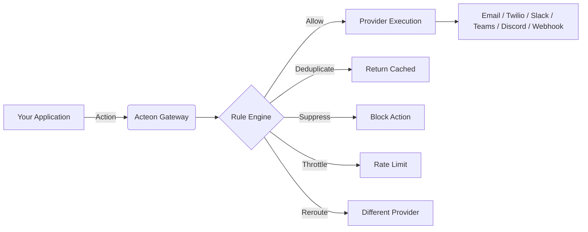
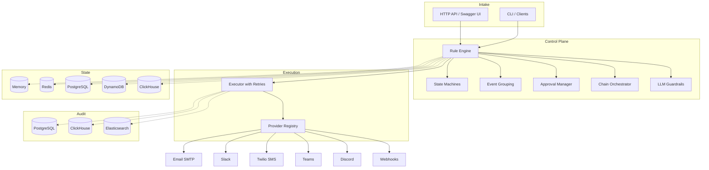

---
hide:
  - navigation
  - toc
---

<div class="hero" markdown>

{ width="180" }

# Acteon

**Actions forged in Rust**

_A distributed action gateway that transforms, deduplicates, routes, and dispatches actions through a configurable pipeline of rules, providers, and state backends._

[Get Started](getting-started/quickstart.md){ .md-button .md-button--primary }
[View on GitHub](https://github.com/penserai/acteon){ .md-button }

</div>

---

## What is Acteon?

Acteon is a **distributed action gateway** built in Rust. It sits between your application and external services (email, SMS, Slack, webhooks, LLMs, and more), providing a powerful control plane that decides _what happens_ to every action before it reaches the outside world.

The name draws from the Greek myth of **Actaeon**, a hunter transformed by Artemis into a stag — the very thing he pursued. Likewise, actions entering Acteon are **transformed** — deduplicated, rerouted, throttled, or dispatched — before they ever reach the outside world.



---

<div class="grid" markdown>

<div class="card" markdown>

### Rule-Based Processing

Define rules in YAML to suppress, deduplicate, throttle, reroute, or modify actions. Rules are evaluated by priority and can match on any field of the action payload.

[Learn more](concepts/rules.md)

</div>

<div class="card" markdown>

### Event Lifecycle Management

Track events through configurable state machines with automatic timeout transitions. Group related events for consolidated notifications.

[Learn more](features/state-machines.md)

</div>

<div class="card" markdown>

### Pluggable Backends

Choose from Memory, Redis, PostgreSQL, DynamoDB, or ClickHouse for state storage. Mix and match with PostgreSQL, ClickHouse, or Elasticsearch for audit trails.

[Learn more](backends/index.md)

</div>

<div class="card" markdown>

### Human-in-the-Loop Approvals

Require human approval before executing sensitive actions. Supports HMAC-signed approval/rejection URLs with configurable TTLs.

[Learn more](features/approvals.md)

</div>

<div class="card" markdown>

### Multi-Step Task Chains

Orchestrate multi-step workflows where each step's output feeds into the next. Supports configurable failure policies and delay between steps.

[Learn more](features/chains.md)

</div>

<div class="card" markdown>

### LLM Guardrails

Use LLM-based evaluation to gate actions through AI-powered guardrails. Block or flag actions based on content analysis with configurable confidence thresholds.

[Learn more](features/llm-guardrails.md)

</div>

<div class="card" markdown>

### Semantic Routing

Route actions by meaning, not just field values. Use vector embeddings and cosine similarity to match actions against topic descriptions in natural language.

[Learn more](features/semantic-routing.md)

</div>

<div class="card" markdown>

### Enterprise Ready

Multi-tenant isolation, API key and JWT authentication, hot-reload for rules and auth config, graceful shutdown, and comprehensive audit trails.

[Learn more](api/authentication.md)

</div>

<div class="card" markdown>

### Polyglot Clients

Official SDKs for Rust, Python, Node.js/TypeScript, Go, and Java. Every client provides dispatch, batch, rule management, and audit querying.

[Learn more](api/polyglot-clients.md)

</div>

<div class="card" markdown>

### Simulation & Testing

End-to-end testing framework with mock providers, failure injection, multi-node scenarios, and performance benchmarks across all backend combinations.

[Learn more](examples/simulation.md)

</div>

<div class="card" markdown>

### Guides

In-depth guides that combine multiple Acteon features to solve real-world problems, from AI agent swarm coordination to production deployment patterns.

[Learn more](guides/index.md)

</div>

</div>

---

## Quick Example

Define a rule to deduplicate emails and suppress spam:

```yaml title="rules/basic.yaml"
rules:
  - name: block-spam
    priority: 1
    condition:
      field: action.action_type
      eq: "spam"
    action:
      type: suppress

  - name: dedup-email
    priority: 10
    condition:
      field: action.action_type
      eq: "send_email"
    action:
      type: deduplicate
      ttl_seconds: 300
```

Dispatch an action:

```bash
curl -X POST http://localhost:8080/v1/dispatch \
  -H "Content-Type: application/json" \
  -d '{
    "namespace": "notifications",
    "tenant": "tenant-1",
    "provider": "email",
    "action_type": "send_email",
    "payload": {
      "to": "user@example.com",
      "subject": "Welcome!"
    },
    "dedup_key": "welcome-user@example.com"
  }'
```

---

## Architecture at a Glance



---

## License

Copyright 2026 Penserai Inc. Licensed under the [Apache License 2.0](https://github.com/penserai/acteon/blob/main/LICENSE).
