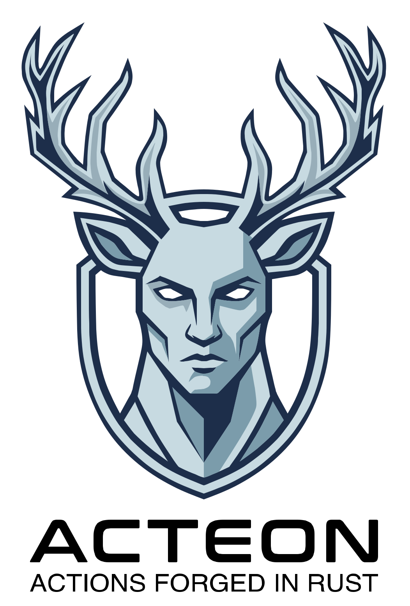

# Turn intent into accountable action.

**Execution and governance for AI agents and deterministic operations.**

Acteon is an open-source platform for putting automation to work. Bring an agent's
decision, an application's request, or a stream of events. Define who can act,
what may run, when a human must approve, and how execution recovers when something
fails.

Rules, durable workflows, agent coordination, typed model calls, and operational
controls work together in one platform—built in Rust and deployed on your infrastructure.

[Run your first action](getting-started/quickstart.md){ .md-button .md-button--primary }
[Explore the platform](concepts/index.md){ .md-button }

  

<dl class="execution-path" aria-label="From intent to evidence">
  
<dt>Intent</dt><dd>Agent decisions, service requests, events</dd>

  
<dt>Policy</dt><dd>Identity, rules, quotas, approvals</dd>

  
<dt>Execution</dt><dd>Providers, chains, workers, workflows</dd>

  
<dt>Evidence</dt><dd>Outcomes, histories, audit, recovery</dd>

</dl>

## A name rooted in transformation

In Greek mythology, **Actaeon** was a hunter transformed by Artemis into a stag—the
very creature he pursued. That idea of transformation gives Acteon its name and
its stag emblem.

Acteon brings that spirit to automation: raw intent takes shape through policy
and execution. An agent's proposal, a service request, or a burst of events can
be filtered, reshaped, routed, and carried through a durable workflow. **Actions
forged in Rust**, with controls that you define and outcomes you can inspect.

## Build automation you can operate

<section markdown>

### Give agents a governed way to act

Connect agents through MCP, A2A, or the Agentic Bus. Scope their permissions,
put sensitive actions behind approval, and invoke models through validated
contracts. Run coordinated agent work with the optional swarm orchestrator.

[Build with agents and AI](features/agents-and-ai.md)

</section>
<section markdown>

### Keep business operations moving

Turn a single action into a durable execution. Compose provider calls into
chains, wait for a signal, run tasks on your own workers, or write workflows in
Python and TypeScript. Track progress across retries, waits, and restarts.

[Choose your execution model](concepts/execution-model.md)

</section>
<section markdown>

### Turn live signals into decisions

Correlate Kafka streams with event-time windows. Validate inputs, checkpoint
processing, quarantine failures, and deliver outputs through a managed outbox.
Combine deterministic rules, typed inference, and agent escalation in one flow.

[Build event-driven systems](features/streams-and-events.md)

</section>

## Make control part of execution

An agent can propose a remediation. A rule can determine whether the evidence is
sufficient. An approval can authorize a sensitive step. A durable chain can carry
out the work and preserve its history. Acteon gives each responsibility a place.

| Your operational question | The platform capability |
|---|---|
| **Who is allowed to do this?** | Tenant and namespace scoping, API key/JWT authentication, grants, and agent lifecycle controls |
| **Should this action run now?** | Rules, deduplication, throttling, quotas, schedules, and human approvals |
| **What happens if it fails?** | Durable receipts, retries, worker leases, checkpoints, dead letters, and explicit recovery operations |
| **How do we explain the outcome?** | Rule evaluation tools, execution histories, model contract evidence, audit storage, metrics, and tracing |

[Understand the governance model](concepts/governance.md)

## See the platform working end to end

The [cascading observability guide](guides/neural-observability-detector.md) joins
metrics, traces, and logs from three Kafka sources, makes real calls to a local
Laya model, and routes the result to suppression, an incident chain, or a bounded
investigator.

Its checked-in simulation covers **four scenarios and 16 real model calls**,
plus worker replacement, quarantine repair, audited halt/resume, and delivery
recovery. Read the configuration, run the experiment, and inspect the results.

[Run the observability scenario](guides/neural-observability-detector.md){ .md-button }

## Start with one action. Expand when you need to.

Acteon includes an HTTP server, Admin UI, CLI, MCP server, and SDKs for Rust,
Python, TypeScript, Go, and Java. Start locally with in-memory state and a log
provider; add the integrations, persistent backends, and workers your workload
needs. Agent orchestration and Kafka capabilities are available through optional
build features.

- **Try it:** [run the quick start](getting-started/quickstart.md) and see execution, deduplication, and suppression.
- **Build a real flow:** choose an [agent, observability, incident, commerce, or cloud guide](guides/index.md).
- **Deploy it:** configure [identity and policy](concepts/governance.md), [persistence](backends/index.md), and [production operations](reference/deployment.md).

Acteon is self-hosted, built in Rust, and released under the
[Apache 2.0 license](https://github.com/penserai/acteon/blob/main/LICENSE).
[Explore the source](https://github.com/penserai/acteon).

