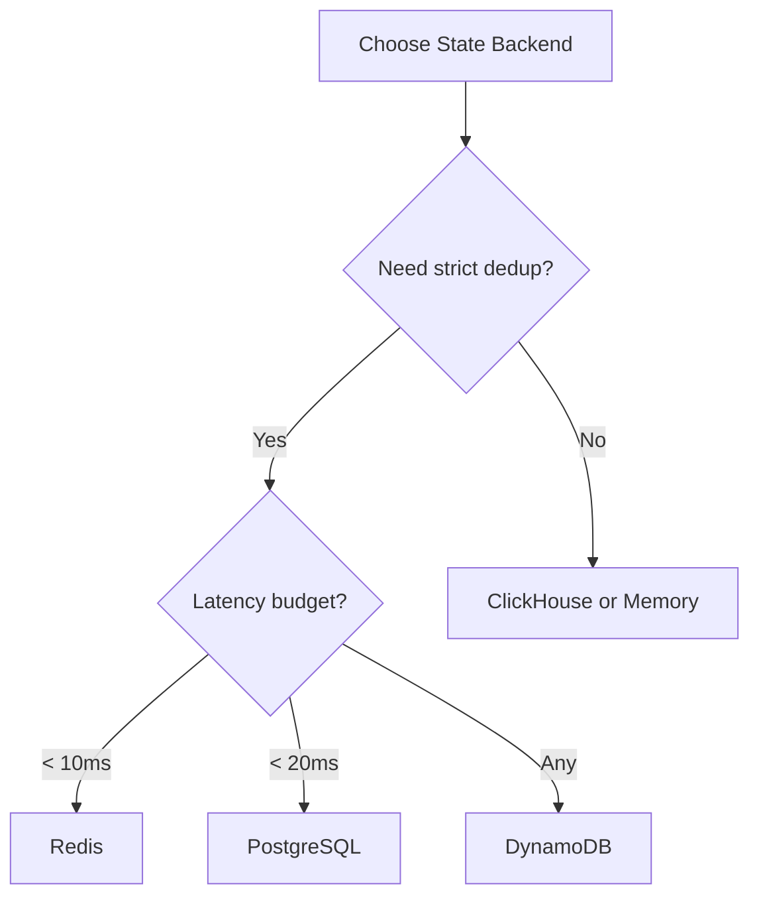

# Performance Guide

## Throughput Benchmarks

Measured with 200 sequential actions, no rules, single provider:

| State Backend | Audit Backend | Throughput | Latency (p50) | Notes |
|---------------|---------------|------------|---------------|-------|
| Memory | None | ~50,000/s | < 1ms | Baseline, no I/O |
| Memory | PostgreSQL | ~28,000/s | 2ms | Async audit writes |
| Redis | None | ~2,000/s | 5ms | Network round-trip |
| Redis | PostgreSQL | ~1,100/s | 8ms | Production combo |
| Redis | ClickHouse | ~970/s | 10ms | Analytics combo |
| PostgreSQL | PostgreSQL | ~850/s | 12ms | Single backend |
| DynamoDB | None | ~340/s | 50ms | AWS SDK overhead |
| ClickHouse | ClickHouse | ~120/s | 100ms | Eventual consistency |

## Concurrent Deduplication Accuracy

With 20 concurrent dispatches using the same `dedup_key`:

| State Backend | Executed | Deduplicated | Accuracy |
|---------------|----------|--------------|----------|
| Memory | 1 | 19 | 100% |
| Redis | 1 | 19 | 100% |
| PostgreSQL | 1 | 19 | 100% |
| DynamoDB | 1 | 19 | 100% |
| ClickHouse | 10-20 | 0-10 | ~50-80% |

## Optimization Tips

### State Backend Selection



### Executor Tuning

| Parameter | Impact | Recommendation |
|-----------|--------|----------------|
| `max_concurrent` | Controls parallelism | Start at 10, increase based on provider capacity |
| `max_retries` | Affects failure recovery time | 3 for most providers, 1 for non-critical |
| `timeout_seconds` | Guards against hanging providers | Match provider SLA, typically 10-30s |

```toml
[executor]
max_concurrent = 100    # High for fast providers
max_retries = 3         # Standard retry count
timeout_seconds = 15    # Aggressive timeout
```

### Rule Optimization

- **Priority ordering** — Place frequently-matching rules at lower priorities (evaluated first)
- **Simple conditions** — `eq` is faster than `regex`
- **Early suppression** — Suppress rules should have the lowest priority numbers

### Background Processing Tuning

```toml
[background]
tick_interval_ms = 1000       # How often to check for work
group_flush_timeout_ms = 60000 # Group wait before notification
timeout_check_batch_size = 100 # Events checked per tick
```

### Connection Pooling

All database backends use connection pooling:

- **Redis**: `deadpool-redis` with configurable pool size
- **PostgreSQL**: `sqlx` connection pool
- **ClickHouse**: HTTP connection pool
- **DynamoDB**: AWS SDK connection management

## Memory Usage

| Component | Approximate Memory |
|-----------|--------------------|
| Gateway (idle) | ~50 MB |
| Per active rule | ~1 KB |
| Per cached dedup key | ~200 bytes |
| Per event group | ~1 KB + 200 bytes/event |
| Per audit record (in-memory) | ~2 KB |

## Running Benchmarks

```bash
# Throughput benchmark
cargo bench -p acteon-simulation --bench throughput

# Latency benchmark
cargo bench -p acteon-simulation --bench latency
```

## Load Testing

For production load testing, use the simulation framework:

```rust
use acteon_simulation::prelude::*;

let harness = SimulationHarness::start(
    SimulationConfig::builder()
        .nodes(1)
        .add_recording_provider("email")
        .build()
).await?;

let start = Instant::now();
for i in 0..10_000 {
    let action = Action::new("ns", "t1", "email", "send", json!({"seq": i}));
    harness.dispatch(&action).await?;
}
let elapsed = start.elapsed();
println!("Throughput: {:.0} actions/sec", 10_000.0 / elapsed.as_secs_f64());
```
