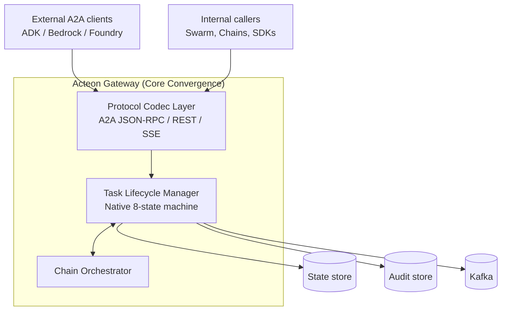

# Acteon A2A Protocol Implementation

**Status:** Draft
**Author:** Acteon Team
**Created:** 2026-05-14
**Updated:** 2026-05-14 (Core-First Convergence)

## Overview

This document proposes implementing the [Agent2Agent (A2A) Protocol](https://a2a-protocol.org/latest/specification/) in Acteon as a **primary architectural citizen**. Rather than a peripheral facade, A2A concepts (Tasks, AgentCards, and the 8-state lifecycle) will be promoted to **native primitives** in `acteon-core`.

This "Core-First" approach ensures that Acteon's hardened orchestration—rules, quotas, compliance hash chains, and multi-tenant auth—is the foundation for a robust, scalable A2A implementation suitable for enterprise-grade federated agent ecosystems.

## Motivation

A2A is rapidly becoming the "default interop fabric" for multi-vendor agent ecosystems. By elevating A2A to a core use case, Acteon achieves:

1.  **Architectural Convergence** — Acteon agents, chains, and swarms are natively A2A-compliant, reducing translation overhead and improving reliability.
2.  **Hardened Orchestration at Scale** — A2A Tasks inherit Acteon's compliance, audit, and sandboxed validation features out of the box.
3.  **Strategic Multi-Agent Foundation** — Acteon becomes the "safe substrate" for cross-vendor coordination, where every external interaction is tracked via a standardized, observable Task lifecycle.

## Convergence Mapping: A2A ↔ Acteon Core

| A2A Concept | Acteon Core Implementation | Location |
|---|---|---|
| `AgentCard` | Native extension to `Agent` struct (skills, interfaces, schemas) | `crates/core/src/bus_agent.rs` |
| `Task` | **NEW** `bus_task.rs` — Native Acteon primitive for asynchronous work | `crates/core/src/bus_task.rs` |
| `TaskState` | Unified 8-state machine used by both A2A and internal orchestration | `crates/core/src/bus_task.rs` |
| `Artifact` | Native `bus_stream.rs` extension with `append` / `lastChunk` support | `crates/core/src/bus_stream.rs` |
| `Message` / `Part` | Converged envelope formats for all bus traffic | `crates/core/src/bus_conversation.rs` |
| `requires_approval` | Maps natively to `BusApproval` | `crates/core/src/bus_approval.rs` |
| Task ↔ Chain | **Native Bridge**: A2A Tasks are backed by Acteon Chain execution | `crates/core/src/chain.rs` |

## Architecture: Core Convergence

A2A is integrated into the **core gateway loop**, not as a separate service. The `acteon-gateway` handles both internal bus events and A2A wire formats (JSON-RPC 2.0 / REST) using a shared protocol substrate.

### Key Decisions for Core-First

1.  **Task ↔ Chain Foundation:** An A2A Task *is* the primary external representation of an Acteon Chain execution. When an external agent invokes Acteon, the lifecycle is managed by the Chain engine, and the state is projected via the A2A Task primitive.
2.  **Stateless Entrypoints:** The protocol layer in the gateway remains stateless. All Task state is persisted in the shared `StateStore` and synchronized via `Kafka` events, allowing horizontal scaling of A2A endpoints.
3.  **Identity Stamping:** A2A interactions use Phase 10's `Grant.agent_id`. Every external call is identity-bound, ensuring the audit trail shows the specific external agent identity alongside the tenant.
4.  **State Machine Convergence:** The 8-state A2A `TaskState` enum is adopted **verbatim** as the canonical lifecycle. Narrower internal enums (`ConversationState`, `ToolResultStatus`) remain in place for their respective domains, and the Task Engine projects from / into them at the bus boundary. Internal callers are not forced to reason in 8 states.
5.  **Breaking Changes Acceptable:** Acteon has no paid or external customers at this stage. The plan treats the existing bus envelope (`bus_conversation.rs`, `bus_stream.rs`, polyglot SDK message shapes) as freely mutable. No version-shimming or back-compat work is in scope.

### Inherits from Existing Infrastructure

The Core-First plan deliberately reuses what's already shipped, not rebuilds it:

- **SSE streaming + reconnect** (PRs #153–157, May 2026) — `Last-Event-ID` replay, per-tenant connection caps, slow-client backpressure. Drop-in for `SubscribeToTask` and push-notification fan-out.
- **JSON Schema registry** at publish-edge (`crates/bus/src/schema.rs`) — directly powers A2A `Skill.inputSchema` validation.
- **Audit hash chain + compliance verifier** (`crates/server/src/api/compliance.rs`) — every Task transition lands in the same tamper-evident audit pipeline.
- **mTLS stack** (`crates/crypto/src/tls.rs`) — already wired into the shared `reqwest::Client`; satisfies `MutualTlsSecurityScheme` for both inbound A2A requests and outbound push delivery.
- **Multi-tenant ACL** — A2A §3.3.2 ("never leak resource existence to unauthorized clients") is already how Acteon returns 403 vs. 404 on tenant mismatches.
- **Idempotency** — action/chain dedup-key infrastructure maps onto A2A `messageId` deduplication.
- **`Grant.agent_id` binding** (Phase 10) — per-agent API-key identity is already in the auth layer.

## Risks

The Core-First posture imports A2A's complexity into Acteon's substrate. Each risk below carries a concrete defense that lands in code as part of the listed phase — Phase 1 is *not* a "trust the spec" pass.

- **A2A spec churn.** 1.0 was ratified in late 2025 and is still evolving. Keep the protocol codec layer thin and put the `A2A-Version` header on the critical path so future revisions don't cascade into the Task Engine.
- **Recursive task-graph landmine (cycles + depth).** `Task` is structurally flat (`referenceTaskIds: Vec<String>` carries IDs, not nested objects, so serialize-side stack overflow is avoided), but the *graph* across rows can cycle. Defenses: Phase 1 ships `MAX_REFERENCE_DEPTH = 5` plus 1-hop self-reference rejection at validation time; Phase 2's Task Engine does BFS cycle detection across rows when resolving reference graphs. utoipa schema is safe (`Vec<String>` not recursive).
- **Shadow states ("Working" task with no chain).** A Task left in a non-terminal state without progress is a memory leak. Defenses: Phase 1 adds `working_ttl_ms`, `last_progress_at`, `is_stale_at(now)` to Task (default 30-minute TTL, derived staleness mirrors `Agent.status_at()`); Phase 2 ships the reaper that transitions stale tasks to `Failed`. Read-time derivation is the backstop if the reaper lags.
- **Part bloat (large `base64` in Kafka).** A2A `Part` carries arbitrary content. Defense: Phase 1 caps `text`/`raw`/`data` parts at **256KB** each; anything larger must use `Part::url` referencing an external store. (The `acteon-blob` crate was previously removed, so external object stores are the supported escape hatch.)
- **AgentCard registry contamination.** A2A `Skill`/`Interface` schemas are verbose; inlining them onto `Agent` bloats the hot heartbeat/list/route path. Defense: the follow-up bus_agent PR adds `Agent.has_agent_card: bool` and stores the full AgentCard at a separate `KeyKind::BusAgentCard`. A2A discovery reads the card; nothing else does.
- **Fragmented HITL workflows.** Acteon has `BusApproval` for operator-approves-outbound-tool-call; A2A adds `AuthRequired` (user provides credential) and `InputRequired` (user clarifies). Defense: Phase 1 adds `Task.pending_approval_id: Option<String>` so any paused Task points at *one* row representing the pause; Phase 2 generalizes `BusApproval` with `kind: PauseKind` (`OperatorApproval` / `UserAuth` / `UserInput`) so there's a single source of truth for "waiting on human."
- **Artifact streaming race.** A2A doesn't specify ordering between `append` chunks and `lastChunk`. A late append after a `lastChunk: true` closes the task can silently drop data. Defense: Phase 1 adds Acteon-extension fields `chunk_index: Option<i64>` (mirrors `StreamChunk.chunk_seq`) and `total_chunks: Option<i64>` (asserted on the last chunk); Phase 2 Engine enforces "all chunks 0..total before close" and "no chunks after lastChunk."
- **Push delivery semantics.** A2A doesn't mandate exactly-once. Reuse the webhook provider's retry + DLQ pattern and stamp `acteon.push.attempt` headers for audit replay.
- **8-state surface area in clients.** SDK consumers will now see eight Task states. Worth a doc page distinguishing terminal (Completed/Failed/Canceled/Rejected) from interrupt (InputRequired/AuthRequired) states so library users don't write incorrect "is finished" checks.

## Implementation Plan

### Phase 1: Core Primitives (`acteon-core`) — ~5 days
- [x] **Native Task:** `bus_task.rs` defining `Task` with the 8-state lifecycle, `Artifact`, `Message`, `Part`. Validation, serde, utoipa.
- [x] **Defensive validation (from adversarial review):**
  - [x] Part caps at 256KB (text/raw/data) — larger payloads must go by URL reference.
  - [x] `MAX_REFERENCE_DEPTH = 5` constant + 1-hop self-reference rejection. Phase 2 Engine does multi-hop BFS.
  - [x] `working_ttl_ms` / `last_progress_at` / `is_stale_at(now)` for shadow-state defense (default 30-minute TTL).
  - [x] `pending_approval_id: Option<String>` to point any paused Task at exactly one BusApproval row.
  - [x] Artifact `chunk_index` / `total_chunks` for streaming race-safety.
- [ ] **Artifact Streaming:** Update `bus_stream.rs` to include `append` and `last_chunk` metadata for native A2A artifact support.
- [ ] **Agent Evolution:** Extend `Agent` in `bus_agent.rs` with `has_agent_card: bool` flag; store the full `AgentCard` (skills, interfaces, security schemes) at a separate `KeyKind::BusAgentCard` so the hot heartbeat/list/route path stays lean.
- [ ] **Converged Envelopes:** Align `bus_conversation.rs` message parts with A2A `Message`/`Part` semantics.
- [x] Unit tests for state transitions, validation, serde round-trips, and the defensive validations above.

### Phase 2: Gateway Integration (`crates/gateway`) — ~6 days
- [ ] **Protocol Codecs:** Implement encoders/decoders for A2A JSON-RPC 2.0 and the REST binding (spec §11). Wire `A2A-Version` header negotiation with `VersionNotSupportedError`.
- [ ] **Task Engine:** Implement the lifecycle manager in the gateway, handling state transitions and persistence via the existing `State` backend (new `KeyKind::A2aTask`). Use CAS retries to mirror the bus's optimistic-locking pattern.
- [ ] **Engine-side hardening (graph + streaming):**
  - [ ] BFS cycle detection across multi-Task `referenceTaskIds` graphs, capped at `MAX_REFERENCE_DEPTH`.
  - [ ] Reaper that transitions stale tasks (`is_stale_at(now)`) to `Failed`, with a corresponding `acteon.task.reaped` audit envelope.
  - [ ] Artifact-stream gatekeeper: rejects chunks arriving after `lastChunk = true`; when `totalChunks` is asserted, holds the close until all indices 0..total are observed.
- [ ] **BusApproval generalization (single source of truth for HITL):** Extend `BusApproval` with `kind: PauseKind` (`OperatorApproval` / `UserAuth` / `UserInput`); Task Engine stamps the approval row's id onto `Task.pending_approval_id`.
- [ ] **The Bridge:** Native mapping between `Task` state and `Chain` status — A2A `Submitted/Working` ↔ chain step progress; `InputRequired/AuthRequired` ↔ generalized `BusApproval`; terminal states ↔ chain `StepResult`.
- [ ] **Audit Integration:** Stamp every A2A operation with `AuditEventKind::A2aTaskTransition`.
- [ ] **Idempotency:** Wire A2A `messageId` through existing dedup-key infrastructure.

### Phase 3: Discovery & SSE Bridge — ~4 days
- [ ] **Global Discovery Registry:** Implement a dynamic `DiscoveryService` that aggregates native `AgentCard` data for `/.well-known/agent.json`. Public and unauthenticated per spec.
- [ ] **High-Scale Streaming:** Integrate `SubscribeToTask` and `SendStreamingMessage` directly with the gateway's SSE bridge, reusing `Last-Event-ID` and per-tenant connection caps. Re-frame internal `StreamChunk` / `StreamEnd` records as A2A `StreamResponse` envelopes.
- [ ] Optional `GetExtendedAgentCard` for authenticated callers.

### Phase 4: Push Notifications & Security Schemes — ~4 days
- [ ] **Native Push Delivery:** Implement task-scoped webhook delivery (`Create/Get/List/Delete TaskPushNotificationConfig`). Reuse shared `reqwest::Client`, retry + DLQ, and audit-stamped envelope pattern from the webhook provider.
- [ ] **Security Schemes:** Map `APIKeySecurityScheme`, `HTTPAuthSecurityScheme` (Bearer), and `MutualTlsSecurityScheme` to native Acteon Grants and TLS configurations. (`OAuth2`/`OpenIdConnect` deferred to a follow-up.)

### Phase 5: Hardening & Validation — ~3 days
- [ ] **Adversarial test suite:** explicit tests for each Risks bullet — Part bloat at boundary, deep cycle attacks, stale-task reaping, race-prone artifact streams, HITL workflow consistency.
- [ ] **Security review:** Run the existing security-review skill against the new endpoints (`/.well-known/agent.json`, `/a2a/rpc`, push delivery worker).
- [ ] **Load test:** Gateway benchmark covering streamed Task lifecycle under N concurrent subscribers, including chunk-ordering and stale-reaper behavior.
- [ ] **Fuzz the codecs:** quickcheck/proptest fuzzing on the JSON-RPC and REST codec layers — guarantees no panics on malformed input.
- [ ] **Per-tenant cap overrides** (if needed): wire the Phase 1 cap constants to be tenant-overridable via the existing quota system for trusted high-throughput tenants.

### Phase 6: SDK & Simulation — ~5 days
- [ ] Update all polyglot SDKs (Rust, Python, Node, Go, Java) to support the native A2A Task primitives.
- [ ] Add `a2a_core_simulation.rs` demonstrating a Task pipeline through all 8 states (including `InputRequired` and `AuthRequired` interrupts).
- [ ] `docs/book/features/a2a.md` user-facing guide; promote this design doc to `docs/architecture/a2a.md` once shipped.
- [ ] CHANGELOG entry + README feature-matrix update.

### Pre-Commit Checks (per Phase)
- [ ] `cargo fmt --all`
- [ ] `cargo clippy --workspace --no-deps -- -D warnings`
- [ ] `cargo test --workspace --lib --bins --tests`
- [ ] `cargo check --all-targets`
- [ ] `(cd ui && npm run lint && npm run build)` when UI changes touched

**Total estimated effort: ~27 days (≈5.5 weeks single-engineer).** Phase ordering is deliberate — Phases 1–3 deliver an unauthenticated, streaming, discoverable A2A endpoint usable by external clients; Phases 4–6 layer in production-grade auth, push, hardening, and SDK parity.

## References

- [A2A Protocol Specification](https://a2a-protocol.org/latest/specification/)
- [A2A on GitHub](https://github.com/a2aproject/A2A)
- [Google announcement of A2A](https://developers.googleblog.com/en/a2a-a-new-era-of-agent-interoperability/)
- [Agent2Agent protocol upgrade — Google Cloud Blog](https://cloud.google.com/blog/products/ai-machine-learning/agent2agent-protocol-is-getting-an-upgrade)
- Internal: `docs/design/mcp-server.md` — sibling external-protocol implementation
- Internal: `docs/architecture/agent-swarm.md` — multi-agent orchestration this complements
