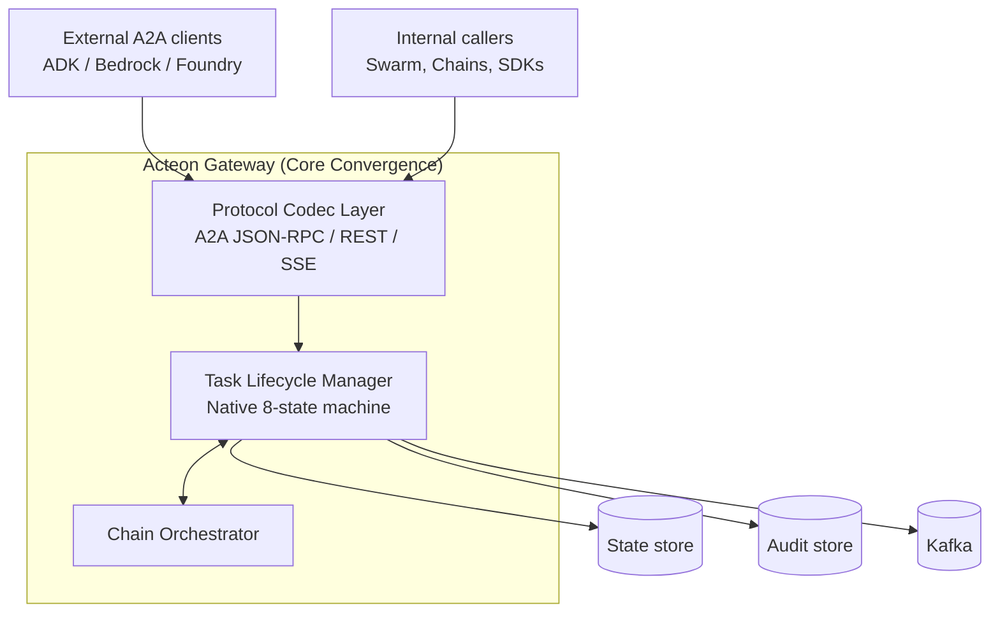

# Acteon A2A Protocol Implementation

**Status:** Draft
**Author:** Acteon Team
**Created:** 2026-05-14
**Updated:** 2026-05-14 (Core-First Convergence)

## Overview

This document proposes implementing the [Agent2Agent (A2A) Protocol](https://a2a-protocol.org/latest/specification/) in Acteon as a **primary architectural citizen**. Rather than a peripheral facade, A2A concepts (Tasks, AgentCards, and the 8-state lifecycle) will be promoted to **native primitives** in `acteon-core`.

This "Core-First" approach ensures that Acteon's hardened orchestration—rules, quotas, compliance hash chains, and multi-tenant auth—is the foundation for a robust, scalable A2A implementation suitable for enterprise-grade federated agent ecosystems.

## Motivation

A2A is rapidly becoming the "default interop fabric" for multi-vendor agent ecosystems. By elevating A2A to a core use case, Acteon achieves:

1.  **Architectural Convergence** — Acteon agents, chains, and swarms are natively A2A-compliant, reducing translation overhead and improving reliability.
2.  **Hardened Orchestration at Scale** — A2A Tasks inherit Acteon's compliance, audit, and sandboxed validation features out of the box.
3.  **Strategic Multi-Agent Foundation** — Acteon becomes the "safe substrate" for cross-vendor coordination, where every external interaction is tracked via a standardized, observable Task lifecycle.

## Convergence Mapping: A2A ↔ Acteon Core

| A2A Concept | Acteon Core Implementation | Location |
|---|---|---|
| `AgentCard` | Native extension to `Agent` struct (skills, interfaces, schemas) | `crates/core/src/bus_agent.rs` |
| `Task` | **NEW** `bus_task.rs` — Native Acteon primitive for asynchronous work | `crates/core/src/bus_task.rs` |
| `TaskState` | Unified 8-state machine used by both A2A and internal orchestration | `crates/core/src/bus_task.rs` |
| `Artifact` | Native `bus_stream.rs` extension with `append` / `lastChunk` support | `crates/core/src/bus_stream.rs` |
| `Message` / `Part` | Converged envelope formats for all bus traffic | `crates/core/src/bus_conversation.rs` |
| `requires_approval` | Maps natively to `BusApproval` | `crates/core/src/bus_approval.rs` |
| Task ↔ Chain | **Native Bridge**: A2A Tasks are backed by Acteon Chain execution | `crates/core/src/chain.rs` |

## Architecture: Core Convergence

A2A is integrated into the **core gateway loop**, not as a separate service. The `acteon-gateway` handles both internal bus events and A2A wire formats (JSON-RPC 2.0 / REST) using a shared protocol substrate.

### Key Decisions for Core-First

1.  **Task ↔ Chain Foundation:** An A2A Task *is* the primary external representation of an Acteon Chain execution. When an external agent invokes Acteon, the lifecycle is managed by the Chain engine, and the state is projected via the A2A Task primitive.
2.  **Stateless Entrypoints:** The protocol layer in the gateway remains stateless. All Task state is persisted in the shared `StateStore` and synchronized via `Kafka` events, allowing horizontal scaling of A2A endpoints.
3.  **Identity Stamping:** A2A interactions use Phase 10's `Grant.agent_id`. Every external call is identity-bound, ensuring the audit trail shows the specific external agent identity alongside the tenant.
4.  **State Machine Convergence:** The 8-state A2A `TaskState` enum is adopted **verbatim** as the canonical lifecycle. Narrower internal enums (`ConversationState`, `ToolResultStatus`) remain in place for their respective domains, and the Task Engine projects from / into them at the bus boundary. Internal callers are not forced to reason in 8 states.
5.  **Breaking Changes Acceptable:** Acteon has no paid or external customers at this stage. The plan treats the existing bus envelope (`bus_conversation.rs`, `bus_stream.rs`, polyglot SDK message shapes) as freely mutable. No version-shimming or back-compat work is in scope.

### Inherits from Existing Infrastructure

The Core-First plan deliberately reuses what's already shipped, not rebuilds it:

- **SSE streaming + reconnect** (PRs #153–157, May 2026) — `Last-Event-ID` replay, per-tenant connection caps, slow-client backpressure. Drop-in for `SubscribeToTask` and push-notification fan-out.
- **JSON Schema registry** at publish-edge (`crates/bus/src/schema.rs`) — directly powers A2A `Skill.inputSchema` validation.
- **Audit hash chain + compliance verifier** (`crates/server/src/api/compliance.rs`) — every Task transition lands in the same tamper-evident audit pipeline.
- **mTLS stack** (`crates/crypto/src/tls.rs`) — already wired into the shared `reqwest::Client`; satisfies `MutualTlsSecurityScheme` for both inbound A2A requests and outbound push delivery.
- **Multi-tenant ACL** — A2A §3.3.2 ("never leak resource existence to unauthorized clients") is already how Acteon returns 403 vs. 404 on tenant mismatches.
- **Idempotency** — action/chain dedup-key infrastructure maps onto A2A `messageId` deduplication.
- **`Grant.agent_id` binding** (Phase 10) — per-agent API-key identity is already in the auth layer.

## Risks

The Core-First posture imports A2A's complexity into Acteon's substrate. Each risk below carries a concrete defense that lands in code as part of the listed phase — Phase 1 is *not* a "trust the spec" pass.

- **A2A spec churn.** 1.0 was ratified in late 2025 and is still evolving. Keep the protocol codec layer thin and put the `A2A-Version` header on the critical path so future revisions don't cascade into the Task Engine.
- **Recursive task-graph landmine (cycles + depth).** `Task` is structurally flat (`referenceTaskIds: Vec<String>` carries IDs, not nested objects, so serialize-side stack overflow is avoided), but the *graph* across rows can cycle. Defenses: Phase 1 ships `MAX_REFERENCE_DEPTH = 5` plus 1-hop self-reference rejection at validation time; Phase 2's Task Engine does BFS cycle detection across rows when resolving reference graphs. utoipa schema is safe (`Vec<String>` not recursive).
- **Shadow states ("Working" task with no chain).** A Task left in a non-terminal state without progress is a memory leak. Defenses: Phase 1 adds `working_ttl_ms`, `last_progress_at`, `is_stale_at(now)` to Task (default 30-minute TTL, derived staleness mirrors `Agent.status_at()`); Phase 2 ships the reaper that transitions stale tasks to `Failed`. Read-time derivation is the backstop if the reaper lags.
- **Part bloat (large `base64` in Kafka).** A2A `Part` carries arbitrary content. Defense: Phase 1 caps `text`/`raw`/`data` parts at **256KB** each; anything larger must use `Part::url` referencing an external store. (The `acteon-blob` crate was previously removed, so external object stores are the supported escape hatch.)
- **AgentCard registry contamination.** A2A `Skill`/`Interface` schemas are verbose; inlining them onto `Agent` bloats the hot heartbeat/list/route path. Defense: the follow-up bus_agent PR adds `Agent.has_agent_card: bool` and stores the full AgentCard at a separate `KeyKind::BusAgentCard`. A2A discovery reads the card; nothing else does.
- **Fragmented HITL workflows.** Acteon has `BusApproval` for operator-approves-outbound-tool-call; A2A adds `AuthRequired` (user provides credential) and `InputRequired` (user clarifies). Defense: Phase 1 adds `Task.pending_approval_id: Option<String>` so any paused Task points at *one* row representing the pause; Phase 2 generalizes `BusApproval` with `kind: PauseKind` (`OperatorApproval` / `UserAuth` / `UserInput`) so there's a single source of truth for "waiting on human."
- **Artifact streaming race.** A2A doesn't specify ordering between `append` chunks and `lastChunk`. A late append after a `lastChunk: true` closes the task can silently drop data. Defense: Phase 1 adds Acteon-extension fields `chunk_index: Option<i64>` (mirrors `StreamChunk.chunk_seq`) and `total_chunks: Option<i64>` (asserted on the last chunk); Phase 2 Engine enforces "all chunks 0..total before close" and "no chunks after lastChunk."
- **Push delivery semantics.** A2A doesn't mandate exactly-once. Reuse the webhook provider's retry + DLQ pattern and stamp `acteon.push.attempt` headers for audit replay.
- **8-state surface area in clients.** SDK consumers will now see eight Task states. Worth a doc page distinguishing terminal (Completed/Failed/Canceled/Rejected) from interrupt (InputRequired/AuthRequired) states so library users don't write incorrect "is finished" checks.

## Implementation Plan

### Phase 1: Core Primitives (`acteon-core`) — ~5 days
- [x] **Native Task:** `bus_task.rs` defining `Task` with the 8-state lifecycle, `Artifact`, `Message`, `Part`. Validation, serde, utoipa.
- [x] **Defensive validation (from adversarial review):**
  - [x] Part caps at 256KB (text/raw/data) — larger payloads must go by URL reference.
  - [x] `MAX_REFERENCE_DEPTH = 5` constant + 1-hop self-reference rejection. Phase 2 Engine does multi-hop BFS.
  - [x] `working_ttl_ms` / `last_progress_at` / `is_stale_at(now)` for shadow-state defense (default 30-minute TTL).
  - [x] `pending_approval_id: Option<String>` to point any paused Task at exactly one BusApproval row.
  - [x] Artifact `chunk_index` / `total_chunks` for streaming race-safety.
- [x] **Artifact Streaming:** `bus_stream.rs::TaskArtifactUpdateEvent` carries native A2A `append` + `lastChunk` (camelCase serde) alongside the Acteon-side `chunk_index` / `total_chunks` for streaming race-safety. The cross-delivery invariants (no updates after close, strictly in-order chunks, completeness on `totalChunks`) are enforced by the artifact-stream gatekeeper (#164).
- [x] **Agent Evolution:** `Agent` in `bus_agent.rs` carries a lean `has_agent_card: bool` flag; the full A2A `AgentCard` (skills, interfaces, security schemes, extensions) lives in `bus_agent_card.rs` and `KeyKind::BusAgentCard` is reserved for storing it at a separate row, so the hot heartbeat / list / route path stays small. The Discovery endpoint that surfaces the card publicly (`/.well-known/agent.json`) is Phase 3.
- [x] **Converged Envelopes:** `bus_conversation.rs::ConversationMessage` wraps an A2A `TaskMessage` directly (`message: TaskMessage` — role + parts + reference task ids); the bus conversation envelope and an A2A message share one wire shape, so an A2A client deserializes the inner message without translation.
- [x] Unit tests for state transitions, validation, serde round-trips, and the defensive validations above.

### Phase 2: Gateway Integration (`crates/gateway`) — ~6 days
- [x] **Protocol Codecs:** `crates/server/src/api/a2a.rs` — A2A JSON-RPC 2.0 (`POST /a2a/{namespace}/{tenant}`) and the REST binding (`v1/message:send`, `v1/tasks/{id}`, `v1/tasks/{id}/cancel`) share one set of method implementations (`message/send`, `tasks/get`, `tasks/cancel`) over the Task Engine. `A2A-Version` header negotiation rejects unsupported versions. Streaming methods (`message/stream`, `tasks/resubscribe`) are deferred to the Phase 3 SSE bridge; push-notification config to Phase 4.
- [x] **Task Engine (2.1):** `task_engine.rs` — lifecycle manager with CRUD + transitions + history append + artifact upsert + heartbeat, persisted via the `State` backend (`KeyKind::A2aTask`). CAS-retry mirrors the bus's optimistic-locking pattern.
- [x] **Idempotency (2.1):** A2A `messageId` deduplication via `KeyKind::A2aMessageDedup` markers, bounded by a 24h TTL.
- [x] **Engine-side hardening (graph + streaming):**
  - [x] **BFS cycle detection (2.2):** reference-graph walk at *write time* (in `create_task` / `append_history`), capped at `MAX_REFERENCE_DEPTH` (cycle) and `MAX_REFERENCE_GRAPH_NODES` (fan-out). Graph bombs refused before they persist.
  - [x] **Stale-task reaper (2.3):** background worker scans `KeyKind::A2aTask` and transitions tasks stale per `is_stale_at(now)` to `Failed` via `TaskEngine::fail_if_stale` (staleness re-checked under CAS, so a just-heartbeated task is spared). The `acteon.task.reaped` audit envelope rides along with the Audit Integration item below.
  - [x] **Artifact-stream gatekeeper (2.4):** `Task::apply_artifact_event` enforces, across deliveries, no updates after a `lastChunk`, strictly in-order `chunkIndex`, and `totalChunks` completeness on close. Per-artifact stream state lives on the Task and commits under the engine CAS.
- [x] **BusApproval generalization (single source of truth for HITL):** `BusApproval` carries `kind: PauseKind` (`OperatorApproval` / `UserAuth` / `UserInput`); `envelope` / `conversation_id` are now optional (a task pause has neither) and a `task_id` links the row to its paused Task, with `validate()` enforcing the per-kind field shape. `TaskEngine::pause_for_human` creates the row, transitions the Task to `AuthRequired` / `InputRequired`, and stamps the approval id onto `Task.pending_approval_id`.
- [x] **The Bridge:** `crates/gateway/src/task_chain_bridge.rs` — `Task.chain_id` ↔ `ChainState.task_id` bidirectional link (via `TaskEngine::link_to_chain` + `link_task_to_chain`). Pure `project_chain_status_to_task_state` maps `Running` / `WaitingSubChain` / `WaitingParallel` → `Working`; terminal chain states → matching terminal task states (`TimedOut` → `Failed`). `Gateway::advance_chain` and `cancel_chain` project automatically on completion; A2A `tasks/cancel` on a chain-backed task propagates to `Gateway::cancel_chain`. V1 projects **state only** — chain step results stay queryable through the chain API; data projection to `Task.artifacts` / `Task.history` is a follow-up. The `InputRequired` / `AuthRequired` ↔ generalized `BusApproval` half landed in #166 (PauseKind generalization).
- [x] **Audit Integration:** Stamp every A2A operation with `AuditEventKind::A2aTaskTransition`. The `TaskEngine` takes an optional `AuditStore` (`with_audit`); every successful mutation — create, transition, history append, artifact update, heartbeat, pending-approval stamp, stale-task reap — emits an `AuditRecord` carrying the `a2a.task.transition` discriminator and the `from → to` states. Records ride the gateway's compliance-decorated store, so they inherit hash-chaining automatically.

### Phase 3: Discovery & SSE Bridge — ~4 days
- [x] **Global Discovery Registry:** `crates/server/src/api/a2a_discovery.rs` — public, unauthenticated `GET /a2a/{namespace}/{tenant}/.well-known/agent.json` returns the tenant's `AgentCard`. If one agent in the tenant has a published card the card is returned verbatim; if several are published, an aggregated tenant card is synthesized (skills, interfaces, security schemes, and extensions merged; capabilities OR-merged; colliding skill names / scheme aliases suffixed with the source `agent_id`). The CRUD that populates this — `PUT` / `GET` / `DELETE /v1/bus/agents/{namespace}/{tenant}/{agent_id}/card` — flips `Agent.has_agent_card` under CAS so the hot heartbeat / list / route path keeps short-circuiting without loading the verbose card body.
- [x] **High-Scale Streaming:** Integrate `SubscribeToTask` and `SendStreamingMessage` directly with the gateway's SSE bridge, reusing `Last-Event-ID` and per-tenant connection caps. Re-frame internal `StreamChunk` / `StreamEnd` records as A2A `StreamResponse` envelopes.
  - [x] **3.2.a — event emission:** `StreamEventType` extended with `TaskTransitioned`, `TaskHistoryAppended`, `TaskArtifactUpdated`; `TaskEngine` gains an optional `broadcast::Sender<StreamEvent>` wired from `Gateway::stream_tx()`. `transition_task` emits a `TaskTransitioned { from, to }` event tagged `action_type = "a2a.task"`, `action_id = task_id`, on every successful transition (no emission on illegal transitions). The pre-mutation read is skipped when no sink is attached, so the cost is zero for non-streamed deployments.
  - [x] **3.2.b — consumer endpoint (this PR):** `GET /a2a/{namespace}/{tenant}/v1/tasks/{id}/events` SSE endpoint subscribes to the gateway broadcast, filters by `(namespace, tenant, action_type = "a2a.task", action_id = task_id)`, and re-uses the existing `make_event_stream` helper that also powers `/v1/stream` — so per-tenant connection caps, lag handling, and serialization all match the established transport. Emissions for the rest of the mutating Task ops (`append_history`, `apply_artifact_update`, `upsert_artifact`, `pause_for_human`, `fail_if_stale`) ship together with the endpoint; `pause_for_human` always emits `Working → target_state` (the gate inside `transition_to` rules out any other origin), and `fail_if_stale` carries the actual pre-reap state. Task events are *not* persisted to audit, so the endpoint is intentionally live-only (no `Last-Event-ID` replay). The JSON-RPC streaming methods (`message/stream`, `tasks/resubscribe`) remain a `MethodNotFound` on the JSON-RPC endpoint by design — JSON-RPC POST is not the right venue for an SSE response; the dedicated REST `events` endpoint is the streaming transport.
- [x] **Optional `agent/getAuthenticatedExtendedCard`:** JSON-RPC method (no REST counterpart — the unauthenticated REST card lives at the well-known endpoint) that returns the tenant's discovery card under standard A2A authorization. Shares the `resolve_tenant_card` helper with `discover_agent`, so verbatim-vs-aggregated semantics are identical, and stamps `capabilities.extendedAgentCard = true` on the returned card so a client can confirm the method reached. A failed state-store scan masks to `InternalError`; a tenant with no published card returns `TaskNotFound (-32001)`, the closest spec-defined code for "no matching resource". The dispatcher signature now returns `Result<Value, A2aError>` so it can carry both `Task` and `AgentCard` results through one path.

### Phase 4: Push Notifications & Security Schemes — ~4 days
- [ ] **Native Push Delivery:** Implement task-scoped webhook delivery (`Create/Get/List/Delete TaskPushNotificationConfig`). Reuse shared `reqwest::Client`, retry + DLQ, and audit-stamped envelope pattern from the webhook provider.
  - [x] **4.1 — Push-config CRUD (this PR):** `TaskPushNotificationConfig` core type with conservative validation (HTTPS/HTTP only, hard caps on URL/token/scheme-alias size, `Debug`-redacted secrets). `KeyKind::A2aTaskPushConfig` rows keyed `{task_id}:{config_id}`, so `scan_keys` with a `task_id:` prefix lists every config bound to one task in one call. Four JSON-RPC methods (`tasks/pushNotificationConfig/{set,get,list,delete}`) and four REST routes (`POST /v1/tasks/{id}/pushNotificationConfigs`, `GET .../{cfgId}`, `GET .../pushNotificationConfigs`, `DELETE .../{cfgId}`) share the same `a2a_push` helper module; both transports check task existence first so a probe cannot enumerate config ids for a task the caller has no rights to. `set` is an upsert: a caller-supplied `id` updates that row (preserving `created_at`), an omitted `id` mints a fresh UUIDv7. JSON-RPC param validation runs *before* the `AppState` requirement so a malformed body still surfaces `INVALID_PARAMS` in test contexts that pass `None` for `state`.
  - [x] **4.2 — Delivery worker (this PR):** `PushDeliveryWorker` in `crates/server/src/api/a2a_push_worker.rs`. Subscribes to `Gateway::stream_tx()`, filters for `action_type = "a2a.task"`, and looks up every config bound to the event's `action_id` (= `task_id`) via the same `KeyKind::A2aTaskPushConfig` prefix scan that backs the `list` endpoint. Per-config retry loop with bounded attempts (3) and capped exponential backoff (1s/2s, capped at 30s); **4xx is terminal, 5xx + network + timeout are transient**. The shared `reqwest::Client` is reused so connection pooling, mTLS, and proxy settings come for free. The worker is spawned from `main.rs` after the gateway is wrapped but before any handlers serve — the broadcast subscriber misses no events. **DLQ is deferred to a follow-up**: terminal and exhausted failures land in `error!` logs in this slice; a persistent DLQ can layer on without touching the broadcast subscriber.
- [x] **Security Schemes (Phase 4.3):** Map `APIKeySecurityScheme`, `HTTPAuthSecurityScheme` (Bearer), and `MutualTlsSecurityScheme` to native Acteon Grants and TLS configurations. (`OAuth2`/`OpenIdConnect` deferred to a follow-up.)
  - Introduces `intrinsic_security_schemes(auth_enabled)` in `a2a_discovery.rs` returning the gateway's own auth options as A2A `SecurityScheme` values — `HttpAuth { scheme = "bearer" }` (the middleware's `Authorization: Bearer` path, which accepts both JWT and raw API-key tokens) and `ApiKey { name = "X-API-Key", in = "header" }` (the explicit fallback header). Auth-disabled servers return an empty list so the card doesn't lie about a Bearer it would accept any token for.
  - `resolve_tenant_card` (shared by the public discovery endpoint and `agent/getAuthenticatedExtendedCard`) now enriches the resolved card with these schemes under the reserved aliases `acteon.bearer` and `acteon.apiKey`. Uses `entry().or_insert(…)` semantics so a user explicitly publishing their own scheme under either reserved alias is preserved verbatim.
  - **Skipped in this slice:** `MutualTls` intrinsic scheme (the server TLS config isn't currently in the `ConfigSnapshot` the API layer sees; a tenant using mTLS publishes the scheme on its per-agent card today). `OAuth2`/`OpenIdConnect` remain out-of-scope per the original plan. The mapping for callers that want to *enforce* mTLS at the transport layer is already implemented (Phase 2 mTLS support); 4.3 is purely about advertising the schemes in the discovery card.

### Phase 5: Hardening & Validation — ~3 days
- [x] **Adversarial test suite (initial pass):** explicit tests for the higher-risk bullets — exact-boundary `Part` bloat (text/raw/data at `cap` and `cap + 1`), multi-hop reference cycles (a four-hop closed loop and a cycle reachable only via one branch of a branching graph), and concurrent stale-task reaping (two reapers racing on the same task converge to a single Failed terminal). Race-prone artifact streams and HITL workflow consistency are already covered by `apply_artifact_update_rejects_update_after_last_chunk`, `apply_artifact_update_rejects_out_of_order_chunk`, `pause_for_human_missing_task_leaves_no_orphan`, and `pause_for_human_illegal_transition_leaves_no_orphan` shipped in earlier phases; this pass folds the remaining adversarial scenarios into the same test surface rather than into a separate module.
- [ ] **Security review:** Run the existing security-review skill against the new endpoints (`/.well-known/agent.json`, `/a2a/rpc`, push delivery worker).
- [ ] **Load test:** Gateway benchmark covering streamed Task lifecycle under N concurrent subscribers, including chunk-ordering and stale-reaper behavior.
- [ ] **Fuzz the codecs:** quickcheck/proptest fuzzing on the JSON-RPC and REST codec layers — guarantees no panics on malformed input.
- [ ] **Per-tenant cap overrides** (if needed): wire the Phase 1 cap constants to be tenant-overridable via the existing quota system for trusted high-throughput tenants.

### Phase 6: SDK & Simulation — ~5 days
- [ ] Update all polyglot SDKs (Rust, Python, Node, Go, Java) to support the native A2A Task primitives.
- [x] Add `a2a_core_simulation.rs` demonstrating a Task pipeline through all 8 states (including `InputRequired` and `AuthRequired` interrupts). In-process simulation runs in ~200ms with no external dependencies; eleven scenarios cover every reachable `TaskState`, both pause-for-human kinds, the artifact-stream gatekeeper across two chunks, and an end-to-end push-notification delivery to a mock HTTP receiver (with the worker's metrics snapshot printed). A background event tailer prints every emitted `StreamEvent` so engine actions and observer events line up by id.
- [x] `docs/book/features/a2a.md` user-facing guide shipped — covers the URL surface (JSON-RPC + REST + SSE + discovery), the 8-state Task lifecycle with a state-machine diagram, pause-for-human, artifact streaming, SSE subscription, push-notification config + delivery semantics (retry classification + transient codes), discovery aggregation, intrinsic security schemes, the full limit table, and a run-it-locally pointer to the simulation example. Registered in `mkdocs.yml` between Approvals and Task Chains. Promoting this design doc to `docs/architecture/a2a.md` remains a follow-up.
- [ ] CHANGELOG entry + README feature-matrix update.

### Pre-Commit Checks (per Phase)
- [ ] `cargo fmt --all`
- [ ] `cargo clippy --workspace --no-deps -- -D warnings`
- [ ] `cargo test --workspace --lib --bins --tests`
- [ ] `cargo check --all-targets`
- [ ] `(cd ui && npm run lint && npm run build)` when UI changes touched

**Total estimated effort: ~27 days (≈5.5 weeks single-engineer).** Phase ordering is deliberate — Phases 1–3 deliver an unauthenticated, streaming, discoverable A2A endpoint usable by external clients; Phases 4–6 layer in production-grade auth, push, hardening, and SDK parity.

## References

- [A2A Protocol Specification](https://a2a-protocol.org/latest/specification/)
- [A2A on GitHub](https://github.com/a2aproject/A2A)
- [Google announcement of A2A](https://developers.googleblog.com/en/a2a-a-new-era-of-agent-interoperability/)
- [Agent2Agent protocol upgrade — Google Cloud Blog](https://cloud.google.com/blog/products/ai-machine-learning/agent2agent-protocol-is-getting-an-upgrade)
- Internal: `docs/design/mcp-server.md` — sibling external-protocol implementation
- Internal: `docs/architecture/agent-swarm.md` — multi-agent orchestration this complements
