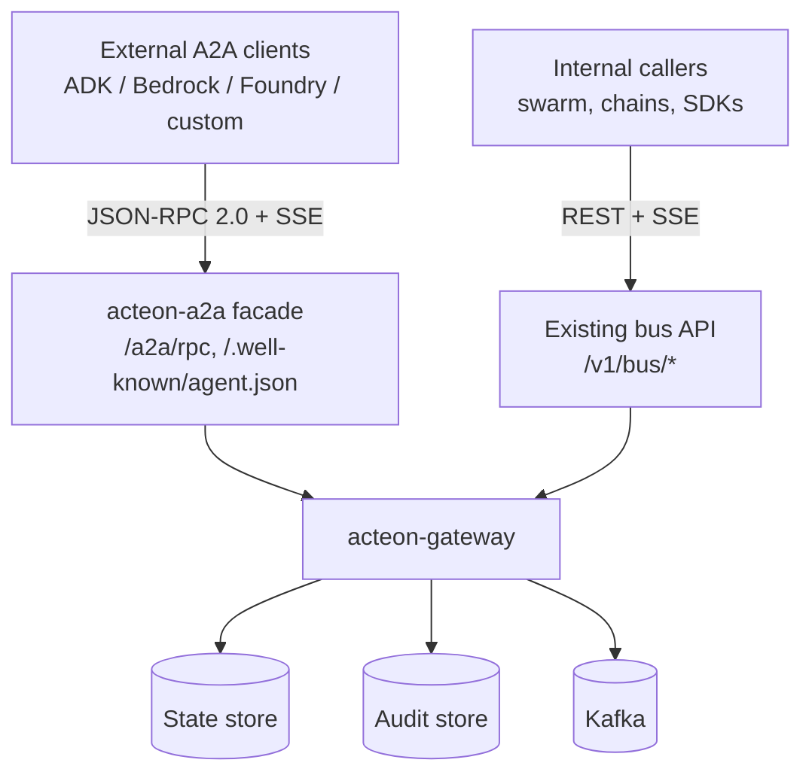

# Acteon A2A Protocol Implementation

**Status:** Draft
**Author:** Acteon Team
**Created:** 2026-05-14

## Overview

This document proposes implementing the [Agent2Agent (A2A) Protocol](https://a2a-protocol.org/latest/specification/) in Acteon, exposing the gateway as a first-class A2A endpoint so external agents (Google ADK, Microsoft Agent Framework, Amazon Bedrock AgentCore, custom builds) can discover, invoke, and stream from Acteon-managed agents using the open standard.

The work is principally a **translation/extension layer** rather than a ground-up build: Acteon already ships the underlying primitives (agents, conversations, tool-call envelopes, streaming SSE, human approvals, multi-tenant auth, schema registry, audit). The remaining 30-40% is wire-format adapters, an explicit `Task` lifecycle, AgentCard discovery, and per-task push notification configs.

## Motivation

A2A was donated to the Linux Foundation in late 2025 and is now backed by 150+ organizations including Google, Microsoft, AWS, Salesforce, SAP, ServiceNow, Workday, and IBM. Adoption is moving from "interesting standard" to "default interop fabric" for multi-vendor agent ecosystems.

By exposing Acteon via A2A we unlock:

1.  **Federated agent ecosystems** — Acteon agents (chains, swarm specialists, recurring jobs) become invocable by any A2A-speaking client.
2.  **Reverse interop** — Acteon agents can act as A2A *clients* against third-party agents (Vertex AI, Bedrock AgentCore, Azure AI Foundry).
3.  **Standardized observability** — A2A's `Task` lifecycle, `Artifact` streaming, and audit-friendly push notifications align with Acteon's existing audit/compliance posture.
4.  **Strategic positioning** — Acteon's hardened orchestration (rules, quotas, retention, compliance hash chain, mTLS, WASM-sandboxed validation) becomes the "safe substrate" layer underneath an A2A-compliant facade.

Acteon's bus already implements most of A2A's *semantics*; this work makes them *interoperable*.

## Background: A2A Protocol Summary

Per the [official specification](https://a2a-protocol.org/latest/specification/):

| Layer | Requirement |
|---|---|
| Transport | JSON-RPC 2.0 over HTTPS, SSE for streaming, optional HTTP+JSON/REST binding |
| Discovery | `AgentCard` published at `/.well-known/agent.json` |
| Core methods | `SendMessage`, `SendStreamingMessage`, `GetTask`, `ListTasks`, `CancelTask`, `SubscribeToTask`, `Create/Get/List/DeleteTaskPushNotificationConfig`, `GetExtendedAgentCard` |
| Core types | `Task` (with `TaskState` enum: submitted/working/completed/failed/canceled/input_required/auth_required/rejected), `Message` (role + parts), `Part` (text/file/data), `Artifact` |
| Streaming | SSE delivering `StreamResponse` wrapping one of `task`, `message`, `statusUpdate`, `artifactUpdate` |
| Push | HTTP POST webhook with auth (API key, Bearer, OAuth2, OIDC, mTLS) |
| Versioning | `A2A-Version` header negotiation |

## Mapping: A2A → Acteon Primitives

| A2A Concept | Acteon Equivalent | File |
|---|---|---|
| `AgentCard` | `Agent` struct (needs richer `skills`, `interfaces`, `securitySchemes`) | `crates/core/src/bus_agent.rs` |
| Capability advertising | `Agent.capabilities: Vec<String>` (A2A `skills[]` is richer — input schema + media types) | `crates/core/src/bus_agent.rs` |
| `contextId` | `Conversation.conversation_id` | `crates/core/src/bus_conversation.rs` |
| `Message` / `Part` | Conversation messages with envelope kinds (Phase 6a/b) | `crates/server/src/api/bus.rs` |
| `Task` + `TaskState` | **MISSING** — closest analog is chain `StepResult` | needs `crates/core/src/a2a_task.rs` |
| `TaskStatusUpdateEvent` | `StreamChunk` / `StreamEnd` on conversation events | `crates/core/src/bus_stream.rs` |
| `Artifact` (with `append` / `lastChunk`) | **MISSING** — tool output JSON has no streaming-append semantics | needs new type |
| `ROLE_USER` / `ROLE_AGENT` | `ToolCall.sender` (agent_id) — implicit role | `crates/core/src/bus_tool.rs` |
| Streaming via SSE | SSE stream + `Last-Event-ID` reconnect | `crates/server/src/api/stream.rs` |
| Push notification webhook | **PARTIAL** — Acteon has webhook providers, not per-task push configs | needs new state-store entity |
| API-key / Bearer / mTLS auth | Already supported | `crates/server/src/auth/`, `crates/crypto/src/tls.rs` |
| `TASK_STATE_AUTH_REQUIRED` interrupt | `BusApproval` (Pending → Approved/Rejected) | `crates/core/src/bus_approval.rs` |
| `TASK_STATE_INPUT_REQUIRED` | **MISSING** — needs Task-side pause-on-input semantics | new |
| Idempotency via `messageId` | Dedup keys on action/chain path | `crates/gateway/src/` |
| Schema registry | JSON Schema per topic, applied at publish-edge | `crates/bus/src/schema.rs` |

## Architecture

We will ship A2A as a **facade crate** (`acteon-a2a`) alongside the existing internal bus, not as a replacement. The internal bus is *Acteon-as-orchestrator* (engines coordinating chains, swarms, tools); A2A is *Acteon-as-interoperable-agent* (external clients invoking Acteon over an open standard). Both consume the same state store, audit, auth, and Kafka transport — they differ in audience and wire format.

Rationale:

- The internal bus API is consumed by 5 polyglot SDKs, the swarm crate, simulation examples, and the admin UI. Refactoring it to *be* A2A would disrupt all of those for no internal benefit.
- A2A's task lifecycle (8 states, including interrupt states) is richer than what the internal bus needs day-to-day. Keeping it in the facade avoids forcing those semantics on internal callers.
- The facade can map A2A → bus selectively. For example, `SendMessage` with `requires_approval=true` lands as a `BusApproval`; `SubscribeToTask` proxies the existing `bus_stream.rs` SSE bridge with re-framed envelopes.

## Net-New Components

### Core types (`acteon-core`)

- `a2a::Task` — id, contextId, status, artifacts[], history[], metadata. 8-state machine.
- `a2a::Artifact` — id, parts[], append/lastChunk flags for chunked output.
- `a2a::Message` / `a2a::Part` — text/file(raw|url)/data variants. Distinct from `ToolCall.arguments` to keep wire-shape isolated.
- `a2a::AgentCard` — extends `Agent` with skills, interfaces, securitySchemes, signature.
- `a2a::PushNotificationConfig` — per-task webhook URL + auth scheme.

### Facade crate (`crates/a2a`)

- JSON-RPC 2.0 router for the 11 spec methods.
- `Task` state machine owner; persistence via existing `State` backend (new `KeyKind::A2aTask`).
- SSE bridge re-framing `StreamChunk`/`StreamEnd` as A2A `StreamResponse`.
- Push delivery worker (reuses shared `reqwest::Client` from `main.rs` and the existing audit-stamped envelope pattern).

### Server endpoints

- `GET /.well-known/agent.json` — public, unauthenticated, returns the active card.
- `POST /a2a/rpc` — JSON-RPC entry point.
- `GET /a2a/tasks/{id}:subscribe` — SSE stream.
- Optional REST binding at `/a2a/tasks/...` per spec §11.

### Auth integration

Map A2A `securitySchemes` to existing API-key grants:

- `APIKeySecurityScheme` → existing API keys.
- `HTTPAuthSecurityScheme` (Bearer) → trivial extension.
- `MutualTlsSecurityScheme` → already supported.
- `OAuth2SecurityScheme` / `OpenIdConnect` → out of scope for MVP.

`Grant.agent_id` (Phase 10 of the bus work) gives caller→agent identity stamping for free.

## What We Get For Free

- **Streaming + reconnect**: PRs #153–157 (May 2026) shipped SSE reconnect with `Last-Event-ID` across all SDKs. Drop-in for `SubscribeToTask`.
- **Multi-tenancy + ACL**: A2A §3.3.2 mandates "never leak resource existence to unauthorized clients." Acteon already returns 403 (not 404) on wrong-tenant access.
- **Schema validation**: A2A `Skill.inputSchema` is JSON Schema; the bus already validates JSON Schema at publish-edge.
- **Idempotency**: Action dedup keys map onto A2A `messageId` idempotency (spec §3.3.1).
- **Audit trail**: Every A2A message → audit record, with hash-chain compliance verification.
- **Polyglot SDKs**: Rust, Python, Node, Go, Java — once the server speaks A2A, all five get it via the existing client codegen pattern.

## Architectural Decisions to Settle

1.  **Task ↔ Chain relationship.** Two options:
    - *Independent* — A2A tasks live in their own state-store kind; chains stay internal-only.
    - *Bridge* — an incoming A2A task can spawn a chain, and chain state is exposed as `TaskStatus`. More work, but powerful (external agents can drive Acteon chains end-to-end).
    
    **Recommended:** start with Independent for MVP. Add the bridge in a follow-up once the task primitive has shipped.

2.  **AgentCard signing.** Optional per spec §8.4. Required only for federated discovery; HTTPS at the well-known endpoint is sufficient for most deployments. Skip in MVP unless customers ask.

3.  **Identity granularity.** A2A is agent-to-agent. Acteon's auth is tenant + API key + grant. Phase 10's `Grant.agent_id` binding lets each external A2A agent get its own API key for cleaner audit. Default to that.

4.  **Versioning posture.** Ship A2A 1.0 only. Use the `A2A-Version` header to gate future migrations.

## Risks & Unknowns

- **Spec churn.** A2A 1.0 ratified late 2025; subsequent versions may change framing. Keep the facade thin to preserve a clean migration path.
- **utoipa recursion.** A2A's `Task` is recursive via `referenceTaskIds`; same infinite-recursion landmine as `ChainStepStatus.parallel_sub_steps`. Apply the same `#[schema(value_type = Object)]` workaround.
- **Payload size.** A2A `Part` can carry arbitrary data; existing publish-edge caps (512KB content / 1MB payload) may need an A2A-specific tier.
- **Push delivery reliability.** A2A doesn't mandate exactly-once. Reuse the existing webhook provider's retry + DLQ pattern.
- **OAuth2 / OIDC.** Not in MVP. If enterprise customers require it, scope as Phase 10.

## Effort Estimate

**~6 weeks single-engineer for full SDK parity** or **~3 weeks server-only MVP**.

---

## Implementation Plan

### Phase 0: RFC & Alignment
- [ ] Settle the four architectural decisions above (Task↔Chain, signing, identity, versioning) with the core team.
- [ ] Confirm coexistence (facade) vs. replacement of internal bus surface.
- [ ] Pick MVP cut: server-only vs. full SDK parity.

### Phase 1: Core Types (`acteon-core`)
- [ ] Add `a2a::Task` with 8-state lifecycle (`Submitted`/`Working`/`Completed`/`Failed`/`Canceled`/`InputRequired`/`AuthRequired`/`Rejected`).
- [ ] Add `a2a::Artifact` with `append` / `lastChunk` semantics.
- [ ] Add `a2a::Message` and `a2a::Part` (text/file/data variants).
- [ ] Add `a2a::AgentCard` extending `Agent` with `skills[]`, `interfaces[]`, `securitySchemes`, optional `signature`.
- [ ] Add `a2a::PushNotificationConfig`.
- [ ] Validation rules + serde + utoipa schemas (apply `#[schema(value_type = Object)]` to recursive fields).
- [ ] Unit tests for state transitions, validation, and serde round-trips.

### Phase 2: Facade Crate (`crates/a2a`)
- [ ] Scaffold `crates/a2a`; register in workspace.
- [ ] JSON-RPC 2.0 router covering the 11 spec methods.
- [ ] `Task` persistence via existing `State` backend (new `KeyKind::A2aTask`).
- [ ] Translation layer: A2A `SendMessage` → bus operations (conversation create / message append / tool-call envelope).
- [ ] CAS-based status transitions matching the bus's retry pattern.
- [ ] Idempotency on `messageId` via existing dedup-key infra.

### Phase 3: Discovery & Auth
- [ ] `GET /.well-known/agent.json` (public, unauthenticated).
- [ ] AgentCard builder (assembles capabilities, skills, interfaces, security schemes from server config + registered providers).
- [ ] `A2A-Version` header negotiation; `VersionNotSupportedError` for unsupported.
- [ ] Map `APIKeySecurityScheme` / `HTTPAuthSecurityScheme` (Bearer) / `MutualTlsSecurityScheme` to existing grants.
- [ ] Optional `GetExtendedAgentCard` for authenticated callers.

### Phase 4: Streaming Bridge
- [ ] `GET /a2a/tasks/{id}:subscribe` SSE endpoint.
- [ ] Bridge: subscribe to relevant `StreamChunk`/`StreamEnd` records, reframe as A2A `StreamResponse`.
- [ ] Reuse `Last-Event-ID` reconnect (already implemented for bus).
- [ ] Per-tenant SSE connection caps (reuse existing config).
- [ ] `SendStreamingMessage` initial response with full task, subsequent updates as `statusUpdate` / `artifactUpdate`.

### Phase 5: Push Notifications
- [ ] `PushNotificationConfig` CRUD endpoints (`Create/Get/List/Delete`).
- [ ] Per-task config persistence (new state-store entity).
- [ ] Delivery worker: subscribes to task status changes, POSTs `StreamResponse` to registered webhooks.
- [ ] Reuse shared `reqwest::Client` and mTLS support from `crates/crypto/src/tls.rs`.
- [ ] Retry + DLQ mirroring webhook provider behavior.
- [ ] Audit-stamp delivery attempts.

### Phase 6: REST Binding
- [ ] `POST /a2a/tasks` (SendMessage).
- [ ] `POST /a2a/tasks:stream` (SendStreamingMessage).
- [ ] `GET /a2a/tasks/{id}` (GetTask).
- [ ] `GET /a2a/tasks` (ListTasks with pagination + status filter).
- [ ] `POST /a2a/tasks/{id}:cancel` (CancelTask).
- [ ] `GET /a2a/tasks/{id}:subscribe` (SubscribeToTask).
- [ ] Push notification config endpoints.
- [ ] All thin wrappers over the JSON-RPC handlers.

### Phase 7: Polyglot SDK Updates
- [ ] Rust client: `crates/client/src/a2a.rs` with helper methods.
- [ ] Python SDK: A2A client surface.
- [ ] Node.js SDK: A2A client surface.
- [ ] Go SDK: A2A client surface.
- [ ] Java SDK: A2A client surface.

### Phase 8: Simulation & Docs
- [ ] `crates/simulation/examples/a2a_simulation.rs` — round-trip a Task through all 8 states.
- [ ] `docs/book/features/a2a.md` — user-facing guide.
- [ ] `docs/architecture/a2a.md` — final architecture doc once shipped.
- [ ] Update CHANGELOG and README feature matrix.

### Phase 9: UI Surface (Optional)
- [ ] Dashboard tab listing A2A tasks distinctly from internal bus tasks.
- [ ] AgentCard preview / signing controls.
- [ ] Push notification config management.

### Phase 10: Hardening (Future)
- [ ] `OAuth2SecurityScheme` / `OpenIdConnectSecurityScheme` support.
- [ ] AgentCard signing (Ed25519, reusing the compliance hash-chain crypto stack).
- [ ] Bridge mode: A2A Task → Acteon Chain spawn.
- [ ] Acteon-as-A2A-client (outbound calls to third-party agents).

### Pre-Commit Checks (per Phase)
- [ ] `cargo fmt --all`
- [ ] `cargo clippy --workspace --no-deps -- -D warnings`
- [ ] `cargo test --workspace --lib --bins --tests`
- [ ] `cargo check --all-targets`
- [ ] `(cd ui && npm run lint && npm run build)` when UI changes touched

---

## References

- [A2A Protocol Specification](https://a2a-protocol.org/latest/specification/)
- [A2A on GitHub](https://github.com/a2aproject/A2A)
- [Google announcement of A2A](https://developers.googleblog.com/en/a2a-a-new-era-of-agent-interoperability/)
- [Agent2Agent protocol upgrade — Google Cloud Blog](https://cloud.google.com/blog/products/ai-machine-learning/agent2agent-protocol-is-getting-an-upgrade)
- Internal: `docs/design/mcp-server.md` (sibling external-protocol implementation)
- Internal: `docs/architecture/agent-swarm.md` (multi-agent orchestration this complements)
