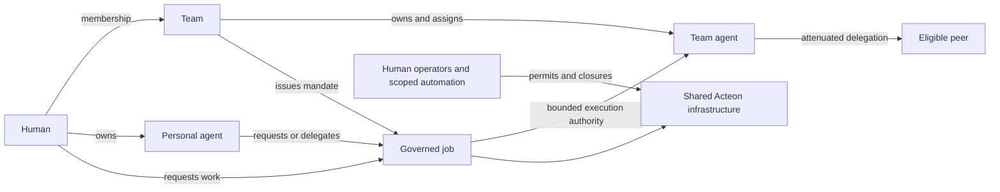

# Agent workforce: people, teams and their agents

**Status:** proposed organizational model for the [governed-city design](governed-agent-city.md).
Existing stable principal bindings identify the actual actor. They do not yet
implement teams, agent ownership or representation mandates.

## Product definition

**Acteon is the shared operating infrastructure for an agent workforce: humans,
their personal agents, team agents and software services collaborating under
explicit mandates and enforceable permits.**

A person can work directly, ask their personal agent to act for them, or request
work from a team agent. A team can maintain shared specialists, approve their
mandates, fund their work and intervene in operations. Agents can discover and
call one another when the current job's authority permits it. Deterministic
services participate through the same execution and governance paths.

The city describes the shared environment. The workforce describes the people
and organizations operating within it. Both use the same roads, services,
permits, traffic control and closures.

## How a workforce is organized

The primary organizational unit is a team. A team brings together human members,
their assigned personal agents, team-owned agents and service integrations.
Humans can belong to several teams, and teams can collaborate on work. Each job
still selects an explicit represented party and authority lineage.

For example, a Reliability workforce can include Maya, her personal assistant,
a shared incident investigator and a deterministic telemetry service. Maya's
assistant helps her prepare and request work. The investigator represents
Reliability when performing its mandated diagnostic service. The telemetry
service performs defined operations under its own identity and permits. Their
different degrees of autonomy do not change the execution boundary.

| Workforce relationship | Example | What Acteon records |
|---|---|---|
| Human belongs to a team | Maya joins Reliability | Membership and scoped team role |
| Human owns a personal agent | Maya maintains her assistant | Owner and separate agent principal |
| Agent is assigned to team work | Maya's assistant helps with an incident | Assignment and its validity |
| Agent represents a team | Investigator diagnoses for Reliability | Team mandate and acting agent |
| Teams collaborate | Reliability requests a Release operation | Explicit invocation and delegation edge |
| Human operates directly | Maya approves or executes a permitted step | Human actor and applicable team authority |

Teams may later be grouped into departments or nested teams. The first version
uses direct membership and explicit collaboration between teams; organizational
hierarchy must not introduce implicit permission inheritance.

In the city metaphor, teams are organizations operating in the city, personal
agents are individual assistants, and team agents are authorized representatives.
Acteon supplies the shared infrastructure and enforces the operating rules.
Teams choose their workforce, duties and collaborators within those rules.

## Domain model

Ownership and membership edges describe organization. The governed job derives
execution authority through explicit permits and mandates.

| Concept | Meaning | Authority consequence |
|---|---|---|
| Principal | Authenticated human, agent, service or system identity | Establishes who actually acted; kind grants no privileges |
| Team | Named organizational unit within an administrative domain and tenant | Owns mandates/resources and carries accountability; has no shared login |
| Membership | Versioned relationship between a human and a team | May allow requesting, approving or administering specific team work |
| Agent ownership | Personal ownership by a human, or organizational ownership by a team | Determines lifecycle stewardship; grants no automatic tool authority |
| Workforce assignment | Places an agent in a team's roster for specified work | Controls availability/visibility; does not replace a mandate |
| Representation mandate | Versioned authorization for an agent/service to act for a person or team | Binds represented party, acting principal, allowed work, limits and validity |
| Execution permit | Authorizes concrete operations and resource scopes | Bounds the actual job and every delegated descendant |
| Execution context | Durable actor, initiator, represented party, mandate and permit lineage | Preserves whose work it is and which authority must remain current |

Use a scoped `TeamRef { domain, tenant, id }`. Teams may operate across explicitly
granted namespaces within their tenant. A team is not a tenant or namespace;
creating a team must not create a new isolation boundary implicitly. A person
may belong to multiple teams. Each execution selects one represented party and
one explicit authority lineage; it cannot collect the union of all memberships.

The initial coordinated execution remains within one namespace/tenant. A team
mandate can describe several explicit scopes, but a job spanning coordinators
requires a separately proven protocol or independently authorized roots; it
must not approximate atomic authority changes with several unchecked writes.

Initially keep memberships direct, without nested-team inheritance. Human team
memberships and agent roster assignments are separate relationships: adding an
agent to a roster never makes it a team administrator. Team-specific roles such
as requester, approver and workforce manager are independent of Acteon's global
Admin/Operator/Executor/Viewer route ceilings.

Execution permits retain a concrete acting principal as their subject. A team
owns an issuance ceiling and mandate; verified representation derives a bounded
permit for that actor. Team ownership or membership is never a wildcard subject
match. Direct human team work uses a membership-backed permit and records the
represented team through the same model, without treating the human as an agent.

## Personal agents

A personal agent has its own principal, credentials, registry entry and human
owner. It acts independently within its own permits or explicitly represents
its owner under a personal mandate. The owner's credential is never copied to
the agent, and ownership does not confer all of the owner's permissions.

Personal delegation is bounded by owner delegation rights, the mandate, the
agent's execution permissions and the root job's limits. An agent belonging to
a person in several teams cannot choose a team and inherit its permissions from
ownership metadata. To perform team work it needs a specific valid team mandate
or a permitted delegation of the owner's relevant team authority.

Personal agents may be temporarily assigned to team work while remaining
personally owned. Their team assignment controls roster visibility and duties;
the mandate controls the work they may perform. Private personal memory is not
made visible to teammates by that assignment.

## Team agents

A team agent is owned by a team and represents it under a team-issued mandate.
It can serve many human requesters and run authorized standing duties. Its
stable principal remains distinct from the team, each requester and each
maintainer. A manager leaving the team does not cause the agent to impersonate
their replacement or switch to another member's credentials.

Separate authority to **request a defined service** from authority to **perform
its underlying operations**. For example, an authorized requester may ask a
release agent to run an approved rollout without receiving deployment secrets
or unrestricted direct production access. The mandate explicitly authorizes
that service and its bounded tool operations; requester entitlement authorizes
the requested job class, scope and inputs. This is reviewed service authority,
not an agent borrowing unrelated privileges.

For request-driven team work, compute the root's effective authority from the
team mandate, requester's invocation entitlement, agent execution ceiling,
job constraints and current restrictions. A requester cannot turn permission
to request a diagnostic into arbitrary remediation. Subsequent delegations
only attenuate this root authority, even when the callee has broader permits.

Standing duties use a separately issued team mandate with an explicit service
initiator, schedule and budget. They do not depend implicitly on whichever human
created the schedule. A mandate requiring continuing member sponsorship records
that requirement and checks it; a team-owned standing mandate does not silently
inherit that dependency.

## Representation and accountability

Proposed mandate records include a scoped ID/revision, represented party, exact
acting principal, allowed job classes and resource/input constraints, eligible
requesters, membership/assignment dependencies, validity, delegation limits,
budget allocation, issuer and lifecycle state. Issuance is bounded by the team
or person's authorized ceiling and the issuer's management capability. Ownership
metadata or a natural-language job description cannot establish that ceiling.

Mandates and service-invocation entitlements identify reviewed job definitions
and versions where applicable. The root binds validated inputs and their digest;
a model cannot turn an approved rollout request into arbitrary tool arguments.

Each execution records these independent facts:

- **Actor:** the authenticated principal performing the current operation.
- **Initiator:** the human/service that requested the root job.
- **Represented party:** the human or team whose mandate authorizes this work.
- **Accountability owner:** the person/team responsible for the assignment and
  its operator-facing history.
- **Authority lineage:** mandate, relevant membership/assignment revisions,
  permits, parent/root execution and accepted ceilings.
- **Funding allocation:** the authorized personal/team budget reference and root
  reservation ledger; callers and models cannot choose an arbitrary payer.

Start with integer call/concurrency allocations. A funding reference does not
establish a strict monetary spending cap until provider-specific estimates and
reservation settlement have been qualified.

Ownership/accountability fields aid operations and auditing. They do not by
themselves authorize data access or tools. A represented team reference is
verified through a current mandate, not accepted from a prompt, agent card,
task payload or SDK label. Preserve these facts across chains, timers, workers,
approvals, schedules and A2A handoffs.

Human approval records the actual approver and the authority they used. It
changes the permitted disposition of a job according to policy; it does not
donate all of that person's privileges to the agent.

## Discovery and autonomous collaboration

Build on the existing registry rather than a second workforce registry. A roster
references existing agent identities and exposes ownership, assignment and
mandate status alongside capability/liveness information.

Candidate discovery filters by visibility, requesting actor, represented party,
mandate, skill, lifecycle, resource scope and root limits. A personal agent is
private by default; team agents are visible to authorized requesters, with
explicit sharing for other teams. Public cards describe capabilities and never
serve as evidence of representation authority.

A personal agent can select a team specialist, and a team specialist can select
another peer, when the original job permits those edges. An inter-team call
requires explicit recipient invocation authority and any required data-sharing
permission. The callee's team membership or broad tool credentials cannot
expand the root job. Cross-tenant work remains an explicit export/import or
federation contract, not a consequence of team sharing.

Memory retrieval, artifact access and data references are separate protected
resources. Granting invocation authority over a shared agent does not grant
access to previous requesters' conversations or personal memories. Team-level
history visibility and private input/artifact visibility need distinct scopes.

## Lifecycle and intervention

Membership removal, mandate revocation, agent suspension and permit revocation
join the authoritative generation protocol before becoming effective. If a job
depends on the removed membership, its next mediated effect is denied. Existing
registered attempts remain classified as in flight, with supported cancellation
requested separately.

An agent may remain available for unrelated jobs under other valid mandates.
Disabling a principal blocks that agent's future effects across its mandates.
Removing an assignment stops that assignment's discovery and work; it does not
automatically revoke independently issued authority unless the mandate makes
assignment validity a prerequisite.

Ownership transfer is explicit and audited. It must not retarget admitted jobs
to a new owner or inherit their permissions. Old jobs keep their accepted
lineage and are reviewed, completed under still-valid authority or parked.
Team disbanding closes its mandate issuance and future represented work; it
does not erase history, settle uncertain effects or convert jobs to personal
authority.

Managers may manage rosters without issuing permits. Approvers may approve
defined work without publishing endpoints. Operators may close resources or
request cancellation under separately scoped intervention permissions. These
capabilities must not collapse into one broad team-manager credential.

## Example workforce

| Participant | Ownership/representation | Permitted work |
|---|---|---|
| Maya | Human member of Reliability and Release | Request diagnoses; approve specified Release changes |
| Maya's assistant | Personally owned; represents Maya under a narrow mandate | Gather authorized context and request team diagnostics |
| Reliability investigator | Reliability-owned agent; team diagnosis mandate | Select diagnostic peers, inspect approved telemetry and return artifacts |
| Release operator agent | Release-owned agent; bounded rollout mandate | Execute approved rollout steps within designated resources |
| Incident scheduler | Team service principal; standing Reliability mandate | Open diagnostic jobs with a fixed budget and deadline |

Maya's assistant discovers the investigator and requests a diagnosis. The
investigator invokes a permitted specialist and returns a scoped artifact.
Neither agent can call the Release operator for arbitrary production changes.
Maya initiates an explicitly authorized rollout request; a designated approval
allows its next policy step. A production closure still blocks subsequent
affected effects. Removing Maya's membership blocks later membership-dependent
work, while the independently authorized incident scheduler can continue its
standing diagnostic duties.

The audit trail retains Maya as initiator, each real agent as actor, the relevant
represented party at each verified delegation edge, and the unchanged root
constraints. No agent is logged as Maya merely because it is her assistant.

## Implementation gates

1. **Organization and ownership:** add scoped teams, direct memberships,
   ownership and assignment records with independent management permissions.
2. **Versioned representation:** extend trusted contexts with initiator,
   represented party and mandate lineage; do not hide authority in metadata.
   Define compatible readers, old-work parking and explicit migration.
3. **Mandates and permits:** deterministic personal/team mandate evaluation,
   requester invocation entitlement and issuance ceilings; serialize relevant
   lifecycle changes with effect-start registration.
4. **Workforce execution:** propagate representation through every deferred and
   delegated path; enforce root limits and ownership-safe artifact access.
5. **Product surface:** typed APIs and all five SDKs, personal/team workforce UI,
   mandate/permit inspection, offboarding tools and public documentation.
6. **Real scenario:** run personal-to-team-to-peer calls, standing team duties,
   membership removal, approvals, closures and restart with real authenticated
   invocations and zero unauthorized effects.

These gates extend Phases 1–4 of the city plan. They are generic platform
features, not special-case incident simulation logic.

## Adversarial acceptance

| Case | Required result |
|---|---|
| Personal agent asserts `represented_team` in its payload | No representation authority gained |
| Human belongs to two teams | Job selects an explicit lineage; no membership union |
| Roster manager assigns an agent to a team | Assignment alone grants no execution/tool permission |
| Team agent receives a narrow diagnostic request | Broader remediation credentials cannot expand that root |
| A requester invokes an approved team service | Only the mandated service/scoped operations are available |
| Relevant member leaves during a workflow wait | Next dependent effect denied; history remains inspectable |
| Creator leaves but independent standing mandate stays valid | Standing job continues under its explicit team authority |
| Agent changes owner or team is disbanded | Existing jobs are not silently reassigned or privileged |
| Shared agent receives two users' requests | Conversations, personal memory and private artifacts stay isolated |
| Child invocation changes represented party | Explicit validated mandate/import edge required; root bounds remain |
| Closure or mandate revocation races with approval | Current denial dominates approval and cached discovery |
