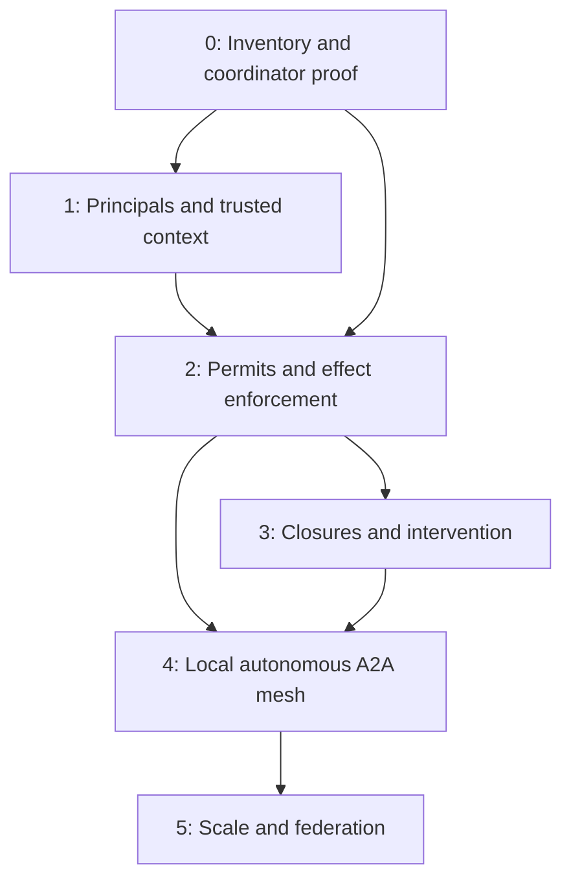

# Governed agent city: phased implementation plan

**Status:** proposed delivery plan, October 3, 2026.

**Design:** [shared operating infrastructure for humans, agents, and software](governed-agent-city.md).

**Implementation evidence:** [progress tracker](governed-agent-city-progress.md) and [effect-boundary inventory](governance-enforcement-inventory.md). This plan does not certify deployment, publication, or completion of any phase.

**Planning baseline:** principal-binding head `4093ae26`, merged as `f44b9e37`. Executor separation, the unintegrated coordinator, exact resource identity and optional principal bindings are implemented. Complete trusted context, permits, generic closures and autonomous peer invocation remain delivery work. Use these existing primitives rather than restarting them as new projects.

## Product outcome

Acteon provides a shared operating environment where humans, autonomous agents, and deterministic software can discover services, perform work, and collaborate under enforceable authority. Operators supply the permits, infrastructure, and interventions that make that autonomy manageable.

The first useful release lets a narrowly authorized participant start durable work, preserves its identity through a restart, and refuses its next external effect after revocation. The next release lets an operator close a resource and inspect what was blocked, what was already in flight, and what remains unresolved. Autonomous registry-based delegation then composes these primitives rather than creating a separate execution system.

A registry tells a participant where it could go. A permit determines where it may go. Policy determines whether and when authorized work should proceed. A start checkpoint determines whether current authority still permits the actual effect.

## Delivery principles

- Each slice supplies a reusable platform primitive, independent of the city demonstration or observability use case.
- Existing rules, registry, dispatch, worker tasks, workflows, receipts, and recovery remain the execution substrate.
- Transport authentication establishes identity; models and request payloads cannot establish authority.
- Administrative credentials do not become implicit execution authority in enforcement mode.
- Every promised guarantee names its storage and adapter prerequisites.
- New APIs ship with Rust, Python, TypeScript, Go, and Java support, shared contract fixtures, UI behavior, and public documentation.
- Strict enforcement is enabled only for scope and effect classes whose coverage has passed. Unsupported paths are refused in that scope rather than silently exempted.

## Dependencies and release boundaries

| Milestone | User-visible result | Prerequisite |
|---|---|---|
| Least-privilege execution | Participants execute without administering their constraints | Role and route audit |
| Governed durable execution | Revocation blocks the next mediated effect across restart | Trusted context, coordinator, permit evaluator, coverage |
| Operational intervention | Resources and routes can be closed with observable impact | Common checkpoints, durable intervention |
| Autonomous local mesh | Agents select and invoke eligible peers from the registry | Attenuation, root limits, governed runtime and transport |
| Federated operation | Independently operated peers collaborate under explicit trust | Local correctness, peer contracts, revocation freshness |

Discovery UI, resource DTOs, and SDK scaffolding may be prepared early. Real delegation cannot bypass the permit and checkpoint gates. Pause/cancel can follow deny-new; federation can follow a useful single-domain mesh.

## Phase 0: prove the enforcement foundation

**Outcome:** a concrete contract for where effects start and how authority changes win races.

### Work packages

1. **Checked boundary inventory.** Map HTTP and RPC operations plus each provider, retry, fallback, inference, enrichment, bus, notification, schedule, workflow, worker, and runtime boundary. Record provenance, deferral, side effects, and owning integration test. Convert the source inventory into a checked fixture so a new route or adapter cannot quietly escape classification.
2. **Canonical resource identity.** Define tenant-scoped resource references and a versioned encoding. Separate provider identity, actual endpoint binding, action type, agent, skill, and route. Validate malformed identifiers and prevent prefix/wildcard ambiguity.
3. **Authority coordinator.** Prototype a non-expiring bounded authoritative record with an incarnation, generation, restrictions, attempt registrations, and pending control intents. CAS registration and authority mutation share one linearization point. Only trusted bootstrap may create missing coordinator state; missing or unsupported state fails closed.
4. **Atomic reservation contract.** Specify either coordinator-integrated root accounting or a recoverable multi-record reservation protocol. A separate counter decrement followed by attempt insertion is insufficient. Enumerate every crash state before choosing the layout.
5. **Backend qualification.** Run independent clients against memory and a real durable backend, initially Redis if its contract passes. Establish durability/failover assumptions, contention behavior, and recovery requirements. Do not infer backend parity from a shared trait.

### Acceptance evidence

Controlled barriers demonstrate closure-before-start refusal and start-before-closure classification as in flight. Lost responses never authorize a second send. Revocation persists before secondary indexes/audit delivery. Deleted/recreated state cannot accept an old incarnation. Concurrent reservations stay within bounds, and uncertain attempts retain their reservations.

### Capacity and recovery decision

A bounded CAS record is an initial correctness strategy, not an unlimited ledger. Admission must leave control-plane headroom. Retention must archive only settled records after their idempotency/replay obligations expire; unresolved attempts cannot be evicted. If control capacity is exhausted, the platform reports the failure and refuses unsafe admission. A closure that failed to persist must never be reported as active. Establish an emergency admission-stop mechanism independent of an exhausted application record before claiming uninterrupted operator control.

Measure record size, active attempts, CAS conflict rate, and mutation latency. Sharding is a later change requiring a new proof for closures spanning shards.

**Completion gate:** ADRs record linearization, capacity, storage assumptions, and crash repair; executable tests verify them. The existing coordinator prototype is an unintegrated substrate until these gates and effect wiring pass.

## Phase 1: establish principals and preserve authority

**Outcome:** a durable execution always carries its original trusted identity and authority lineage.

### Work packages

1. **Execution/control separation.** Verify the checkout's Executor role and fail-closed operation inventory. Maintain independently scoped management permissions; exercise REST, JSON-RPC batches, bus routes, and credential reload.
2. **Stable principals.** Bind API keys, JWT users, and trusted services to stable principal IDs. Specify disablement, credential rotation, represented actors, and administrative issuance ceilings. Preserve file-backed authentication workflows without competing sources of truth.
3. **Trusted execution context.** Add versioned principal, root/parent, resource, deadline, authority-reference, and request-digest types. Constructors require trusted adapters. Client metadata remains separate and cannot replace ancestry.
4. **Durable propagation.** Add context to admissions, chains, workflows, worker queues, approvals, schedules, recurring work, and derived notifications. Grouping requires compatible authority or an explicitly permitted aggregator with contributor provenance.
5. **Migration and surface.** Classify old records as reviewed migration, bounded drain, or parked work. Add principal administration/inspection APIs, all SDKs, UI, and credential guidance.

### Acceptance evidence

An executor cannot modify registry endpoints or execution constraints, even with wildcard execution grants. Forged subject/parent fields fail. A second replica resumes admitted work using its original principal. Credential rotation preserves identity; principal disablement prevents new effects once the Phase 2 checkpoint is enabled. Legacy records never inherit the current server administrator's authority.

**Completion gate:** context propagation is covered at every deferred boundary; unknown formats and unsafe rollback readers fail closed. Least-privilege roles alone do not complete this phase.

## Phase 2: implement permits and enforce every effect

**Outcome:** execution authority is scoped, revocable, and checked at the actual attempt boundary.

### Work packages

1. **Permit model and administration.** Implement versioned subject, operation, exact resource scope, validity, constraints, delegation policy, limits, issuer, and revocation. Updates require expected revisions. Issuance is bounded by the issuer's configured ceiling.
2. **Deterministic evaluator.** Match complete operation/resource tuples. Compose current grants, permit lineage, principal status, restrictions, deadline, and budget. Return stable reason codes and redacted decision evidence. Dry evaluation is advisory and spends nothing.
3. **Executor integration.** Check after concurrency waiting and before each real attempt. Resolve the actual fallback/provider instance, not only the action's original provider field. Every retry obtains fresh authority and its own classified reservation.
4. **Asynchronous and auxiliary integration.** Cover chain/subchain, workflow, queue, approval, scheduled/recurring/grouped work, inference, embeddings, enrichment, notifications, bus publication/delivery, and trusted library adapters. If a class is unfinished, strict-mode admission for it is refused explicitly.
5. **Root reservations.** Enforce call units, concurrency, depth, and deadlines across descendants. Keep ambiguous outcomes reserved until reconciliation. Define safe settlement and idempotency; release capacity only on durable settlement. Monetary caps wait for bounded provider-specific estimates.
6. **Rollout and product surface.** Ship legacy/observe/enforce configuration, APIs/OpenAPI, five SDKs, UI permit inspection, migration tools, and public execution-authority docs.

### Acceptance evidence

Revoke between enqueue and claim, between chain steps, during retry backoff, and during semaphore waiting. All subsequent affected attempts are refused. Approval, fallback, preview inference, direct execution, and recovery cannot bypass authorization. Concurrent fan-out cannot spend the last units twice. Observation mode records decisions without claiming enforcement; strict mode rejects missing authority and unavailable authoritative storage.

**Completion gate:** the inventory is completely enforced or explicitly unsupported within the enabled scope. Real-server and multi-replica tests confirm admission versus execution semantics.

## Phase 3: give operators closures and intervention

**Outcome:** an operator can close a building or road and see the actual consequence.

### Work packages

1. **Deny-new closure.** Exact resources and explicit routes, actor/reason, revision, optional expiry, and source-event idempotency. Activation and start registration serialize through the coordinator. Suspension remains an additional restriction.
2. **Impact and reconciliation.** Persist authoritative restriction plus pending intervention intent atomically. Repairable indexes locate affected work; desired and observed states remain distinct. Repeated scans and requests are idempotent.
3. **Drain and pause.** Admit only explicitly bounded pre-boundary continuations under drain. Pause parks at safe boundaries; adapters advertise whether they support remote pause/resume. New mesh edges are denied by default during drain.
4. **Cancellation.** Add capability-aware local and remote cancellation, durable requests, and separate acknowledgments. Unsupported or lost acknowledgment stays unresolved. Compensation is separately authorized.
5. **Operator experience.** Scoped external-event automation, impact previews, histories, reopen controls, SDKs, UI, and recovery runbooks.

### Acceptance evidence

Closure races follow the documented start linearization point across replicas. Restart preserves active restrictions and pending intervention. Overlapping closures compose restrictively; expiry/reopen cannot restore revoked authority or replay uncertain work. Delivered bus payloads and already-started provider calls are reported honestly as in flight. Unsupported cancellation is never displayed as confirmed cancellation.

**Completion gate:** operators can inspect blocked, parked, cancel-requested, canceled, completed, and unresolved work without interpreting a request as success.

## Phase 4: materialize the autonomous local A2A mesh

**Outcome:** agents select eligible peers and cause real governed peer execution.

### Work packages

1. **Governed discovery.** Reuse individual registry cards. Filter by caller authority, skill, lifecycle, and scope; return bounded untrusted descriptions and revisions. Cards advertise capability, not entitlement.
2. **Runtime bindings.** Configure agent-specific inbound task execution using existing chains, workers, swarm providers, or an external runtime. Preserve current tenant-level A2A semantics unless a target is explicitly configured.
3. **Delegation authority.** Derive child authority from root constraints, parent delegation rights, the child envelope, and recipient execution permissions. Use opaque server-held handles bound to recipient and execution. Share root limits and retain ancestry.
4. **Durable outbound transport.** Resolve approved endpoints and credential references; enforce network bounds. Persist send intent, attempt registration, local child/remote task mapping, progress cursor, artifact bounds, and reconciliation state.
5. **Lifecycle bridge and host tools.** Implement discovery/delegate tools whose host supplies trusted context, plus required-input, observation, cancellation, artifact, and terminal result handoffs. Update SDKs and UI lineage views.

### Acceptance evidence

A planner selects a peer from the current registry, and the peer logs a real A2A invocation. Registry changes alter selection without rewriting a static chain. A powerful callee cannot expand a narrow root. Suspension or closure after discovery blocks send. Response loss is retried only with verified peer idempotency or reconciliation; otherwise the task remains uncertain. Cross-tenant task/artifact access is denied.

**Completion gate:** one real inbound runtime and one real outbound peer complete the lifecycle under enforced authority, including restart and cancellation ambiguity. Existing submitted A2A tasks alone do not satisfy this gate.

## Phase 5: qualify production scale and federation

**Outcome:** documented operational limits and explicit trust between administrative domains.

First qualify local production operation: backend failover, workload limits, compaction/retention, bounded recovery scans, key rotation, protocol conformance, and chaos tests. Publish a tested storage/adapter/peer capability matrix.

Then introduce federation through an explicit trust ADR: audience-bound delegation envelopes, import/export policy, authenticated peer credentials, revocation freshness, clock assumptions, and partition behavior. A remote signed envelope must not remove local restrictions. State exactly what a domain can verify about a remote effect and how unresolved work is reconciled.

**Completion gate:** replay, stale endpoints, compromised credentials, lost acceptance, partitions, and rollback preserve isolation and honest reporting against named peer implementations. Cross-region coordination and monetary caps remain separate contracts requiring their own proof.

## Reviewable PR sequence

| Order | Deliverable | Required predecessor |
|---|---|---|
| 1 | Inventory, coordinator contract, resource-identity ADR | Existing source audit |
| 2 | Backend race/crash proof and capacity behavior | 1 |
| 3 | Stable principals and trusted context constructors | 1 |
| 4 | Durable context propagation and migration | 3 |
| 5 | Permit lifecycle and deterministic evaluator | 2, 3 |
| 6 | Per-attempt executor hook and deterministic dispatch | 4, 5 |
| 7 | Deferred and auxiliary coverage; root reservations | 6 |
| 8 | Enforce rollout, full SDK/UI/docs surfaces | 7 |
| 9 | Deny-new closures and durable impact reconciliation | 8 |
| 10 | Drain/pause/cancel capabilities and operator surfaces | 9 |
| 11 | Governed discovery and inbound runtime binding | 8, 9 |
| 12 | Attenuated delegation and real outbound A2A | 10, 11 |
| 13 | Peer lifecycle/recovery and city demonstration | 12 |
| 14 | Scale qualification and federation ADR/implementation | 13 |

Split any package whose adversarial review cannot cover its bypass paths. API work should not be merged as a promise of runtime enforcement before the corresponding backend gate passes. Estimates are established after Phase 0 identifies the actual propagation and storage work; assigning calendar dates now would hide those dependencies.

## End-to-end validation and presentation

Use a human operator, scheduled detector, investigator, diagnostic peer, and remediation peer. Simulated incident data is sufficient, but Acteon dispatch, durable state, peer HTTP calls, and governance decisions are real.

1. Dispatch a narrow diagnostic root and let its agent discover/select a peer.
2. Invoke that peer and collect structured progress/results.
3. Attempt production remediation through a privileged peer; deny it because root authority lacks that operation.
4. Let a human initiate a separate narrowly permitted remediation after approval.
5. Close that resource before its next effect while unrelated work proceeds.
6. Repeat with restart, overlapping closures, budget exhaustion, and lost acceptance responses.
7. Demonstrate pause/cancel only against adapters whose capability has been verified.

Produce JSON assertions and a readable report: actor/permit matrix, delegation graph, request IDs at both peers, decision timeline, closure boundary, effect counts, reservation ledger, and recovery evidence. Assert zero unauthorized effects and no new registration after a winning denial. Show unresolved outcomes rather than smoothing them away. An optional real model planner can select peers; label whether it was invoked and keep governance independent of its output.

Reuse fixtures in the agent-swarm, A2A registry, and cascading-alerting guides as each building block ships. Public documentation describes released functionality; this design remains the proposal reference.

## Release evidence and definition of done

For each package, update the progress tracker with its commit/PR, adversarial review findings and fixes, tests, supported backends/adapters, migration limits, and documentation changes. Before merge, run the repository-required checks and the relevant real-server, SDK, fault-injection, and multi-replica contracts. Verify the CI head matches the reviewed head.

After merge, verify release/deployment status and published documentation separately. Run the relevant released scenario and record the result artifact. A successful docs build does not prove publication, and a merged implementation does not prove a phase's runtime contract.

The vision is complete only when participants share one durable authority model across every supported mediated effect, operators can impose observable restrictions, and autonomous delegation preserves authority and accountability through failure. Until then, the progress tracker must retain the unmet gates.

## Execution roadmap and ownership

Ownership below names responsibilities, not assigned people. Each phase needs one accountable maintainer who coordinates the runtime, storage, SDK and documentation work. A handoff is complete only when the receiving integration has an executable contract test.

| Phase | Accountable responsibility | Main code areas | Exit artifact |
|---|---|---|---|
| 0 | Governance/storage maintainer | `crates/governance`, state backends, checked inventories | Coordination/reservation ADR, backend contract suite, bounded-capacity report |
| 1 | Authentication/runtime maintainer | Core/server auth, admission, chains, workflows, queues and schedules | Context compatibility matrix and restart/rotation tests |
| 2 | Gateway/executor maintainer | Evaluator, executor retry loop, all effect adapters | Enforced coverage report and revocation/fan-out proof |
| 3 | Operator-control maintainer | Closure storage, intervention outboxes, adapters, UI | Closure/cancellation capability matrix and recovery runbooks |
| 4 | Agent-runtime/transport maintainer | Registry, inbound binding, outbound A2A, delegation lifecycle | Real peer invocation and constrained mesh result bundle |
| 5 | Reliability/security maintainer | Backends, retention, federation and deployment | Qualified support matrix, load/chaos evidence and trust ADR |

SDK/API, UI and documentation maintainers participate throughout. Their work is part of each feature's exit gate, rather than a final cleanup phase.

### Immediate implementation sequence

1. **Finish the trusted-context contract.** Define separate persisted and verified types, scoped principal references, immutable accepted ceilings, trusted constructors and recovery verification. Record which auth revision is authoritative and how file reload publishes it. Test spoofed metadata, two credentials with different grants for one principal, unknown versions and incompatible rollback.
2. **Propagate context through durable execution.** Start with admission and chains, then worker/workflow/approval handoffs, scheduled and recurring work, grouping and notifications. Extend the effect inventory with the stored field and recovery verifier at each boundary. Park legacy records according to the migration policy. Do not claim revocation enforcement from propagation alone.
3. **Close coordinator/accounting prerequisites.** Extend single-resource starts to complete resource sets and specify atomic root reservations. Test multi-resource closures, lost acknowledgments, fan-out, retention and emergency admission stop. Publish the supported single-domain/backend limits before wiring strict checkpoints.
4. **Deliver the smallest enforced vertical slice.** Implement current permit/ceiling evaluation and one real deterministic provider path, including its wait, retry and fallback behavior. A second replica resumes the original actor, and revocation blocks its next attempt. Ship that scope's SDK/UI/docs and refuse unsupported paths within it.
5. **Expand coverage and intervention.** Cover every deferred and auxiliary effect class, then expose deny-new closures and impact reconciliation. Add drain/pause/cancel incrementally against named adapter capabilities.
6. **Build the mesh on the proven substrate.** Add governed candidates, runtime bindings, attenuated child authority and durable real A2A transport. Demonstrate a model/runtime-selected peer with recorded receive-side evidence and no root-authority expansion.

Steps 1–2 advance Phase 1 while Step 3 completes remaining Phase 0 prerequisites. Step 4 cannot ship an enforcement claim until both dependency streams pass. The current bounded coordinator is a useful starting point, not proof that those prerequisites are already satisfied.

### Sizing and scheduling policy

Use dependency gates rather than fixed calendar promises. Size each package after its affected effect paths and migration work are known. Separate changes that require a new storage proof, an externally visible wire contract or an independently reviewable adapter. Keep each PR small enough that its authority bypasses and crash states can be reviewed together.

After Phase 0, publish measured checkpoint overhead and the integration inventory to set staffing and dates. If backend qualification or legacy migration blocks strict rollout, continue independently useful context, SDK and observation work while retaining the blocked enforcement gate. Federation must not consume effort needed to make local revocation and recovery correct.

## Phase acceptance scenarios

| Gate | Minimal demonstrable scenario | Evidence that fails the gate |
|---|---|---|
| 0 | Two independent clients race start registration with restriction; crash/lost-response recovery preserves accounting | Unit tests against a single fake client, or separate non-atomic counters |
| 1 | A different replica resumes a queued execution with the original principal and accepted ceiling after key rotation | Only adding caller fields, or recovering under current server credentials |
| 2 | Revocation during capacity wait/backoff denies the actual next provider attempt; concurrent children conserve root units | An admission-only check, or grants collected from several credentials |
| 3 | An active closure survives restart; overlapping reopen and remote cancel show accurate impact | A UI toggle without authoritative activation, or cancel-request counted as canceled |
| 4 | The runtime discovers and chooses a peer; that peer executes a real A2A call under attenuated authority | A submitted task without runtime handoff, or only a hardcoded routing chain |
| 5 | Qualified deployment and named remote peers pass failover/partition/replay tests with documented trust freshness | Assuming every state backend or A2A implementation behaves identically |

For each scenario, save the input configuration, build revision, assertions, effect counts and recovery timeline. Business data may be simulated; authentication, storage, checkpoint decisions and network invocations must be real for the guarantee being tested.
