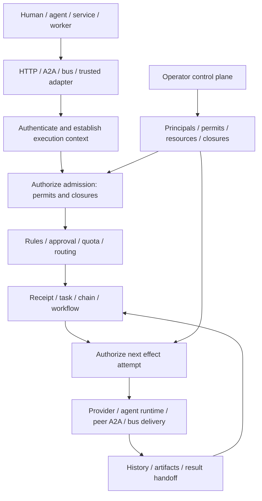

# Acteon: shared infrastructure for autonomous and deterministic operations

**Status:** platform design; implementation proceeds through the companion phase gates.

**Baseline:** reviewed principal-binding head `4093ae26`, merged as `f44b9e37`, including execution-role, coordinator and resource-identity changes. Checkout implementation alone is not evidence of release or publication; the tracker records those separately. The original effect inventory was taken at `9037a71a`; integrations must be rechecked as source changes.

**Audience:** platform maintainers, SDK authors, operators, and agent-runtime integrators.

Unless explicitly identified as existing checkout behavior, new types, endpoints, configuration, and guarantees below are proposals. The current-capabilities section describes what exists today. This document is a platform design; its examples exercise reusable primitives rather than defining special-purpose observability behavior.

The companion [phased delivery plan](governed-agent-city-implementation-plan.md) breaks this design into reviewable work packages, dependency gates, and release evidence. The [implementation tracker](governed-agent-city-progress.md) records progress; the [effect inventory](governance-enforcement-inventory.md) identifies concrete integration boundaries.

## 1. Product definition

**Acteon is the execution and governance infrastructure for humans, agents, and software operating together. It gives every participant scoped authority, connects them to shared services, coordinates durable work, and lets operators intervene while the system is running.**

Imagine an orderly city. Humans drive alongside autonomous vehicles and robots. Participants choose their destinations and collaborators. The city provides addresses, roads, utilities, buildings, permits, traffic control, and emergency closures. Autonomy operates within enforceable authority.

In Acteon, the participant may be a person, agent, service, scheduled job, or worker. The operation may be a deterministic provider call, an agent delegation, a workflow, a message, or an inference request. The same governance model applies to each.

The city metaphor explains the product. The implementation uses concrete concepts:

| City concept | Platform primitive | Responsibility |
|---|---|---|
| Residents and vehicles | Principals | Authenticate an actor and establish its identity |
| Permits | Execution permits | Authorize particular operations on particular resources |
| Addresses and directories | Resource references and agent registry | Resolve a destination without accepting arbitrary caller-supplied endpoints |
| Roads | Dispatch, A2A, bus, chains, workflows | Carry work through governed execution paths |
| Buildings | Providers, agents, tools, topics, datasets | Identify destinations and protected resources |
| Utilities | Worker capacity, inference services, shared budgets | Allocate execution resources and account for consumption |
| Traffic control | Rules, approvals, quotas, concurrency controls | Decide whether and when authorized work should run |
| Road and building closures | Closures and intervention records | Deny admission, drain, pause, or request cancellation |
| City records | Audit, receipts, execution history | Explain authority, decisions, effects, and recovery |

The metaphor does not imply that Acteon hosts every agent, supplies physical infrastructure, or can stop effects outside its control. Providers and runtimes remain execution boundaries with explicit capabilities.

## 2. Goals, boundaries, and invariants

### Goals

1. Give humans, agents, and services least-privilege execution authority without granting policy administration.
2. Apply authorization and intervention consistently across HTTP, A2A, bus delivery, direct library use, and durable background execution.
3. Allow agents to discover eligible peers and autonomously delegate to registry-backed destinations.
4. Preserve authority, deadlines, budgets, and provenance across delegation and asynchronous handoffs.
5. Make intervention observable, durable, and honest about in-flight external effects.
6. Deliver every phase as independently useful product functionality, including SDKs, operator UI, public documentation, and recovery tests.

### Initial boundaries

- First release supports one Acteon administrative domain with multiple server replicas and tenant isolation. Cross-domain federation is a later phase.
- Acteon governs operations mediated by it. Network policy and credential isolation are required to prevent runtimes from bypassing Acteon and calling providers directly.
- Agents may use any planning or inference system. Governance decisions are deterministic; model output cannot grant authority.
- Registry membership advertises capabilities. It does not confer permission or prove that a capability description is truthful.
- Typed inference and schema validation remain complementary platform features. They do not replace execution authorization.
- A closure does not undo a completed effect. Compensation, when supported, is a separately authorized operation.

### Required invariants

| Invariant | Consequence |
|---|---|
| Identity is established by a trusted transport or runtime adapter | Request payloads cannot impersonate a principal or supply trusted ancestry |
| Data-plane authority is separate from control-plane authority | An executor cannot modify the rules or permits that constrain it |
| Delegation only attenuates authority | A child cannot obtain an operation, scope, lifetime, or budget its lineage does not allow |
| Denials dominate allows | A permit, cached discovery result, approval, or queued receipt cannot override a current closure or revocation |
| Every effect attempt has an execution authorization checkpoint | Acceptance of work is not permanent permission to execute it |
| Recovery preserves original provenance | A background worker cannot gain the scheduler's or server's broad authority |
| Ambiguous effects remain ambiguous | A timeout or lost acknowledgment does not justify automatic replay |
| Administrative changes have durable versions and actor attribution | Operators can explain which revision affected an execution |

## 3. Current capabilities and concrete gaps

The baseline already has substantial reusable infrastructure:

| Area | Existing implementation | What this design adds |
|---|---|---|
| Authentication and grants | API keys, JWTs, Executor role, scoped grants, optional stable principal bindings and current-identity inspection | Principal lifecycle, trusted deferred authority, permit lifecycle and delegated authority |
| Policy and execution | Rules, approvals, quotas, silences, circuit breakers, dispatch, chains and workflows | Common authorization checkpoint across execution boundaries |
| Durability | CAS-backed dispatch receipts, worker tasks, recovery, result handoffs, execution history | Persisted authority lineage, intervention reconciliation, delegation receipts |
| Governance substrate | Bounded CAS coordinator and exact typed resource references; not integrated into effects | Verified authority evaluation, atomic root reservations and common effect checkpoints |
| Agent registry | Scoped agents, capability filters, heartbeats, administrative suspension/ban, individual cards | Governed candidate discovery and validated destination resolution |
| A2A | JSON-RPC/REST task submission, reads, cancellation, SSE and discovery | Destination selection, runtime handoff, outbound peer invocation and remote-task reconciliation |
| Messaging | Agent inbox addressing, bus subscriptions, conversations and receipts | Governed publish/delivery and preserved sender/delegation authority |
| Clients | Rust, Python, TypeScript, Go, Java clients; generated finite-operation catalog | First-class typed APIs for permits, closures, resources and delegation |

Important implementation details constrain the plan:

- The inspected checkout contains Admin, Operator, Executor, and Viewer. Executor separates dispatch from the OperationsManage ceiling. Existing action grants already constrain namespace, tenant, provider, and action type. Stable principal metadata is retained through admission receipts and chains on this branch; complete durable per-effect authority is still proposed.
- `CallerIdentity` is server-local. Its conversion to the core `Caller` is an audit identity, not a complete authorization context suitable for deferred execution.
- A2A `method_message_send` creates a Submitted task or appends task history. It does not resolve a target agent or invoke its runtime. Accepted `configuration` and `metadata` fields are currently ignored.
- A2A shares state, audit and streaming infrastructure, but task submission does not automatically traverse ordinary dispatch rules and quotas.
- The A2A lifecycle check concerns the authenticated caller's bound agent. Destination authorization needs an additional check.
- Existing suspension and ban are useful agent-specific controls. They are not generic resource closures with drain, pause and cancellation semantics.
- Tenant-level discovery can aggregate multiple cards. Delegation must resolve an individual agent card so skills remain associated with their owning endpoint.
- Existing dispatch receipts explicitly distinguish acceptance from exactly-once external effects. Worker terminal records already serve as recoverable result outboxes. Extend those patterns rather than introduce an unrelated execution system.

Code anchors: [roles](../../crates/server/src/auth/role.rs), [identity](../../crates/server/src/auth/identity.rs), [grants](../../crates/server/src/auth/config.rs), [registry agents](../../crates/core/src/bus_agent.rs), [agent cards](../../crates/core/src/bus_agent_card.rs), [A2A handlers](../../crates/server/src/api/a2a.rs), [dispatch admission](../../crates/gateway/src/admission.rs), [worker handoff](../../crates/gateway/src/task_queue/handoff.rs), [task-chain bridge](../../crates/gateway/src/task_chain_bridge.rs).

## 4. Architecture



Separate three questions:

1. **Authority:** may this actor perform this operation on these resources?
2. **Policy:** should this authorized operation run, be approved, throttled, rerouted, or suppressed?
3. **Execution:** can the selected adapter perform the work and report its outcome durably?

A rule can narrow authority or choose a permitted route. It cannot expand a permit. Every rewritten provider, fallback destination, chain step, or enrichment call must be authorized against its actual effect target.

### Placement in the repository

- `acteon-core`: serializable principal, resource, permit, closure, decision and execution-context types.
- `acteon-governance`: extend the existing coordinator substrate with deterministic evaluation, selector matching, attenuation validation, versioned authority storage and reservations. Keep this independent of Axum and agent planning.
- `acteon-gateway`: admission and effect checkpoints, context propagation, durable intervention and delegation orchestration.
- `acteon-server`: authenticate requests, construct trusted contexts, expose scoped administration and discovery/delegation APIs, OpenAPI schemas.
- Proposed A2A transport module or crate: outbound protocol negotiation, credentials, bounded networking and peer-task reconciliation. The gateway owns execution state; transport does not own policy.
- State backends: consistent versioning and the coordination capabilities required by strict enforcement. Unsupported configurations fail startup rather than silently weaken guarantees.
- SDKs and UI: typed access to the same contracts, with no alternate authorization logic.

Do not create a second agent registry or a separate scheduler for the mesh.

## 5. Identity and execution authority

### Principals

The checkout's `PrincipalIdentity { id, kind }` is an administrative-domain identity, separate from namespace/tenant grants. Introduce a scoped `PrincipalRef` for governance bindings without redefining that identity or treating its descriptive kind as a privilege. Kinds are `human`, `agent`, `service`, and `system`. Credentials authenticate a principal. Rotating a credential does not change the principal; preserve the credential used for each original admission as separate provenance.

A request records both the authenticated actor and any authorized represented actor. Human approval and service execution remain distinguishable. Acting on behalf of another principal requires an explicit binding; payload fields cannot establish that binding.

The existing agent registry remains the capability and liveness directory for agent principals. Principal records must not copy card contents or heartbeat state. A migration binding maps existing credential identities to stable principals.

### Control plane and data plane

Retain and verify the checkout's execution-only role and checked route-permission inventory. Introduce explicit endpoint permissions for permit management, closure management, registry publication, delegation, task observation, cancellation, and reconciliation. Audit every registered route, including bus endpoints that currently use general scope checks.

Administrators and trusted operators may manage authority. Executing production work still requires an execution permit once enforcement is enabled. Administrative power is not an implicit bypass at the effect boundary.

Permit issuance is itself scoped: an issuer can grant only operations and resources within its configured issuance ceiling. Revocation, closure creation and endpoint publication each have independent management scopes. Automation may receive one of these narrow management permissions without receiving the whole Operator role.

Break-glass access is a separate short-lived, attributable capability. It may authorize emergency management or recovery actions, but must explicitly state which closure can be overridden. It is never inherited by an agent delegation.

### Execution context

Persist a versioned `ExecutionContext` alongside durable work:

- authenticated and represented principal references;
- root execution ID, parent execution ID, immediate delegator, and ancestry reference;
- selected permit IDs and immutable accepted revisions;
- resource references, operation, request digest and definition version;
- absolute deadline, delegation depth, budget reservation IDs;
- admission decision ID, authority revision and trusted context format version.

Only trusted entrypoints and adapters construct this context. The gateway receives a verified context or a deliberately configured legacy context. A generic Rust caller cannot construct a privileged context simply by deserializing client JSON. Public library APIs need explicit secure constructors and an independently configured trusted adapter boundary.

Credential authentication and execution entitlement have different lifetimes. Check current principal status and current grant/permit ceilings at deferred execution; a JWT's old role claims or an admission snapshot cannot preserve revoked execution authority. Specify credential-revocation behavior separately: rotating a key need not cancel all admitted work, while disabling its principal must block future effects.

Accepted revisions explain admission; current permit and closure state controls future effect attempts. Old accepted snapshots are not grandfathered authorization.

## 6. Resources and execution permits

### Resource references

Use a canonical, tenant-scoped `ResourceRef { kind, namespace, tenant, id }`. Initial kinds are agent, provider, action, topic, subscription, chain, workflow, and registered external service. Define a versioned encoding and escape identifiers rather than splitting arbitrary strings on colons.

An operation identifies all resources it touches: source identity, destination, route, and any explicit data resource. A delegate call, for example, touches the delegation operation, target agent, selected skill and endpoint binding. Authorizing only its action name is insufficient.

Resource labels are operator-controlled selectors. Label changes increment resource revisions. For initial releases, exact IDs and explicit sets are sufficient; group labels can follow once their revocation semantics are implemented. Human-readable names and tenant-prefix grants must not accidentally expand new permit scopes.

### Permit record

Proposed permit fields:

| Field | Meaning |
|---|---|
| `id`, `revision`, `schema_version` | Stable identity, optimistic concurrency and format |
| `subject` | Exactly one principal; reusable permit templates may be added later |
| `namespace`, `tenant` | Explicit scope; child tenants require an explicit selector |
| `operations` | Allowed operations such as dispatch, delegate, publish, consume |
| `resources` | Allowed destination/resource selectors |
| `constraints` | Action types, skill IDs, schema references, approved routes |
| `valid_from`, `expires_at`, `state` | Time bounds and active/revoked lifecycle |
| `delegation` | Allowed recipients, depth and attenuation rules; disabled by default |
| `limits` | Calls, concurrency and optional metered cost reservation |
| `parent_permit_id`, `root_execution_id` | Delegated lineage and shared accounting scope |
| `issued_by`, `reason`, timestamps | Control-plane provenance |

Missing permissions deny. Permit selection must match a complete operation/resource tuple within one valid authority chain; never assemble an unintended cross-product of unrelated allows. For operations requiring several distinct resources, explicitly record the authority covering each resource and validate the full set.

### Delegated authority

For a child invocation, compute:

`effective authority = root constraints ∩ parent delegation grant ∩ child envelope ∩ recipient execution permissions`

The callee's own permission to use a powerful tool does not make that tool available to this delegated request. A child deadline cannot exceed its parent deadline. Delegation depth increases once per edge, and all descendants spend from shared root limits. Revocation of any ancestor blocks subsequent effect attempts.

Initial implementation should prefer server-held opaque delegation handles, scoped to a recipient and execution, over general bearer tokens. Passing a handle does not authenticate the recipient. Distributed signed envelopes belong to federation and still need revocation and audience checks.

### Limits and accounting

Reuse quotas for traffic policy; permit limits bound authority. A quota increase cannot increase a permit budget.

Start with integer call limits, concurrency and deadlines. Monetary limits require a provider-specific price estimate and a reservation policy; unknown-cost work must be denied under a strict cost cap or explicitly permitted as unmetered. Do not promise an exact spending ceiling from retrospective token usage.

Reserve budget before an attempt; retain the reservation through ambiguous outcomes. Release capacity on durable settlement, not socket timeout. Record whether retries consume a new attempt. An idempotent admission replay does not spend twice.

Shared reservations require a backend-supported atomic operation or one authoritative root-ledger CAS. A chain of independent counters cannot provide atomic shared-budget guarantees. Define retention and bounded descendant indexing before selecting the storage layout.

## 7. Common enforcement and consistency

### Enforcement matrix

| Execution path | Admission checkpoint | Effect checkpoint |
|---|---|---|
| Single/batch dispatch | Each semantic action | Actual routed provider, including fallback |
| Durable dispatch | Receipt creation or authorized replay | Before each effect attempt; original lineage retained |
| Direct provider chain steps | Chain start | Each provider step, including retry |
| Redispatched chain/workflow steps | Parent execution | Child dispatch plus resolved target |
| Enrichment/inference calls | Enclosing operation | Each external call with explicit resource and authority |
| Scheduled/recurring/grouped work | Schedule creation or constituent admission | Each firing/flush with defined retained authority |
| Approval continuation | Original action admission | Current authority after approval; approval alone cannot override closure |
| Worker tasks | Enqueue with execution context | Claim/start and subsequent mediated effects |
| Bus publish and delivery | Publish/subscription admission | Destination delivery and delegated worker claim |
| Inbound A2A | Task creation or continuation | Governed runtime handoff and subsequent effects |
| Outbound A2A | Delegation acceptance | Peer send, continuation and any retry |
| Signals/cancel/compensation | Independently authorized management operation | Any resulting effectful work |

Audit the concrete call sites: direct provider execution and background paths must not rely solely on server middleware. Non-effectful reads still require resource and tenant authorization.

Grouped work cannot arbitrarily select one member's authority. Initially group only compatible contexts or use an explicitly permitted aggregator principal and retain all contributing provenance. Recurring schedules run under the original subject's current authority; ownership transfer is explicit and audited.

### Closure/revocation linearization

A final state read alone cannot eliminate the race between checking authority and starting an effect. Define an authorization start lease registered against current authority generations. Closure activation and start-lease registration must serialize through a backend-supported coordinator.

Permit revocation, principal disablement and changes to relevant grant ceilings participate in the same generation protocol. This checkpoint machinery ships with permit enforcement in Phase 2; Phase 3 exposes generic closure controls on top of it.

- If closure activation wins, the start lease is refused.
- If start registration wins, the attempt is already in flight for closure purposes, even if the network request follows shortly afterward.
- An existing lease cannot authorize later steps or retries.
- A paused process may still send after it resumes. Local fencing prevents state commits, but cannot fence an arbitrary remote provider. This belongs to the in-flight limitation, not a claim of instantaneous external stoppage.

Begin with a per-tenant authoritative coordinator/generation record and active-attempt records, with a documented scalability limit. Cross-record persistence uses durable intents and reconciliation unless a backend offers a validated transaction. Do not assume the generic StateStore CAS provides multi-key transactions. Prototype the start/closure protocol before promising strict multi-replica semantics.

Governance reads use authoritative storage in enforcement mode. Cached discovery may suggest candidates; it cannot authorize effects. Notifications invalidate caches promptly but are not the correctness mechanism. Storage unavailability fails closed for new effects, while authorized observation and reconciliation retain a defined degraded mode.

## 8. Closures and operator intervention

### Closure record

A closure identifies a scope, resource or route selector, mode, reason, source event, creator, start time, optional expiry, revision and reconciliation status. Initial route selectors are explicit source-to-destination pairs; avoid introducing a general policy language in this feature.

Modes have distinct contracts:

| Mode | New affected work | Accepted but not started | In-flight work |
|---|---|---|---|
| `deny_new` | Denied | Blocked at future effect checkpoints | Existing start leases may settle |
| `drain` | Denied | Previously accepted execution may advance under a recorded drain boundary | May finish while current permits and budgets remain valid |
| `pause` | Denied | Parked at safe boundaries | Pause-capable adapters receive a request; other effects settle |
| `cancel` | Denied | Cancellation requested | Adapter cancellation requested; acknowledgment tracked |

Drain is an explicit exception to the normal closure checkpoint, limited to executions admitted before its recorded boundary. It does not exempt those executions from revocation or other closures. A drained root cannot create unbounded new child work: only declared, bounded continuations may proceed; new mesh delegation is denied by default.

Overlapping closures compose restrictively. `cancel` dominates `pause`, and either dominates drain. Any non-drain closure can block a grandfathered execution. Revocation always remains effective. Expiry removes that closure's restriction; it does not restore revoked permits or automatically rerun canceled work.

### Intervention lifecycle

Create the closure durably before applying asynchronous intervention. The authoritative record contains pending reconciliation state, so process failure cannot lose the request. Scan/index affected executions, emit intervention requests idempotently, and record each acknowledgment or unresolved effect.

Separate desired state from observed execution state. A cancellation request is not proof of cancellation. Operators see counts for blocked, parked, cancellation-requested, confirmed-canceled, completed and reconciliation-required attempts. Persist histories; do not rely only on an agent row's latest moderation fields.

Resources/adapters declare capabilities: observe, cancel, pause, resume, reconcile and compensate. Unsupported pause means stop at the next Acteon boundary; unsupported cancel means attempt termination cannot be confirmed. Bus closure prevents future delivery/claims but cannot retract payloads already delivered to external consumers.

External control events can request closures through authenticated, deduplicated operations. Rule-based automation may issue narrowly scoped closures under its own service permit. Human operators can inspect and reverse them. Reopening never clears unresolved effects or silently retries them.

## 9. Registry-backed autonomous A2A mesh

### Agent-facing contract

Expose two tools through runtime adapters:

- `discover_agents(capability, skill, constraints)`: return authorized candidate identities and bounded public descriptions.
- `delegate(agent_id, skill_id, input, idempotency_key)`: create a governed child execution.

Agents choose among candidates. Acteon validates their choice at invocation time. Discovery does not reserve availability or confer permission. The returned candidate includes registry/card revisions, but stale revisions cause re-resolution or an explicit conflict rather than authorization by cache.

The host adapter, not the model, supplies the parent execution context and delegation handle. Model-selected URLs, credentials, parent IDs and permit IDs are rejected as authority sources. Peer descriptions and artifacts are untrusted data, including prompt-injection content.

### Destination resolution

Resolve the target's individual card inside the permitted scope. Check actor binding, admin state, liveness policy, skill, supported transport and approved endpoint binding. Liveness and administrative authority are different: an Online agent may still be forbidden. Endpoint/card changes require authorized publication and a new revision.

Store credential references separately from public cards. Enforce destination allowlists, TLS, DNS/IP validation, redirect restrictions, response size/time bounds, and protection against access to internal metadata services. Pin the approved destination binding for an accepted attempt; any later endpoint migration needs revalidation.

### Durable delegation lifecycle

Reuse task/worker/receipt machinery with a `DelegationRecord` holding target identity, skill, card revision, input digest, local child ID, remote task ID, parent context, attempt lease, progress cursor, artifacts and intervention state.

1. Authenticate caller, derive child authority and reserve root limits.
2. Admit a durable child execution with a stable local ID and dispatch policy evaluation.
3. Persist the pending peer-send intent inside the authoritative delegation record.
4. Claim the intent with a fenced lease; recheck permits, closures and destination.
5. Invoke the peer's real A2A endpoint and persist its remote task mapping.
6. Observe progress through supported streaming or bounded polling; deduplicate event delivery and sanitize artifacts.
7. Settle local task/parent handoffs durably through recoverable outbox state.
8. Propagate cancel requests and record remote acknowledgment separately from local cancellation intent.

Suggested internal states are accepted, prepared, submitting, running, awaiting-input, cancel-requested, completed, failed, canceled and reconciliation-required. Map them explicitly to the existing public A2A Task states; do not add nonstandard public states without a versioned extension.

If the peer accepts a request but its response is lost, the sender may not know its task ID. Require verified peer idempotency or a reconciliation mechanism for safe retries. Otherwise retain reconciliation-required and do not resend automatically. Local idempotency cannot manufacture exactly-once behavior at a remote endpoint.

### Inbound execution

Add a configured agent-to-runtime binding so a Submitted task can be handed to a chain, worker, swarm provider, or external runtime under the same execution context. Define explicit agent addressing in a native endpoint and a documented A2A extension or agent-specific endpoint. Preserve current tenant-level submission semantics unless an operator configures a default target; never select an arbitrary card from an aggregate.

Task continuation, required-input responses, cancellation and artifact retrieval need ownership/participant authorization. Keep safety operations such as operator cancellation available when an actor is suspended, without granting the suspended actor general mutation authority.

### Mesh limits

- Default same namespace and tenant; cross-tenant delegation requires explicit export/import authority.
- Root deadline, maximum depth, call count and concurrency limits apply to every descendant.
- Persist ancestry; reject cycles by default, with an explicit bounded policy for legitimate repeated visits.
- Fan-out reservations are atomic against a shared root ledger.
- Artifacts have schema/content-type and byte limits. References to external data require separate access authority.
- Retry policy is classified by peer capabilities, not inferred by a model.

## 10. Proposed APIs and client experience

The following route family is illustrative and must be reconciled with routing and OpenAPI conventions during implementation:

```text
GET/POST    /v1/governance/principals
GET/PUT     /v1/governance/principals/{id}
GET/POST    /v1/governance/permits
GET/PUT     /v1/governance/permits/{id}
POST        /v1/governance/permits/{id}/revoke
GET/POST    /v1/governance/closures
GET         /v1/governance/closures/{id}
POST        /v1/governance/closures/{id}/reopen
GET         /v1/governance/closures/{id}/effects
POST        /v1/governance/evaluate
GET         /v1/agents/candidates
POST        /v1/delegations
GET         /v1/delegations/{id}
POST        /v1/delegations/{id}/cancel
```

All operations require explicit namespace/tenant scope and corresponding endpoint permissions. IDs alone cannot authorize access. Mutation requests use expected revisions; idempotency keys bind to caller and semantic request digest. Reusing a key with changed target/input returns conflict.

Dry evaluation returns matched permits, restricting closures and a structured reason, with sensitive details filtered by caller permissions. It is advisory and reserves no authority or budget. Decisions include stable machine-readable reason codes: permit_missing, permit_revoked, scope_denied, destination_closed, budget_exhausted, deadline_exceeded, target_unavailable and reconciliation_required.

Provide typed models and convenience methods in all five SDKs, preserving snake_case wire conventions where applicable. Extend the generated operation catalog and shared contract fixtures. Credentials, opaque receipts, pagination, concurrency errors and null/text responses must behave consistently. SSE/RPC remains a distinct transport contract; generic finite-route coverage does not constitute streaming support.

The UI adds principal/permit inspection, scoped closure creation with an impact preview, desired-versus-observed intervention status, delegation lineage and shared-budget usage. Previews are not execution guarantees. Redact credentials and sensitive inputs; do not expose unrestricted administrative tools to agent adapters.

## 11. Audit, observability, and operational guarantees

Record authority decisions, permit issuance/revocation, closure creation/reopening, effect start/settlement, delegation selection, remote task mapping and reconciliation. Link each record to principal, execution, parent, resource, authority revision and reason. Persist critical control-plane changes and effect-start intent before proceeding in strict mode, reusing existing compliance mechanisms.

Metrics include authorization denials by bounded reason, decision latency, active start leases, closure propagation/reconciliation lag, parked execution count, cancellation acknowledgment latency, ambiguous remote submissions and root budget utilization. Put high-cardinality principal/execution IDs in structured logs and traces rather than metric labels.

Document guarantees per backend and adapter. Initially support strict enforcement only on backends where the coordination contract has passed multi-replica tests. Development memory mode is single-process. Distinguish closure activation acknowledgment, affected-execution discovery completion and external cancellation acknowledgment.

Set operational limits for permit count, selector size, ancestry depth, active execution indexing, artifact size and retention. Bound recovery scans and use indexes as repairable discovery aids, not sole authority. Prevent stale-task reapers from converting an unresolved external effect into safe replay.

## 12. Compatibility and rollout

Use an explicit namespace/tenant enforcement setting:

1. `legacy`: existing role/grant behavior; new governance guarantees are unavailable.
2. `observe`: evaluate and audit proposed decisions without claiming enforcement.
3. `enforce`: execution context and permits required; missing lineage fails closed.

Roles/grants remain the authentication and coarse scope ceiling during migration. A permit cannot expand that ceiling. Existing tenant-prefix grants retain their documented behavior; new permits use explicit tenant scope unless deliberately configured otherwise.

Old durable records lack authority provenance. Migration must classify them before enabling enforcement: attach reviewed authority with an audited migration, drain them under a time-bounded migration capability, or park them. Never silently infer broad authority from the current server credential.

Pin schema versions; add backward-compatible fields where safe and validate unknown context versions. Test rollback readers before introducing records they cannot understand. A deployment rollback must not reopen closures or discard revocations; refuse an incompatible rollback or keep affected work parked.

## 13. Implementation by phase

Implementation order prioritizes the authority gap before autonomous routing. Estimates should follow the enforcement inventory and coordinator prototype; these phases are dependency and acceptance gates, not calendar promises.

### Phase 0 — Enforcement inventory and consistency prototype

**Outcome:** an agreed contract and verified feasibility of multi-replica closure enforcement.

- Inventory every authenticated route, provider call, internal redispatch, bus delivery, scheduled firing, enrichment and recovery path.
- Classify each as read, control-plane mutation, admission, or effect; identify its current caller/provenance storage.
- Design and prototype the serialized start-lease/closure protocol and shared-budget root ledger against memory plus at least one durable backend.
- Specify backend capabilities, linearization points, crash states, unsupported adapter behavior and resource identity encoding.
- Capture decisions as ADRs and produce a checked enforcement coverage fixture.

**Gate:** deterministic race tests demonstrate closure-before-start refusal, start-before-closure in-flight classification, and crash repair. No strict guarantee relies on cross-key CAS that a backend cannot provide.

**PR slices:** route/effect inventory and coverage test; coordinator prototype and backend contract; ADRs and operational bounds.

### Phase 1 — Least-privilege actors and trusted execution context

**Outcome:** agents and ordinary services can execute without policy-administration privileges.

- Add execution-only role and explicit management/delegation permissions; audit endpoint use of general scope authorization.
- Introduce stable principal references and trusted execution-context construction.
- Persist context through dispatch receipts, chains, workflows, worker tasks and schedule records; implement legacy-record handling.
- Add SDK configuration/examples and UI permission-aware controls.
- Document production credential separation and the remaining legacy-mode boundaries.

**Gate:** executor can dispatch within grants and cannot modify rules, quotas, registry endpoints, permits, closures or administrative state. Forged actor/ancestry fields are rejected. Deferred work retains its actor after credential rotation and restart.

**PR slices:** role/route hardening; core context and server adapter; durable propagation/migration; SDK/UI/docs and real-server contract tests.

### Phase 2 — Execution permits and common effect checkpoints

**Outcome:** scoped, revocable execution authority applies to deterministic and agent operations alike.

- Implement permit storage, evaluation, lifecycle and revision-controlled administration.
- Integrate authorization at admission and every effect path in the coverage fixture, including direct chain steps and fallback/enrichment calls.
- Add deadline, call/concurrency reservations and shared-root accounting; defer strict monetary caps until provider metering is defined.
- Separate rule decisions from authority; reauthorize resolved/rerouted targets.
- Deliver observe/enforce rollout, typed APIs across all SDKs, UI permit inspection and an authorization reference guide.

**Gate:** revocation between enqueue and execution blocks the effect on a second replica. Revocation during a chain blocks its next step. Provider substitution, approval continuation and recovery cannot bypass authorization. Parallel children cannot overspend shared reservations.

**PR slices:** permit types/storage/evaluator; deterministic dispatch checkpoint; asynchronous path enforcement; reservations/recovery; complete product surface.

### Phase 3 — Resource and route closures

**Outcome:** operators can restrict any mediated resource and inspect the real impact.

- Ship deny_new first with serialized start leases and durable intervention intents.
- Add bounded drain semantics, safe-boundary pause, and capability-aware cancellation in separate slices.
- Reconcile overlapping closures, expiry, agent suspension compatibility and reopening.
- Expose impact inspection, intervention histories, external-event-triggered closures and UI controls.
- Keep existing agent admin-state behavior as an additional restriction; do not silently reinterpret it as cancellation.

**Gate:** concurrent activation and effect starts match the documented linearization contract across replicas. Closure survives restart. Cancellation without acknowledgment remains unresolved. Drain cannot spawn unrestricted delegations. Reopen does not replay canceled or ambiguous effects.

**PR slices:** closure model/deny_new; indexing and crash-safe intervention; drain/pause; cancellation adapters; operator UI/SDK/docs.

### Phase 4 — Local autonomous delegation and runtime handoff

**Outcome:** an agent chooses a peer from the existing registry and causes real governed execution.

- Add permit-aware candidate discovery using individual cards and approved endpoint bindings.
- Implement attenuation, ancestry, root limits and idempotent delegation records.
- Add inbound agent-to-runtime bindings and outbound real A2A calls.
- Bridge progress, artifacts, required input, terminal results and cancellation to existing task/chain/workflow mechanisms.
- Provide host tools that supply trusted parent context, plus typed SDK methods.

**Gate:** a root agent selects a permitted peer without a statically encoded routing chain; the selected runtime receives a real invocation. A privileged peer cannot expand root authority. Duplicate submissions/restarts preserve one local child and safe remote retry behavior. Target suspension/closure between discovery and send blocks invocation.

**PR slices:** candidate discovery and bindings; child authority/receipt; outbound transport and task mapping; lifecycle/recovery; real-peer scenario and product documentation.

### Phase 5 — Production hardening and federation

**Outcome:** governed delegation works with independently operated peers under explicit trust contracts.

- Complete protocol conformance and peer capability negotiation against selected external implementations.
- Add explicit cross-domain trust, audience-bound signed delegation envelopes, credential exchange, revocation freshness and import/export policy.
- Validate state-backend parity before expanding strict-mode support.
- Add load/chaos tests, scalable indexes, retention, recovery runbooks and staged rollout controls.
- Define federation failure behavior: uncertain remote authority/cancellation remains uncertain, with operator-visible reconciliation.

**Gate:** credential compromise, stale cards, remote outage, response loss, replay and partition tests preserve isolation and honest effect reporting. Public interoperability claims identify tested implementations and supported features.

Federation is not a prerequisite for a useful local mesh. Strict monetary budgets, advanced resource-label selectors and cross-region coordination should be independently scoped follow-ups after their contracts are validated.

## 14. Convincing end-to-end simulation

Use a repeatable city-operations scenario with a human operator, scheduled service, investigator agent, diagnostic peer and remediation peer. Each is an independently authenticated principal. Real peer servers return deterministic diagnostic artifacts so governance failures are reproducible; an optional model-driven planner can select peers through the same tools.

### Scenario progression

1. A scheduled detector dispatches an incident under a narrow service permit.
2. An investigator discovers agents advertising a diagnostic skill and chooses one from the current candidate set. Change the registry between runs to demonstrate selection rather than a hardcoded chain.
3. Acteon performs a real A2A network call; the diagnostic peer emits progress and a bounded structured artifact. Capture both sender and receiver request IDs.
4. Diagnosis suggests remediation. The root permit permits diagnosis and requesting human approval, but not production modification; a more privileged remediation agent cannot execute the change on that delegated authority.
5. A human independently approves and initiates a narrowly scoped remediation execution with its own authority. Approval does not donate the human's whole permit to the investigator.
6. An external control event closes the production-remediation resource before its next effect. Another operation on an unaffected resource continues.
7. Exercise drain, pause and cancel in separate runs with explicitly capable/incapable peers; show requested versus acknowledged cancellation.
8. Restart a server after durable submission and before result handoff. Confirm lineage, reservations and terminal delivery recover.
9. Lose a peer's acceptance response. Demonstrate safe retry only with a verified idempotent peer; otherwise surface reconciliation-required.

### Results to publish

Produce a machine-readable result bundle and a readable report containing actor/permit matrix, delegation graph, actual peer invocation evidence, closure timeline, decisions and reasons, budget ledger, recovery checkpoints and effect counts. Distinguish simulated business data from real Acteon/A2A execution and identify whether any model was actually invoked.

Required assertions include zero unauthorized production effects, no authority expansion through delegation, no new start lease after a deny closure wins, one durable local child per idempotency key, conserved shared reservations, preserved original actor across restart, and unresolved reporting for ambiguous remote effects. Report actual elapsed timings without treating a single run as a performance benchmark.

Keep this scenario under simulation/examples with fixtures reused by tests. Update the agent-swarm, A2A registry and cascading alerting guides as each primitive ships; public guides must describe shipped capabilities, with design proposals clearly separated.

## 15. Adversarial validation and release checklist

| Attack/failure | Required behavior |
|---|---|
| Executor modifies its rules or permits | Denied independently of execution grants |
| Caller forges subject, parent or delegated handle | Rejected or ignored as untrusted; no effect |
| Broad callee acts for narrow root | Effective authority remains attenuated |
| Approval races with revocation/closure | Execution checkpoint denies current restriction |
| Provider fallback or direct chain step changes target | New effect target independently authorized |
| Concurrent fan-out spends last budget units | Atomic reservation admits only available capacity |
| Cached discovery returns suspended peer | Send-time check refuses destination |
| Card points to forbidden network address or redirects | Transport refuses before peer send |
| Task ID or artifact reference from another tenant | No read, mutation or existence disclosure |
| Worker recovers with server admin credential | Original context governs execution |
| Closure write or result handoff crashes | Durable intent remains discoverable and repairable |
| Peer accepts but acknowledgment is lost | Idempotent reconciliation or explicit ambiguity |
| Suspended actor attempts self-reinstatement | Denied; authorized operator safety actions remain available |
| Bus message already delivered when closure activates | Report in-flight limitation; block future governed claims |
| Rollback reads new authority records | Supported decoding or startup refusal; no permissive fallback |

Each feature PR must include meaningful tests of the relevant invariants, shared SDK contracts, OpenAPI/catalog checks, UI handling, backend guarantees and public docs. Run the repository's required Rust and frontend pre-commit checks. Use real-server integration tests for authorization boundaries, deterministic clocks/barriers for races, fault injection for CAS/outbox recovery, and real peer endpoints for delegation. Passing unit tests alone is insufficient evidence for cross-replica enforcement.

Before merging, perform an adversarial review around bypass paths, privilege amplification, ambiguity and migration. After deployment, verify the published documentation and run the released scenario against the published server build. A phase is complete only when its functionality, SDKs, documentation and operational limitations agree.

## 16. Decisions and open questions

### Proposed decisions

- Use one actor/authority model for humans, agents and deterministic services.
- Reuse the existing registry, dispatch/task durability and result-outbox mechanisms.
- Implement least privilege and common enforcement before autonomous peer execution.
- Prefer opaque server-held delegated authority inside one administrative domain.
- Start with exact resource selectors and integer reservations.
- Treat closure activation, effect start and external cancellation as separate events.
- Roll out explicitly by scope; legacy mode never advertises strict governance.

### Questions to resolve at phase gates

| Question | Resolution point |
|---|---|
| Which durable backend first supports the strict coordinator contract? | Phase 0 prototype; select based on measured correctness and deployment needs |
| Is per-tenant coordination sufficiently scalable? | Phase 0 benchmark; shard only with a proven cross-shard closure contract |
| How are stable principals provisioned alongside file-backed credentials? | Phase 1 migration ADR; preserve auth-file workflows and avoid dual authority sources |
| Which existing grouped/recurring records require manual migration? | Phase 1 inventory and compatibility tests |
| Which operations consume permit call units, including reads and retries? | Phase 2 accounting contract, explicit per-operation classification |
| Which adapters support pause/cancel/reconcile? | Phase 3 capability matrix and conformance tests |
| How is a target agent addressed by external A2A clients? | Phase 4 protocol/endpoint ADR and compatibility tests |
| Which external peers support safe submission retries? | Phase 4/5 verified transport capability matrix |
| How fresh must federated revocation be, and what happens during partition? | Phase 5 trust contract; no implicit optimistic execution |

The first implementation milestone should be **an execution-only actor whose authority survives asynchronous handoffs and whose next effect can be reliably denied**. That foundation makes the city metaphor an enforceable product contract and makes later autonomous mesh behavior safe to compose.

## 17. Concrete execution and storage contracts

The contracts below refine the proposal into implementation boundaries. Names are illustrative; they do not describe APIs already available to callers.

### Trusted context versus persisted data

Use three distinct representations:

| Representation | Who may produce it | What it proves |
|---|---|---|
| Request metadata | Caller, model or SDK | Business intent only |
| Versioned persisted context | Trusted admission or delegation path | Recorded provenance and accepted ceiling; still needs verification on recovery |
| Verified execution context | Configured authentication/runtime adapter or recovery verifier | Usable input to current authority evaluation; never permanent authorization to send |

The verified wrapper has private construction and is not deserializable from public request bodies. A model-facing tool receives an opaque execution handle; its host resolves that handle and supplies the parent context. The model can propose a destination and input, but cannot choose an authenticated actor, budget ledger or permit ancestry.

Persisted context verification checks format, administrative domain, namespace/tenant, execution ownership, semantic request digest and lineage. Recovery uses trusted storage and validates the referenced authority records. Storage access is a privileged boundary; accepting an arbitrary caller-supplied serialized context is never a recovery path. Federation adds authenticated, audience-bound envelopes rather than relaxing this rule.

Keep original accepted grant ceilings even when another credential for the same principal has broader grants. Current principal status and current ceiling revisions may narrow execution further. Do not union credentials belonging to one principal. A file-backed auth reload that changes execution authority must publish its authoritative revision through the coordinator before replicas treat that revision as effective; independent file watchers cannot establish globally ordered revocation.

### Evaluation and attempt registration

The common checkpoint accepts a verified context and a resolved effect descriptor: operation, complete resource set, destination binding revision, input digest, attempt ID and bounded cost units.

1. Resolve and validate the actual target, including redirects or fallbacks allowed by the adapter.
2. Wait for local execution capacity without holding a fresh start authorization.
3. Read current authority and evaluate grants, permits, lineage, principal status, closures, deadline and root capacity.
4. Atomically register the attempt and reserve its units against the evaluated authority generation. If that generation changed, reevaluate; do not reuse the earlier allow.
5. Persist the send intent needed for recovery, then perform one external attempt.
6. Persist settlement or uncertainty and deliver audit/result outboxes idempotently.

Registration is the start linearization point. A duplicate attempt ID returns an observation of the existing attempt, never a second authorization to send. Retries and new chain steps use fresh attempt IDs and checkpoints. Once registered, an attempt may be in flight even if its process pauses before sending. This limitation must remain visible in operator impact reports.

Start registration, restrictions and root reservations must share a validated atomic boundary. The current coordinator stores one resource per start and has no root-budget accounting; multi-resource authorization and accounting require an explicit extension, not parallel calls to the existing API. If a root spans multiple coordinators, initially reject that execution or use a separately proven protocol.

### Authoritative records and projections

| Record | Authoritative content | Repairable projection |
|---|---|---|
| Principal/ceiling | Status, issuance/execution ceilings, revision | Search/list index and display name |
| Permit | Exact scope, lineage, validity, constraints, revision | Subject/resource lookup index |
| Execution | Verified lineage references, accepted ceiling, digest, lifecycle | Operator search and delegation graph |
| Coordinator/root ledger | Authority incarnation/generation, restrictions, attempts and reservations | Utilization dashboards |
| Closure | Selector, mode, revision, activation boundary and pending intervention | Impact index and UI counts |
| Delegation | Child identity, target binding, send intent, remote mapping and uncertainty | Progress stream and notification delivery |

Publishing a mutation must make its restriction and revision authoritative before acknowledging success. Secondary indexes and notifications may lag and are repaired through durable intents. A permit record stored separately from the coordinator needs a staged publication/reconciliation protocol; a plain pair of writes is insufficient. Failures leave either the old effective revision or a fail-closed pending change, never an untracked allow.

## 18. Lifecycle and failure semantics

Track execution lifecycle separately from effect attempts and operator intent:

| Transition | Required condition | Failure behavior |
|---|---|---|
| Accepted → ready | Durable context and permitted admission | Reject admission or retain a classified parked record |
| Ready → running | Current authority and registered attempt | Deny/park without sending |
| Running → completed/failed | Durable known outcome | Retry result delivery, not the external effect |
| Running → uncertain | Acceptance or effect outcome cannot be established | Retain reservation and require reconciliation |
| Ready → paused | Active intervention at a safe boundary | Resume only after current authority reevaluation |
| Any nonterminal state → cancel-requested | Authorized operator/participant intent | Keep request separate from adapter acknowledgment |
| Cancel-requested → canceled | Confirmed local non-start or supported remote acknowledgment | Otherwise remain running or unresolved |

Map these internal distinctions to existing public task/receipt states with explicit reason and intervention fields. Do not equate a failed governance check, provider failure and uncertain send. An uncertain record is not made safe to replay by a timeout, expired lease, server restart or closure reopening.

Closures have their own lifecycle: requested, active, intervention-pending, reconciled and ended. Activation means the restriction is authoritative; reconciliation means affected work has been classified. Neither means every remote operation stopped. Overlapping closure records retain independent identities; ending one cannot remove another's restriction. Expiry follows the same serialized authority change as manual reopen.

### Required failure experiments

- Stop a process immediately before and after attempt registration, external send, settlement and result handoff; verify each recovery classification.
- Lose the response to a successful CAS and to a peer acceptance; prove neither causes an unverified second send.
- Revoke a permit while another replica waits on a semaphore or retry timer; verify the next checkpoint refuses.
- Disable the actor or narrow its ceiling while queued work retains the original credential name; verify recovery does not borrow an administrator's or replacement credential's privileges.
- Exhaust coordinator capacity, including retained records; verify admission stops and an unpersisted closure is reported as failed.
- Restore stale state or delete/recreate a coordinator; reject old incarnations and document the recovery procedure before enabling new work.

## 19. Deployment, rollout and operational readiness

The initial deployment is one administrative domain with scoped server replicas, trusted workers and one qualified durable coordination backend. External agent runtimes use narrowly scoped credentials and restricted network access. Deterministic operations use the same admission and checkpoint paths. Direct calls that bypass Acteon cannot be governed by its permits.

Enable enforcement per scope and effect class only after coverage is complete. At startup, validate backend capabilities, supported context versions, adapter capabilities and the selected enforcement profile. An unfinished effect class is refused in that profile; it does not fall back to legacy execution. Observe mode retains existing safety checks while reporting additional proposed governance decisions.

Before cutover, inventory existing durable work, bind principals, provision exact resource identities and ceilings, issue permits, and classify legacy records. Run observation against representative production traffic, correct missing grants and false assumptions, then canary a narrow scope. Widen only after denial, latency, recovery and capacity evidence meet agreed thresholds.

Define service objectives during qualification rather than inventing numeric promises here: checkpoint latency, admission throughput, control activation latency, reconciliation lag, maximum unresolved attempts and recovery time. Benchmark contention at both a hot tenant and many independent tenants. Capacity limits and unsupported backends belong in the public support matrix.

Incident runbooks cover unavailable authority storage, exhausted coordinator records, compromised credentials, stuck uncertain attempts, stale projections, remote cancellation failure and incompatible rollback. Emergency admission stop must remain available when ordinary record capacity is exhausted. Restoration of availability never automatically replays uncertain effects.

## 20. Scope decisions for the first useful release

The first governed release provides exact resources, stable actors, trusted durable context, revocable permits, integer call/concurrency limits and a qualified deterministic execution path. A narrow agent runtime then uses those same primitives. Humans retain separate issuance and intervention permissions; ordinary deterministic clients do not need to masquerade as agents.

The first autonomous mesh release adds registry-based selection, actual inbound execution and outbound A2A, attenuated child authority and honest remote recovery. A static chain that chooses all peers in advance is useful orchestration but does not demonstrate autonomous selection.

Keep advanced label selectors, strict monetary limits, cross-domain federation and cross-region atomic coordination behind independent contracts. Models may improve planning and diagnosis; no model is part of the authorization decision. This keeps the platform useful for traditional software while allowing agents to choose their next operation within enforceable permits.
