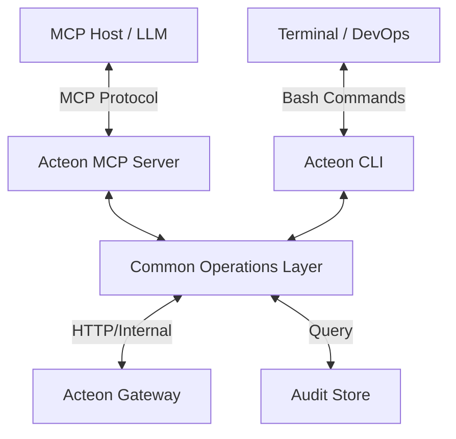

# Acteon MCP Server Design

**Status:** Draft
**Author:** Acteon Team
**Created:** 2026-02-14

## Overview

This document proposes the implementation of a Model Context Protocol (MCP) server for Acteon. The MCP server will allow LLMs and AI agents to interact directly with Acteon's dispatch engine, audit trail, and state management systems, enabling agentic workflows for incident response, alert tuning, and automated operations.

## Motivation

As Acteon grows into a central hub for event dispatching and notification management, it becomes a critical source of truth for system health and operational history. By exposing Acteon via MCP, we enable:

1.  **Autonomous Incident Analysis**: Agents can query the audit trail to correlate events and identify root causes.
2.  **Natural Language Dispatch**: Humans or agents can send notifications or trigger workflows using plain language.
3.  **Interactive Rule Tuning**: Agents can analyze notification volume and suggest improvements to grouping, inhibition, or routing rules.
4.  **Operational Assistance**: Real-time status checks and manual state transitions (ACK/Resolve) through chat interfaces.

## Architecture

We will implement a **Common Operations Layer** (likely within `crates/client` or a new `crates/ops`) that encapsulates the logic for interacting with the Acteon Gateway. This layer will serve as the single source of truth for both the MCP Server and the CLI.

### 1. Acteon CLI

The CLI will provide a human-friendly way to interact with Acteon, mapping 1:1 with the capabilities exposed to the MCP server.

**Example Commands:**
- `acteon dispatch --tenant prod --type error --payload '{"msg": "db down"}'`
- `acteon audit search --tenant prod --since 1h`
- `acteon rule simulate --file ./new_rule.yaml --events ./samples.json`
- `acteon event ack <fingerprint>`
- `acteon health`

### 2. Model Context Protocol (MCP) Server
The MCP server will be a thin wrapper around the Operations Layer, exposing the same logic as Tools and Resources to LLM agents.

## Surfaced Capabilities

### 1. Resources

Resources provide the LLM with read-only access to Acteon's data.

| URI Pattern | Description |
| :--- | :--- |
| `audit://{tenant}/{id}` | Full details of a specific audit log entry. |
| `rules://{tenant}` | The active rule set for a given tenant (YAML/JSON). |
| `state://{tenant}/{fingerprint}` | Current state and history of a stateful event. |
| `groups://{tenant}/{group_id}` | Membership and status of an event group. |
| `subscriptions://{tenant}` | Active event subscriptions for real-time notifications. |
| `config://system` | Non-sensitive system configuration and status. |

### 2. Tools

Tools allow the LLM to perform actions within Acteon.

| Tool Name | Parameters | Description |
| :--- | :--- | :--- |
| `dispatch` | `tenant`, `action_type`, `payload`, `metadata`, `provider?` | Send a new action/event through Acteon. |
| `query_audit` | `tenant`, `query?`, `start_time?`, `end_time?`, `limit?` | Search the audit trail for historical events. |
| `update_rule` | `tenant`, `rule_name`, `update_patch` | Modify an existing routing or grouping rule. |
| `manage_event` | `fingerprint`, `action` (ack/resolve/silence) | Transition the state of a stateful event. |
| `schedule_action` | `tenant`, `schedule`, `action_payload` | Create or update a recurring action. |
| `manage_approval` | `approval_id`, `decision` (approve/deny), `reason` | Handle manual approval requests for sensitive actions. |
| `list_chains` | `tenant` | List action chains (sequences of related actions). |
| `check_health` | - | Check gateway health and circuit breaker status. |
| `simulate_rule` | `rule_definition`, `events` | Run a simulation of a rule against a set of sample events to see outcomes. |
| `evaluate_policy` | `action`, `policy` | Use Acteon's LLM evaluator to check an action against a natural language policy. |
| `analyze_impact` | `tenant`, `fingerprint` | Returns statistics on how often an event has fired and its notification history. |

### 3. Prompts

Pre-defined prompt templates to guide the LLM in operational tasks.

-   **`investigate_incident`**: "I see a spike in errors for service {{service}}. Use Acteon to find related events in the last 30 minutes, check if any rules were recently changed, and summarize the impact."
-   **`optimize_alerts`**: "Analyze the notifications sent to {{provider}} for tenant {{tenant}} over the last 24 hours. Identify noisy patterns and suggest grouping rules to reduce fatigue."
-   **`draft_guardrail`**: "I need a policy that prevents notifications from being sent to {{team}} during their quiet hours unless the severity is 'critical'. Draft a natural language policy for Acteon's LLM guardrail."

## Agentic Workflows

### Scenario A: Automated Root Cause Analysis
1.  An external monitoring tool triggers a "High Latency" event in Acteon.
2.  An MCP-enabled agent receives this event.
3.  The agent calls `query_audit` to see what else happened around the same time.
4.  It finds a `deploy_started` event and several `database_connection_error` events.
5.  The agent calls `dispatch` to send a summary to Slack: "Latency spike correlated with Deployment #452 and DB connection errors. Investigating..."

### Scenario B: Intelligent Alert Suppression
1.  A "Database Maintenance" window begins.
2.  An agent (or scheduled task) calls `update_rule` to temporarily add an inhibition rule for DB alerts.
3.  When maintenance finishes, the agent removes the rule and calls `manage_event` to resolve any lingering alerts.

### Scenario C: Safe Rule Evolution
1.  An agent identifies a "noisy" alert that fires 100 times a day but is usually ignored.
2.  The agent proposes a new grouping rule with a 10-minute window.
3.  Before applying it, the agent calls `simulate_rule` with historical events from the last 24 hours.
4.  The simulation shows that notifications would drop from 100 to 12.
5.  The agent presents these findings to a human and, upon approval, calls `update_rule`.

## Security Considerations

1.  **Authentication**: The MCP server must validate tenant access. When running via stdio for a local user, it should inherit their permissions.
2.  **Sensitive Data**: Payloads in the audit trail may contain PII or secrets. The MCP server should provide a way to redact or mask sensitive fields before sending them to the LLM.
3.  **Rate Limiting**: Tools like `dispatch` should be subject to the same (or stricter) rate limits as the standard API.
4.  **Confirmation**: Destructive actions (like deleting rules) should require explicit user confirmation in the MCP Host UI.

## Implementation Phases

### Phase 1: Basic Connectivity
-   Scaffold `crates/mcp-server`.
-   Implement `stdio` transport.
-   Implement `dispatch` tool and `audit://` resource.

### Phase 2: Audit & Search
-   Implement `query_audit` tool.
-   Add support for filtering and pagination.
-   Integrate with `acteon-audit` backends.

### Phase 3: State & Rules
-   Implement `manage_event` for stateful events.
-   Implement `update_rule` with validation.
-   Expose rules as resources.

### Phase 4: Polish & Prompts
-   Add comprehensive prompt templates.
-   Implement `http` (SSE) transport.
-   Documentation and examples.

## Future Extensions
-   **Log Streaming**: Use MCP's notification mechanism to stream new audit events to the agent in real-time.
-   **Visualizations**: Return mermaid diagrams or chart data as part of resource representations.
