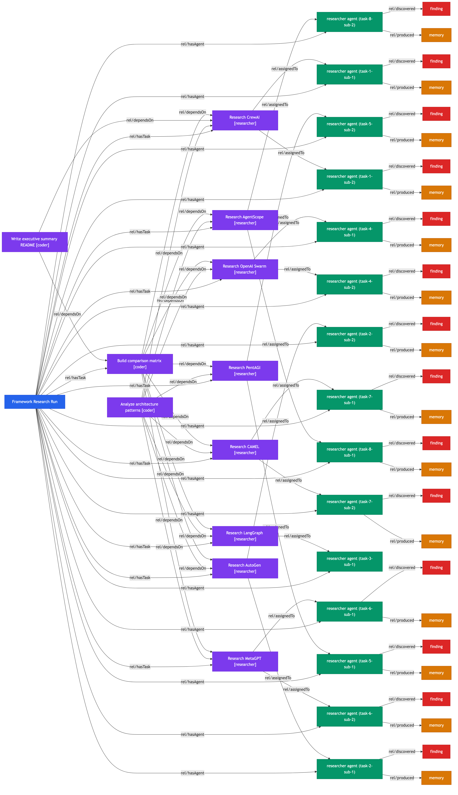

# Swarm Example: Deep Research — Open Source Agent Frameworks

An agent swarm that performs deep research on the most prominent open source multi-agent and swarm orchestration frameworks, producing per-framework analyses and comparative insights.

## Swarm Digital Twin Graph



**Legend**: Blue = SwarmRun, Purple = SwarmTask, Green = AgentSession, Orange = EpisodicMemory, Red = SemanticMemory

## Run Results

| Metric | Value |
|--------|-------|
| Status | 14/16 agents completed |
| Tasks | 11 |
| Agents spawned | 16 |
| Duration | ~20 minutes |
| Model | Sonnet |
| TesseraiDB entities | 81 |
| RDF triples | 335KB |
| Graph | 55 nodes, 85 edges |

## Frameworks Researched

| Framework | File | Lines |
|-----------|------|-------|
| CrewAI | `crewai.md` | 332 |
| AutoGen (Microsoft) | `autogen.md` | 196 |
| OpenAI Swarm | `openai-swarm.md` | 206 |
| PentAGI | `pentagi.md` | 166 |
| MetaGPT | `metagpt.md` | 171 |
| CAMEL | `camel.md` | 198 |
| AgentScope (Alibaba) | `agentscope.md` | 224 |

Each report covers: architecture, agent communication model, tool system, memory management, strengths/weaknesses, GitHub activity, and comparison to acteon-swarm.

## Output

```
output/research/
  frameworks/
    crewai.md              332 lines   CrewAI deep dive
    autogen.md             196 lines   Microsoft AutoGen analysis
    openai-swarm.md        206 lines   OpenAI Swarm analysis
    pentagi.md             166 lines   PentAGI pentest swarm analysis
    metagpt.md             171 lines   MetaGPT analysis
    camel.md               198 lines   CAMEL framework analysis
    agentscope.md          224 lines   AgentScope (Alibaba) analysis
```

## Knowledge Graph Artifacts

| File | Description |
|------|-------------|
| `output/swarm-graph.png` | Visual graph (55 nodes, 85 edges) |
| `output/swarm-graph.mmd` | Mermaid source |
| `output/knowledge-graph.ttl` | Full RDF triples (335KB) |

## How to Reproduce

```bash
# Start Acteon and TesseraiDB (see other examples)

mkdir /tmp/research && cp examples/swarm-deep-research/swarm.toml /tmp/research/
cd /tmp/research
acteon-swarm run \
  --prompt "Deep research the most prominent open source agent swarm frameworks..." \
  --auto-approve
```
