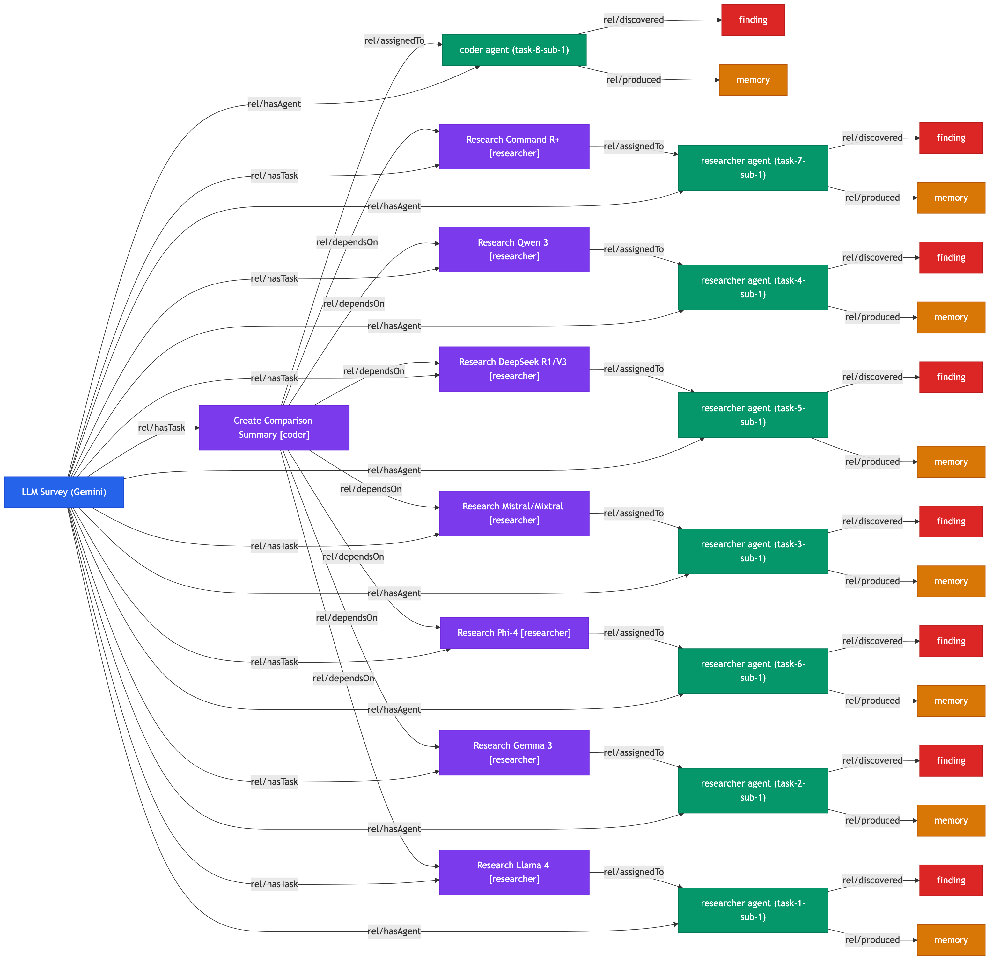

# Swarm Example: Open Source LLM Survey (Gemini Engine)

An agent swarm powered by **Gemini CLI** that surveys the most prominent open source LLMs as of early 2026, producing per-model analyses and a comparison table.

## Swarm Digital Twin Graph



**Legend**: Blue = SwarmRun, Purple = SwarmTask, Green = AgentSession, Orange = EpisodicMemory, Red = SemanticMemory

## Run Results

| Metric | Value |
|--------|-------|
| Status | Completed |
| Engine | **Gemini CLI** |
| Agents spawned | 8 |
| Agents completed | 8 / 8 |
| Duration | ~7 minutes |
| TesseraiDB entities | 50 |
| RDF triples | 118KB |
| Graph | 33 nodes, 47 edges |

## Models Surveyed

| Model | File | Lines |
|-------|------|-------|
| Llama 4 (Meta) | `llama4.md` | 41 |
| Gemma 3 (Google) | `gemma3.md` | 32 |
| Mistral/Mixtral (Mistral AI) | `mistral.md` | 73 |
| Qwen 3 (Alibaba) | `qwen3.md` | 59 |
| DeepSeek R1/V3 | `deepseek.md` | 90 |
| Phi-4 (Microsoft) | `phi4.md` | 63 |
| Command R+ (Cohere) | `command-r.md` | 109 |
| **Comparison** | `README.md` | 30 |

## Output

```
output/survey/
  llama4.md        Meta Llama 4 analysis
  gemma3.md        Google Gemma 3 analysis
  mistral.md       Mistral/Mixtral analysis
  qwen3.md         Alibaba Qwen 3 analysis
  deepseek.md      DeepSeek R1/V3 analysis
  phi4.md          Microsoft Phi-4 analysis
  command-r.md     Cohere Command R+ analysis
  README.md        Comparison table
```

## Configuration

```toml
[defaults]
engine = "gemini"    # Uses Gemini CLI instead of Claude
max_agents = 8
```

## Knowledge Graph Artifacts

| File | Description |
|------|-------------|
| `output/swarm-graph.png` | Visual graph (33 nodes, 47 edges) |
| `output/swarm-graph.mmd` | Mermaid source |
| `output/knowledge-graph.ttl` | Full RDF triples (118KB) |
