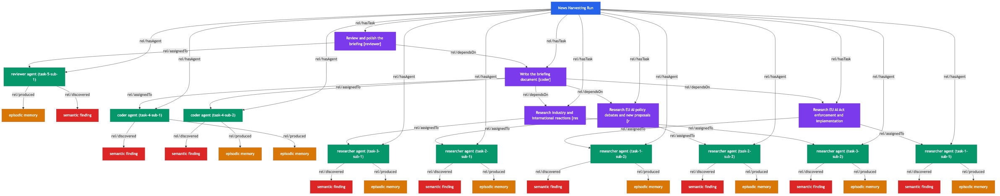

# Swarm Example: News Harvesting

An agent swarm that researches recent EU AI regulation news and produces a structured briefing document.

## Swarm Digital Twin Graph



**Legend**: Blue = SwarmRun, Purple = SwarmTask, Green = AgentSession, Orange = EpisodicMemory, Red = SemanticMemory

## Run Results

| Metric | Value |
|--------|-------|
| Status | Completed |
| Agents spawned | 9 |
| Agents completed | 9 / 9 |
| Duration | ~25 minutes |
| Model | Sonnet |
| TesseraiDB entities | 48 twins |
| RDF triples | 165KB |
| Relationships | 45 edges |
| Memory reuse | Prior findings injected (count: 2→4→5→5→5) |

## Output

- `output/briefing.md` — Comprehensive briefing with key developments, dated source URLs, executive summary, and outlook

## Knowledge Graph Artifacts

| File | Description |
|------|-------------|
| `output/swarm-graph.png` | Visual graph of all agent interactions |
| `output/swarm-graph.mmd` | Mermaid source for the graph |
| `output/knowledge-graph.ttl` | Full RDF triples in Turtle format (165KB) |

## Twin Types in Graph

| Type | Count | Description |
|------|-------|-------------|
| SwarmRun | 1 | Run metadata — objective, plan, roles |
| SwarmTask | 5 | Task decomposition with dependencies |
| AgentSession | 9 | Agent lifecycle — role, subtask, timestamps |
| EpisodicMemory | 9 | Per-action records — full agent output |
| SemanticMemory | 9 | Key findings — research results |

## Relationships

| From | Relationship | To |
|------|-------------|-----|
| SwarmRun | hasTask | SwarmTask |
| SwarmRun | hasAgent | AgentSession |
| SwarmTask | dependsOn | SwarmTask |
| SwarmTask | assignedTo | AgentSession |
| AgentSession | produced | EpisodicMemory |
| AgentSession | discovered | SemanticMemory |

## How to Reproduce

```bash
# Start Acteon (in-memory)
cargo run -p acteon-server --release -- --port 8090 &

# Start TesseraiDB (in-memory)
DATABASE_PATH=:memory: PORT=8091 DISABLE_AUTH=true /path/to/tesseraidb &

# Run
mkdir /tmp/news && cp examples/swarm-news-harvesting/swarm.toml /tmp/news/
cd /tmp/news
acteon-swarm run \
  --prompt "Research the latest news about AI regulation in the European Union..." \
  --auto-approve
```
