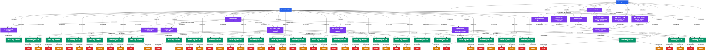

# Swarm Example: Security Audit (Parallel Penetration Testing)

An agent swarm that performs a white-box security audit of the Acteon gateway with **6 parallel analysis tracks**: authentication, injection, SSRF, dynamic API testing, dependency audit, and configuration review.

## Swarm Digital Twin Graph



**Legend**: Blue = SwarmRun, Purple = SwarmTask, Green = AgentSession, Orange = EpisodicMemory, Red = SemanticMemory

## Run Results

| Metric | Value |
|--------|-------|
| Status | 23/28 agents completed |
| Tasks | 7 (6 parallel + 1 sequential) |
| Agents spawned | 28 |
| Agents completed | 23 |
| Duration | ~25 minutes |
| Model | Sonnet (agents) + Haiku (refiner) |
| Refinements | 1 |
| TesseraiDB entities | 140 |
| RDF triples | 963KB |
| Relationships | 149 edges |
| Max concurrent | 6 agents running simultaneously |

## Parallel Execution

6 security analysis tasks started simultaneously at 12:54:51:
- task-1: Auth/AuthZ review (reviewer)
- task-2: Injection analysis (reviewer)
- task-3: SSRF/network review (reviewer)
- task-4: Dynamic API testing (executor)
- task-5: Dependency audit (executor)
- task-6: Configuration review (reviewer)

## Output

```
output/report/
  injection-findings.md      270 lines   Input validation and injection analysis
  ssrf-findings.md           305 lines   SSRF and network security findings
  dependency-audit.md        254 lines   Cargo dependency CVE audit
```

Additional findings stored as 26 semantic memories in TesseraiDB (963KB RDF).

## Knowledge Graph Artifacts

| File | Description |
|------|-------------|
| `output/swarm-graph.png` | Visual graph (97 nodes, 149 edges) |
| `output/swarm-graph.mmd` | Mermaid source |
| `output/knowledge-graph.ttl` | Full RDF triples (963KB) |

## Note

This is an authorized security assessment of our own system. The swarm analyzes source code and probes API endpoints for vulnerabilities — it does not perform destructive testing.
